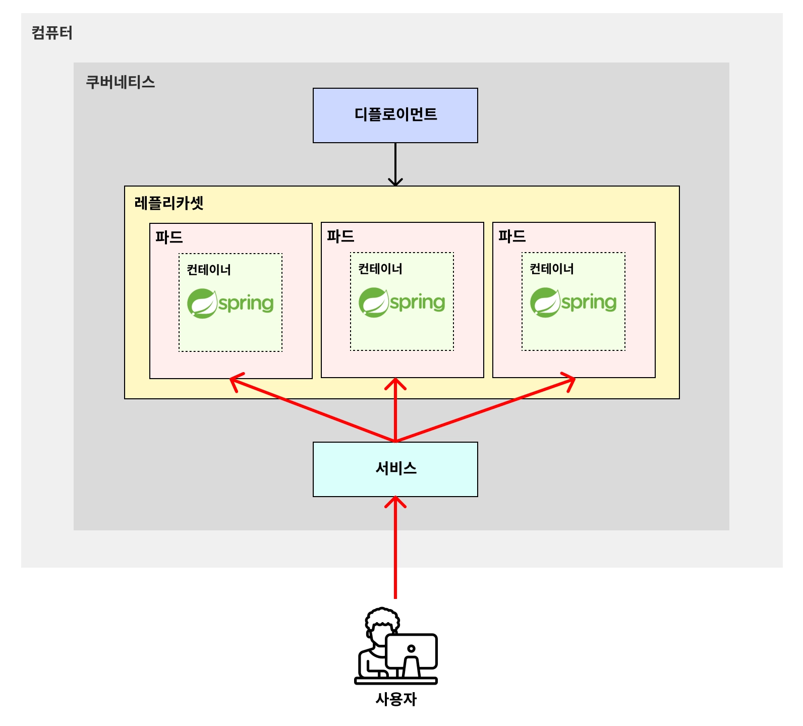
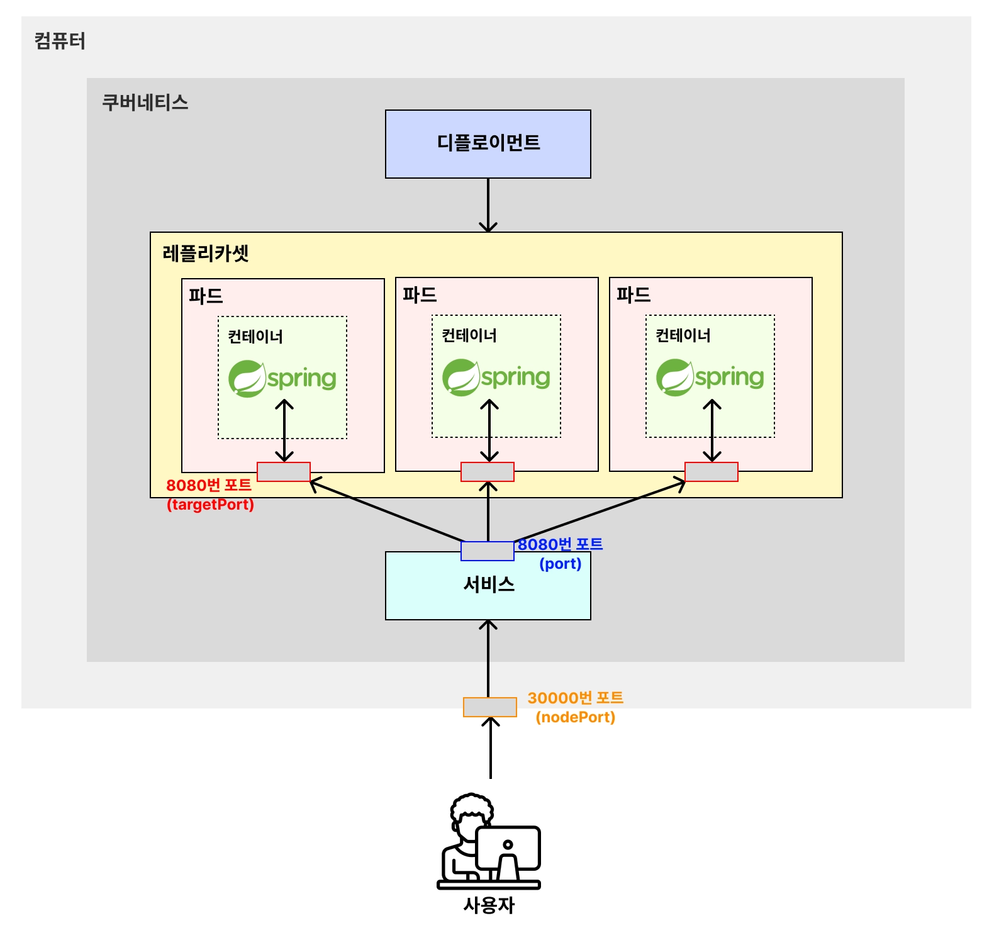

# 🧑🏻‍💻 Service
> [!NOTE]
> Service: 외부로부터 들어오는 트래픽을 받아, 파드에 균등하게 분배해주는 로드밸런서 역할을 하는 기능  
> 
> 실제 서비스에서 Pod에 요청을 보낼 때, port-forwarding이나 파드 내로 직접 접근(`kubectl exec ...`)해서 요청을 보내지는 않는다.  
> ➡ Service를 통해 요청을 보내는 것이 일반적이다.

 

## ✅ Service Node 종류
- `NodePort` : 쿠버네티스 내부에서 해당 서비스에 접속하기 위한 포트를 열고 **외부에서 접속 가능**하도록 한다.
- `ClusterIP` : 쿠버네티스 내부에서만 통신할 수 있는 IP 주소를 부여. 외부에서는 요청할 수 없다.
- `LoadBalancer` : 외부의 로드밸런서(AWS의 로드밸런서 등)를 ㄹ활용해 외부에서 접속할 수 있도록 연결한다.

 

**출처**  
[쿠버네티스 강의](https://www.inflearn.com/course/%EB%B9%84%EC%A0%84%EA%B3%B5%EC%9E%90-%EC%BF%A0%EB%B2%84%EB%84%A4%ED%8B%B0%EC%8A%A4-%EC%9E%85%EB%AC%B8-%EC%8B%A4%EC%A0%84?cid=335433)