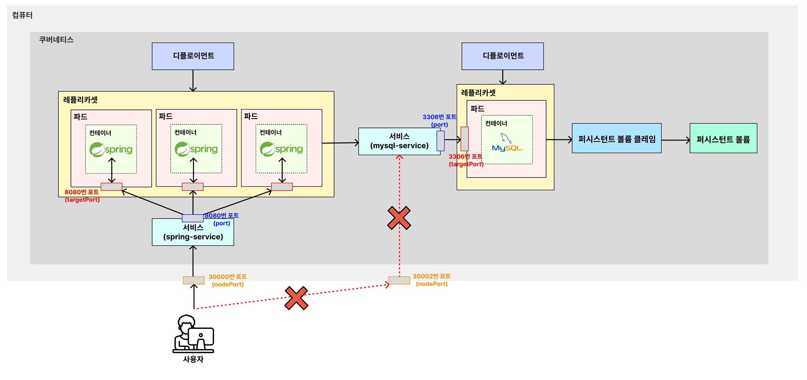

# 🧑🏻‍💻 Service
> [!NOTE]
> Service: 외부로부터 들어오는 트래픽을 받아, 파드에 균등하게 분배해주는 로드밸런서 역할을 하는 기능  
> 
> 실제 서비스에서 Pod에 요청을 보낼 때, port-forwarding이나 파드 내로 직접 접근(`kubectl exec ...`)해서 요청을 보내지는 않는다.  
> ➡ Service를 통해 요청을 보내는 것이 일반적이다.


<br>

## ✅ Service Node 종류
- `NodePort` : 쿠버네티스 내부에서 해당 서비스에 접속하기 위한 포트를 열고 **외부에서 접속 가능**하도록 한다.
- `ClusterIP` : 쿠버네티스 내부에서만 통신할 수 있는 IP 주소를 부여. 외부에서는 요청할 수 없다.
- `LoadBalancer` : 외부의 로드밸런서(AWS의 로드밸런서 등)를 ㄹ활용해 외부에서 접속할 수 있도록 연결한다.


<br>

## ✅ DB에 직접 접근 가능한 보안 조치

> [!NOTE]
> 보안적인 문제점 해결을 위해 `Service`의 종류 중 `NodePort`를 사용하지 않고 `ClusterIP`를 활용해야 한다.  
> `ClusterIP`를 활용함으로써 외부에서 아무나 MySQL에 접근하지 못하게 막아야 한다.

<br>

```yaml
apiVersion: v1
kind: Service

# Service 기본 정보
metadata:
  name: mysql-service # Service 이름

# Service 세부 정보
spec:
  type: ClusterIP # Service의 종류
  selector:
    app: mysql-db # 실행되고 있는 파드 중 'app: mysql-db'이라는 값을 가진 파드와 서비스를 연결
  ports:
    - protocol: TCP # 서비스에 접속하기 위한 프로토콜
      port: 3306 # 쿠버네티스 내부에서 Service에 접속하기 위한 포트 번호
      targetPort: 3306 # 매핑하기 위한 파드의 포트 번호
      nodePort: 30002 # 외부에서 사용자들이 접근하게 될 포트 번호
```



<br>

### ⭐️ DB를 관리하기 위해 접속해야할 때는?
> [!NOTE]
> 쿠버네티스의 포트 포워딩을 활용해서 접속하면 된다.  
> 아래 포트 포워딩 명령어를 사용하면 내 로컬 컴퓨터에서만 해당 파드와 연결을 허용시킬 수 있게 된다.
```shell
$ kubectl port-forward pod/[MySQL 파드명] 3306:3306
```


<br>

**출처**  
[쿠버네티스 강의](https://www.inflearn.com/course/%EB%B9%84%EC%A0%84%EA%B3%B5%EC%9E%90-%EC%BF%A0%EB%B2%84%EB%84%A4%ED%8B%B0%EC%8A%A4-%EC%9E%85%EB%AC%B8-%EC%8B%A4%EC%A0%84?cid=335433)