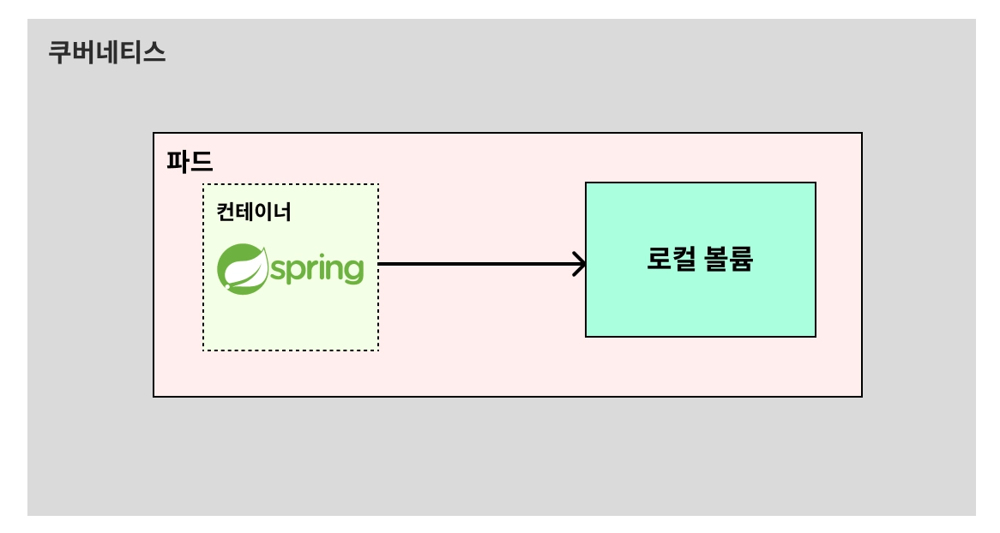
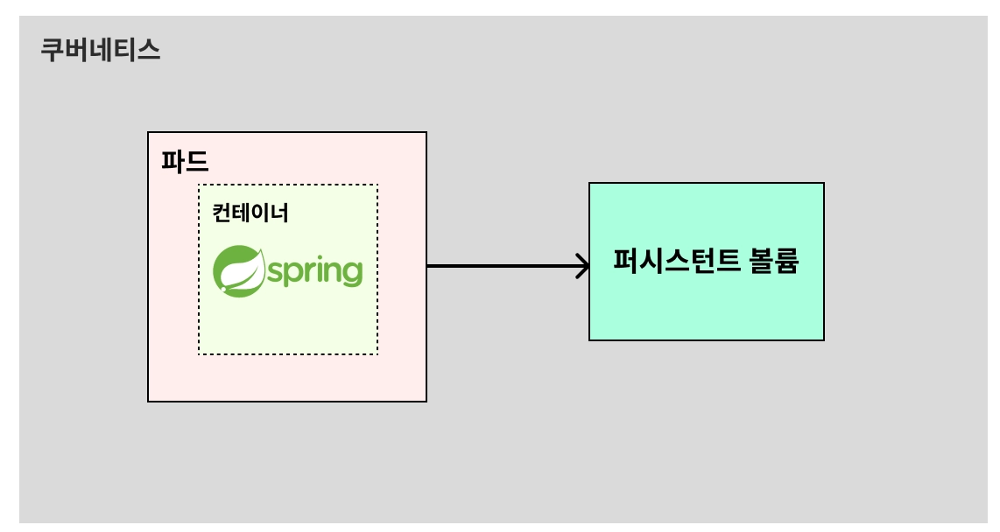
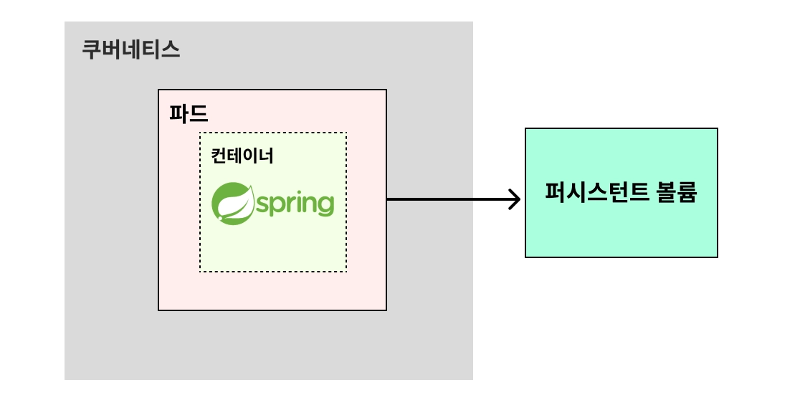
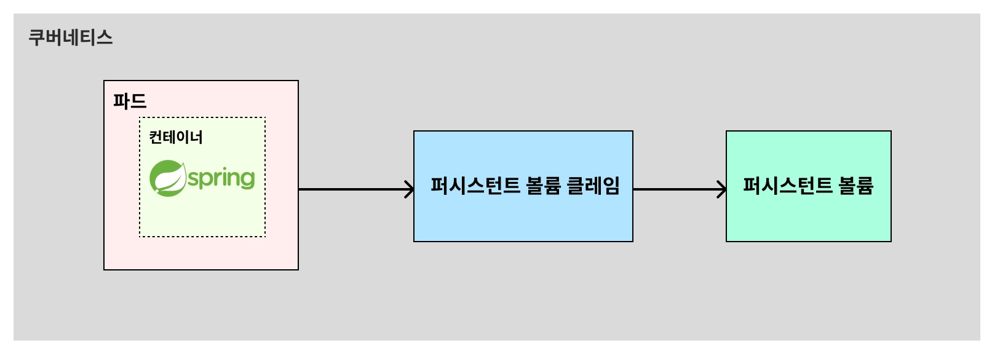

# 🧑🏻‍💻 Volume

---

**볼륨(Volume)** 이란 **데이터를 영속적으로 저장하기 위한 방법**이다.  
쿠버네티스에서 볼륨은 크게 2가지 종류로 나뉜다.

1. **로컬 볼륨**

   **파드 내부의 공간 일부를 볼륨(Volume)으로 활용하는 방식**이다. 이 방식은 파드가 삭제되는 즉시 데이터도 함께 삭제된다. 이런 불편함 때문에 **실제로 사용되는 일이 잘 없다.**  
   

2. **퍼시스턴트 볼륨(Persistent Volume, PV)**

   **파드 외부의 공간 일부를 볼륨(Volume)으로 활용하는 방식**이다. 이 방식은 파드가 삭제되는 것과 상관없이 데이터를 영구적으로 사용할 수 있다는 장점이 있다. 현업에서는 주로 이 방식을 많이 활용한다.
   1. 쿠버네티스 내부의 공간 일부를 사용하는 경우  
      
   2. 외부 저장소(AWS EBS 등)를 사용하는 경우  
      

 

## ✅ Persistent Volume Claim(PVC)
> [!NOTE]
> 실제로는 파드(Pod)가 퍼시스턴트 볼륨(PV)에 직접 연결할 수 없다.  
> 퍼시스턴트 볼륨 클레임(PVC)이라는 중개자가 있어야 한다.  
> 그래서 쿠버네티스 구조에서는 아래와 같은 구조로 퍼시스턴트 볼륨(PV)을 연결한다.

 

> [!IMPORTANT]
> 퍼시스턴트 볼륨 클레임(PVC)은 파드(Pod)와 퍼시스턴트 볼륨(PV) 사이에서 중개자 역할을 한다.

 

**출처**  
[쿠버네티스 강의](https://www.inflearn.com/course/%EB%B9%84%EC%A0%84%EA%B3%B5%EC%9E%90-%EC%BF%A0%EB%B2%84%EB%84%A4%ED%8B%B0%EC%8A%A4-%EC%9E%85%EB%AC%B8-%EC%8B%A4%EC%A0%84?cid=335433)