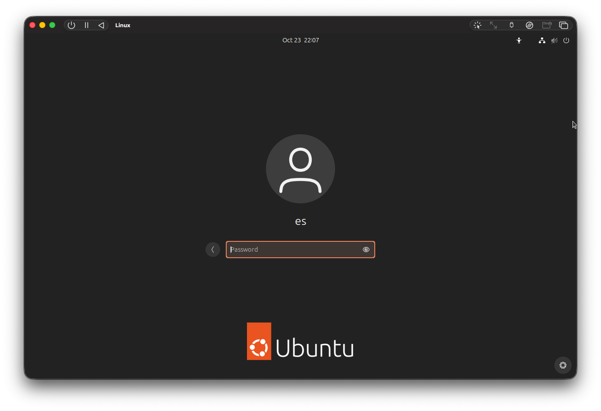
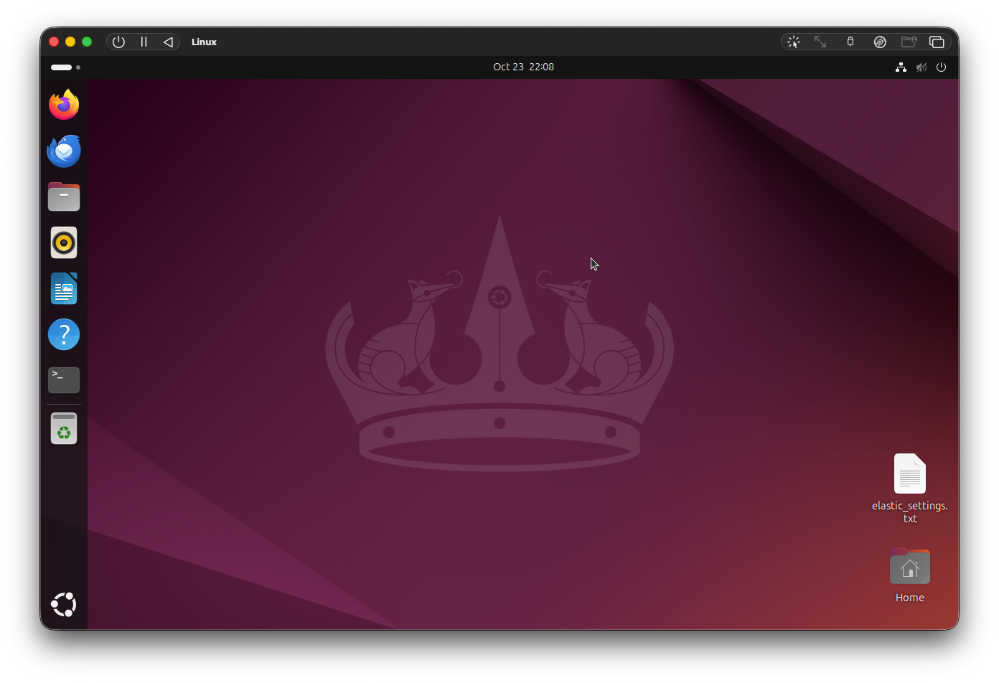

# 💻 리눅스 셋팅
> MAC OS 환경 기반입니다.

## ✅ 우분투 데스크탑 설치
가상 머신에 로그인을 한 후, Terminal 환경에서 다음의 명령어 실행  
`apt`: **Advanced Package Tooll**의 약자로, 우분투와 같은 데비안(Debian) 기반 리눅스 시스템에서 패키지(소프트웨어)를 설치, 업데이트, 삭제 및 관리하는 데 사용되는 명령어다.  
```shell
sudo apt update
// 리눅스 시스템에서 현재 사용할 수 있는 패키지 목록을 최신 정보로 갱신하는 명령어다.
```
```shell
sudo apt intall ubuntu-desktop
// 오래 걸린다.
```
```shell
sudo reboot
```

화면 캡처  
  
  

<br>

## ✅ SSH로 접속하기
Mac에서 제공하는 터미널에서 직접 리눅스 SSH에 접근하는 방법도 있다.

<br>

1. UTM 리눅스에 SSH 서버 설치
`systemctl`: Linux 운영체제에서 시스템 서비스(daemon)을 관리하는 명령어다.  
```shell
sudo apt update
sudo apt install openssh-server
sudo systemctl enable ssh
sudo systemctl start ssh
```

2. 리눅스 VM의 IP 확인
```shell
ip addr
// 혹은 hostname -I
// 혹은 ifconfig
```

3. Mac 터미널 환경에서 SSH 접속
```shell
ssh username@192.***.**.*
```