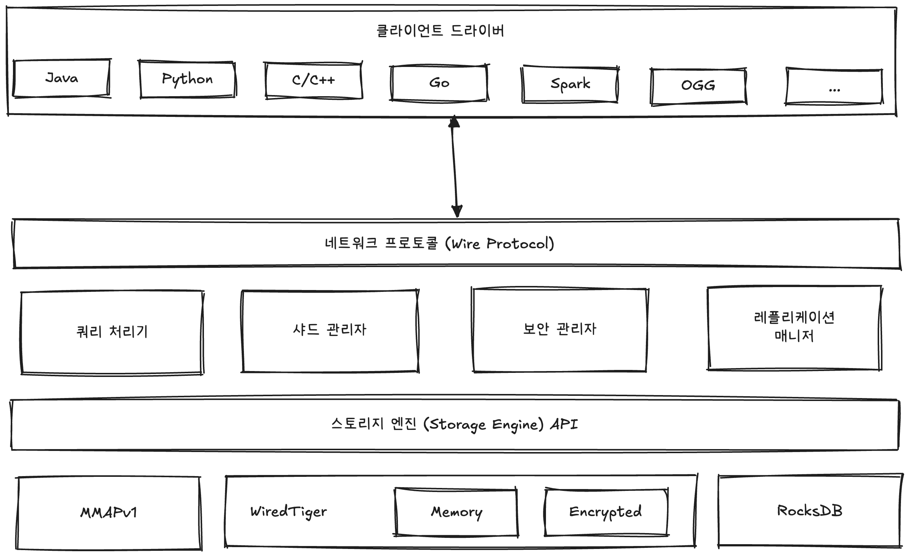

# 🧑🏻‍💻 MongoDB 아키텍처

> [!NOTE]
> 응용 프로그램은 각 프로그래밍 언어별로 적절한 클라이언트 드라이버를 이용해서 MongoDB 서버와 통신한다.  
> ➡ 그리고 MongoDB 서버의 네트워크 모듈은 클라이언트의 요청을 받아서 MongoDB 서버의 쿼리 프로세서 모듈로 전달한다.  
> ➡ 쿼리 프로세서 모듈은 여러 과정을 거쳐서 사용자 데이터를 지정된 스토리지 엔진으로 주고받는다.  
> ➡ MongoDB 서버의 구성 요소에서 가장 아래에 위치한 스토리지 엔진은 사용자 데이터를 디스크에 저장하거나 디스크로부터 읽어서 쿼리 프로세서 모듈로 전달한다.

  

 

**참고 자료**  
[대용량 데이터 처리를 위한 Real MongoDB](https://product.kyobobook.co.kr/detail/S000001766322)