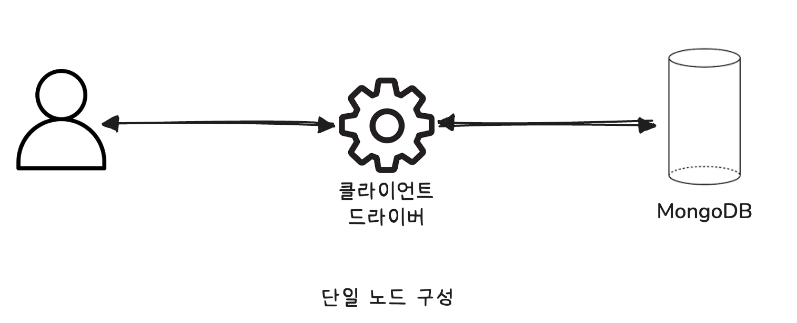
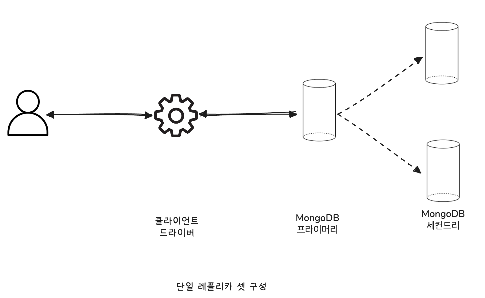

# 🧑🏻‍💻 MongoDB 아키텍처

- [✅ 단일 노드(Standalone)](#-단일-노드standalone)

> [!TIP]
> MongoDB도 HBase나 카산드라와 같이 클러스터 형태로 서비스할 수 있도록 구현된 데이터베이스 서버다.  
> 하지만 MongoDB는 반드시 클러스터 형태로 구성해야만 사용할 수 있는 것은 아니다.  
> MongoDB의 배포 형태는 오히려 MySQL 서버의 구조와 매우 비슷하다.  
> MySQL 서버와 같이 단일 서버로도 서비스에 사용할 수 있을 뿐만 아니라 복제 또는 샤딩된 구조로도 활용할 수 있다.

 

## ✅ 단일 노드(Standalone)

> [!NOTE]
> 단일 노드로 MongoDB를 사용할 때에는 아무런 관리용 컴포넌트도 필요하지 않다.  
> 마치 기존의 RDBMS가 작동하는 방식으로 MongoDB를 사용하는 형태라고 볼 수 있다.  
> ➡️ 이 배포 형태의 MongoDB는 복제를 위한 로그(OpLog)를 별도로 기록하지 않으며, 다른 노드와의 통신도 필요하지 않다.

> [!CAUTION]
> 위 그림과 같이 단일 노드 구성에서는 응용 프로그램의 MongoDB 드라이버가 MongoDB 서버로 직접 연결디며, 별도의 레플리카 셋을 가지지 않으므로 MongoDB 서버가 응답 불능 상태라 하더라도 자동 페일오버(Fail-over)나 HA 기능이 작동할 수 없다.  
> ➡️ 주로 이 형태는 개발 서버의 구성에 사용된다.

 

## ✅ 단일 레플리카 셋(Single Replica-set)

> [!NOTE]
> 단일 레플리카 셋 구조에서도 별도의 관리용 컴포넌트가 필요하지는 않지만, 레플리카 셋(Replica-set)의 구축을 위해서 추가로 MongoDB 서버가 필요하다.  
> 레플리카 셋은 특정 서버에 장애가 발생했을 때 자동 복구를 위한 최소 단위이므로 자동 복구가 필요하다면 항상 레플리카 셋으로 MongoDB를 배포해야 한다.  
> MongoDB 드라이버는 직접 MongoDB 서버로 접속하지만, 단일 노드로 접속할 때와는 달리 레플라카 셋(replicaSet) 옵션을 사용해야 한다.

  

> [!IMPORTANT]
> 위 그림과 같이 하나의 레플리카 셋에는 항상 하나의 프라이머리 노드와 1개 이상의 세컨드리 노드로 구성된다.  
> - 프라이머리 노드: 사용자의 데이터 변경 요청을 받아서 처리한다.
> - 세컨드리 노드: 프라이머리 노드로부터 변경 내용을 전달받아서 서로의 데이터를 동기화한다.
> 
> ❗️ 읽기 쿼리는 프라이머리 노드뿐만 아니라 필요하면 세컨드리 노드로 요청할 수도 있다.

> [!TIP]
> MongoDB 레플리카 셋은 항상 레플리카 셋(Replica-set)에 포함된 노드 간 투표를 통해서 프라이머리(Primary) 노드를 결정하므로 가능하면 홀수 개의 노드로 구성하는 것이 좋다.  
> 
> 또한 짝수 멤버로 레플리카 셋을 구성하면 쿼럼(Quorum) 구성이 어려울 수도 있다.  
> 레플리카 셋의 멤버(노드)가 과반수 이상 통신할 수 있는 상태여야만 투표를 실행할 수 있기 때문에 3개의 노드로 구성한 경우는 투표를 위한 최소 노드 수가 2, 4개의 노드로 구성한 경우는 투표를 위한 최소 노드 수가 3개다.  
> ➡️ 3개의 노드로 구성한 경우와 4개의 노드로 구성한 경우 모두 2개 이상의 노드가 응답 불능 상태가 되면 레플리카 셋은 투표를 실행하지 못하므로  
> ➡ 프라이머리 노드를 선출하지 못한다.  
> ➡️ 노드 장애에 대한 내구성은 같은 것이다.

 

## ✅ 샤딩된 클러스터(Sharded Cluster)

> [!NOTE]
> 샤딩된 클러스터 구조에서는 하나 이상의 레플리카 셋이 필요하며, 각 레플리카 셋은 자신만의 파티션된 데이터를 가지게 된다.  
> ➡️ 샤딩된 클러스터에 참여하고 있는 각각의 레플리카 셋을 샤드라고 하는데, 이 샤드들이 어떤 데이터를 가지는지에 대한 정보는 MongoDB Config가 관리한다.

> [!IMPORTANT]
> 샤딩된 클러스터 구조에서는 응용 프로그램의 MongoDB 드라이버가 직접 MongoDB 서버로 연결하도록 해서는 안 된다.  
> 1. 샤딩된 클러스터에서 MongoDB 드라이버는 MongoDB 라우터 (mongos)로 연결한다.
> 2. MongoDB 라우터는 자동으로 MongoDB Config 서버로부터 각 샤드가 가지고 있는 데이터에 대한 메타 정보들을 참조해서 쿼리를 실행한다.

> [!TIP]
> MongoDB 라우터는 이름 그대로 사용자로부터 요청된 쿼리를 실제 데이터를 가지고 있는 샤드로 전달하는 역할을 수행한다.  
> 그뿐만 아니라 사용자들 대신해서 모든 샤드로 쿼리를 요청하고 결과를 정렬 및 병합해서 반환하는 처리도 수행한다.  
> MongoDB 라우터는 각 샤드간의 데이터가 재분배되는 시점에도 동일한 역할을 수행하여 사용자나 응용 프로그램이 알아채지 못하게 투명하게(Transparent) 데이터 밸런싱 작업을 처리한다.

 

**참고 자료**  
[대용량 데이터 처리를 위한 Real MongoDB](https://product.kyobobook.co.kr/detail/S000001766322)