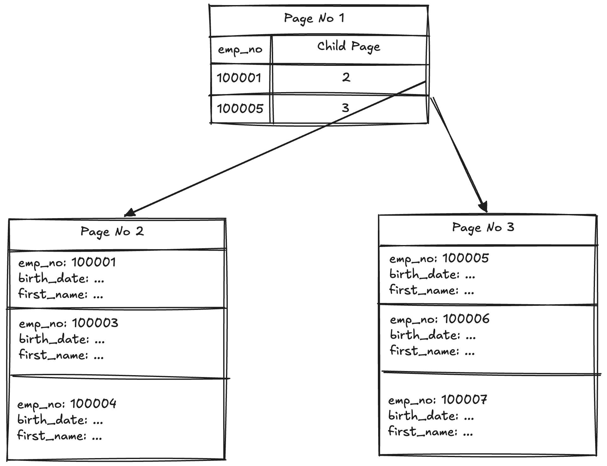
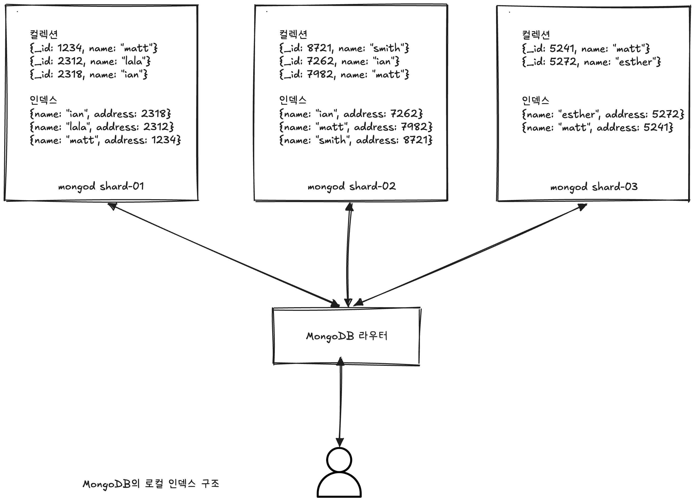

# 🧑🏻‍💻 MongoDB 인덱스
<hr>

- [✅ 클러스터링 인덱스](#-클러스터링-인덱스)
- [✅ 인덱스 내부](#-인덱스-내부)
- [✅ 인덱스 키 엔트리 자료 구조](#-인덱스-키-엔트리-자료-구조)

> [!NOTE]
> SortedList는 DBMS의 인덱스와 동일한 자료구조이며, ArrayList는 데이터 파일과 동일한 자료구조를 사용한다.  
> DBMS의 인덱스도 SortedList와 동일하게 저장되는 컬럼의 값을 이용해서 항상 정렬된 상태로 유지해야 하며, 데이터 파일은 ArrayList와 같이 저장된 순서대로 파일을 저장한다.

> [!CAUTION]
> DBMS에서 인덱스는 데이터의 저장 성능을 희생해서 상대적으로 데이터의 읽기 속도를 향상시키는 존재다.  
> 테이블의 인덱스를 하나 더 추가할지 말지는 데이터의 저장 속도를 어디까지 희생할 수 있으며, 읽기 속도를 얼마나 더 빠르게 만들어야 하는지 조율하면서 결정해야 하는 것이지, 무조건 FIND 쿼리 문자의 조건절에 사용되는 필드라고 전부 인덱스로 생성해서는 안 된다.

> [!TIP]
> Primary Key와 Secondary Key로 구분할 수 있다.  
> Primary Key는 도큐먼트를 대표하는 필드들의 값으로 만들어진 인덱스고, 식별자라고도 불린다.  
> NULL 값을 허용하지 않고, 중복도 허용되지 않는다.  
> Primary Key를 제외한 나머지 모든 인덱스를 Secondary Index라고 부른다.

<br>

## ✅ 클러스터링 인덱스
<hr>




> [!NOTE]
> 위 그림을 보면 알겠지만, 하나의 페이지에 `emp_no` 값이 순서대로 정렬돼서 저장된다.

> [!IMPORTANT]
> 일반적인 인덱스(클러스터링 되지 않은 인덱스, Non-Clustering 인덱스)는 레코드를 저장하는 시점에 임의의 빈 공간에 레코드를 저장한다.  
> 하지만 클러스터링 인덱스는 인덱스 키 값 순서대로 데이터를 저장하는 인덱스 구조라서 INSERT가 느리게 처리된다.  
> ❗️ 하지만 클러스터링 키 값을 대상으로 범위 검색을 수행하는 경우에는 별도의 랜덤 액세스 없이 레코드를 읽기 때문에 매우 빠르게 레인지 스캔을 수행할 수 있다.

<br>

## ✅ 인덱스 내부
<hr>

- [💡 MMAPv1 스토리지 엔진의 Record-Id](#-mmapv1-스토리지-엔진의-record-id)
- [💡 WiredTiger 스토리지 엔진의 Record_id](#-wiredtiger-스토리지-엔진의-record_id)

> [!TIP]
> MongoDB 스토리지 엔진들이 컬렉션과 인덱스를 구현하는 방법에 조금씩 차이가 있다.  
> B-Tree 알고리즘의 차이가 아니라, B-Tree에 존재하는 인덱스 키의 구성 방식이 다르다.  
> 리프 노드에서 `Record-Id`는 MongoDB에서 내부적으로 키 값과 연결된 도큐먼트의 저장 주소를 의미하는데, 논리적인 주소일 수도 있지만 물리적인 주소일 수도 있다.

### 💡 MMAPv1 스토리지 엔진의 Record-Id
<hr>

> [!NOTE]
> MMAPv1 스토리지 엔진에서는 인덱스 키의 `Record-Id`에 실제 도큐먼트가 저장된 주소(물리적인 주소)를 저장한다.  
> 도큐먼트의 주소는 크게 "데이터 파일"과 "파일 내에서 도큐먼트의 저장 위치(offset)"으로 구성된다.

<br>

> [!CAUTION]
> MMAPv1 스토리 엔진에서 한 가지 재밌는 것은 Record-Id가 실제 도큐먼트의 물리 저장 주소이기 때문에 도큐먼트가 데이터 파일의 다른 위치로 옮겨지면 Primary Key를 포함해서 모든 인덱스의 엔트리를 변경해야 한다는 것이다.

```javascript
mongo> db.mmapv1.insert({name:"matt"})
mongo> db.mmapv1.insert({name:"lara"})

// _addSpecial(): MongoDB 커서에 특수 쿼리 옵션을 추가하는 내부 메서드
// "$showDiskLoc": 각 문서의 실제 디스크 저장 위치를 결과에 포함시키는 옵션
// "$recordId": 결과에 추가되는 필드로, 해당 문서의 디스크상 물리적 위치
mongo> db.mmapv1.find()._addSpecial("$showDiskLoc", true)
{ "name": "matt", "$recordId": NumberLong(20656) }
{ "name": "lara", "$recordId": NumberLong(20720) }

mongo> db.mmapv1.update({name:"matt"}, {$set:{address:"서울시 광진구"}})
WriteResult({ "nMatched": 1, "nUpserted" : 0, "nModified" : 1 })

mongo> db.mmapv1.find()._addSpecial("$showDiskLoc", true)
{ "name": "lara", "$recordId": NumberLong(20720) }
{ "name": "matt", "address":"서울시 광진구", "$recordId": NumberLong(20784) }
```

> [!NOTE]
> name="matt"인 도큐먼트의 전체 크기가 증가했고, 이로 인해 도큐먼트가 새로운 위치로 옮겨져야 했다.  
> 그래서 위치가 20656(Offset) ➡ 20784(Offset)로 옮겨졌다.  
> 💡 MongoDB의 MMAPv1 스토리지 엔진에서는 도큐먼트의 크기가 증가하는 경우를 상당히 경계한다.  
> 그래서 `paddingFactor`라는 옵션을 도입해서 도큐먼트를 저장할 때 일부러 도큐먼트 사이에 빈 공간을 할당해 뒀다가 도큐먼트의 크기가 증가하는 경우에는 그 빈 공간을 활용하여 도큐먼트의 위치가 최대한 옮겨지지 않도록 처리하고 있다.

<br>

> [!WARN]
> MMAPv1 스토리지 엔진에서 도큐먼트의 이동을 경계하는 이유는 도큐먼트가 옮겨질 때마다 그 도큐먼트의 물리 주소를 가지고 있는 인덱스의 엔트리를 찾아서 모두 변경해줘야 하기 때문이다.  
> ➡️ 모든 인덱스가 도큐먼트의 물리 주소를 가지기 때문에, 컬렉션에 인덱스가 10개가 있다면 10개의 인덱스를 모두 룩업해서 키의 주소 부분을 변경해야 하는 것이다.  
> 이는 매우 많은 디스크 랜덤 액세스를 유발하므로 상당히 느리게 처리된다.  
> 이를 보완해서 도입된 `paddingFactor`는 디스크의 데이터 파일 용량을 늘리는 주범이 됐다.

<br>

### 💡 WiredTiger 스토리지 엔진의 Record_id
<hr>

> [!NOTE]
> WiredTiger 스토리지 엔진은 인덱스 키 엔트리에 논리 주소를 사용한다.  
> 논리 주소로 도큐먼트마다 고유의 식별자를 할당해서 Record-Id로 부여한다.  
> ➡ WiredTiger 스토리지 엔진에서 부여하는 도큐먼트의 고유 식별자는 우리가 흔히 알고 있는 자동 증가값(Auto-Increment) 방식을 사용한다.

```javascript
// 스토리지 엔진 설정은 mongod.conf로 지정하는거고, 아래 wiredtiger는 컬렉션 이름에 해당한다.
mongo> db.wiredtiger.insert({name:"matt"})
mongo> db.wiredtiger.insert({name:"lara"})

mongo> db.wiredtiger.find()._addSpecial("$showDiskLoc", true)
{ "name": "matt", "$recordId": NumberLong(1) }
{ "name": "lara", "$recordId": NumberLong(2) }

mongo> db.wiredtiger.update({name:"matt"}, {$set:{address:"서울시 광진구"}})
WriteResult({ "nMatched": 1, "nUpserted" : 0, "nModified" : 1 })

mongo> db.wiredtiger.find()._addSpecial("$showDiskLoc", true)
{ "name": "lara", "$recordId": NumberLong(1) }
{ "name": "matt", "address":"서울시 광진구", "$recordId": NumberLong(2) }
```

> [!IMPORTANT]
> WiredTiger 스토리지 엔진은 내부적으로 Record-Id 값을 인덱스 키로 가지는 내부 인덱스를 하나 더 가진다.  
> 더 정확하게는 Record-Id 값을 키로 하는 클러스터링 인덱스를 가진다.  
> ➡️ WiredTiger 스토리지 엔진에서는 Primary Key나 Secondary 인덱스를 이용해 도큐먼트를 검색할 때 2번의 인덱스 검색(사용자가 생성한 인덱스와 WiredTiger 내부 Record-Id 인덱스)을 수행해야 최종 결과를 얻을 수 있다.  
> 이렇게 함으로써 데이터 읽기는 MMAPv1 스토리지 엔진보다 느리지만, 데이터 변경은 훨씬 더 유연하게 처리할 수 있다.

<br>

## ✅ 로컬 인덱스(Local Index)
<hr>

> [!TIP]
> MongoDB는 다른 NoSQL DBMS(HBase 등)와는 달리 아주 다양한 형태의 Secondary Index를 지원한다.  
> 사실 MongoDB를 지원하는 인덱스의 종류는 범용의 RDBMS보다 많아서 MongoDB를 온라인 트랜잭션(OLTP: Online Transaction Processing) 서비스에 사용하는 데 있어서 전혀 문제가 되지 않는다.  

> [!NOTE]
> MongoDB의 Secondary Index는 로컬 인덱스로 관리되므로, 각 샤드가 저장하고 있는 도큐먼트에 대한 인덱스만 가진다.  
> ➡️ MongoDB의 모든 인덱스(Primary도 포함)는 샤드 단위로 로컬 데이터에 대한 인덱스를 관리한다.  
> ➡️ Primary Index나 Unique Index는 샤드 키를 반드시 포함해야 하거나 응용 프로그램 수준에서 유니크함을 보장해야 한다.

<br>



> [!CAUTION]
> 위 그림에서는 각 인덱스 엔트리의 주소 항목에 `_id` 필드의 값이 표시되어있지만, 실제는 그렇지 않다.  
> 실제로는 $recordId에 해당되는 도큐먼트의 논리 또는 물리적 주소가 저장된다.

> [!TIP]
> 위 그림에서는 3개의 샤드를 가지는 클러스터고, 각 클러스터는 하나의 컬렉션과 하나의 인덱스를 가지고 있다.  
> 여기에서 샤드 1번부터 샤드 3번까지의 컬렉션이 가진 데이터 중에서 "name" 필드의 값이 중복된 데이터가 여러 건 저장돼 있다.  
> 하지만 각 샤드의 인덱스는 해당 샤드가 저장하고 있는 도큐먼트에 대해서만 인덱스를 가지고 있다.


<br>

**참고 자료**  
[대용량 데이터 처리를 위한 Real MongoDB](https://product.kyobobook.co.kr/detail/S000001766322)