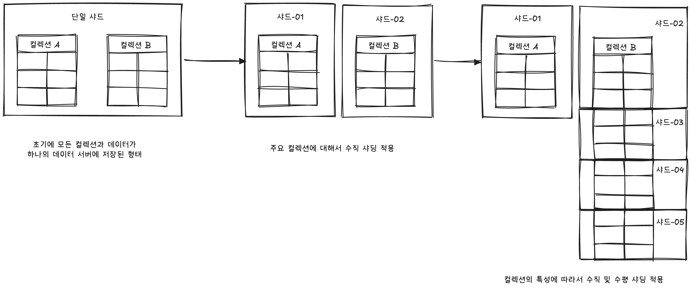
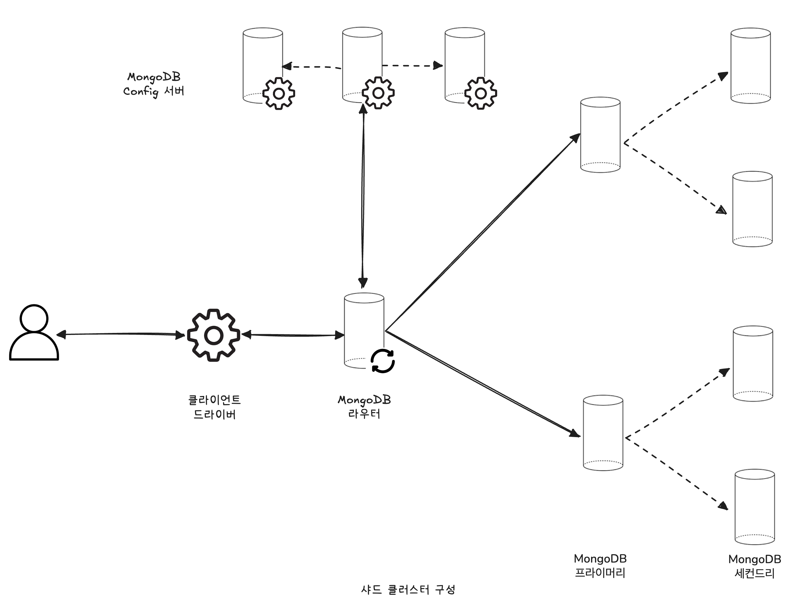
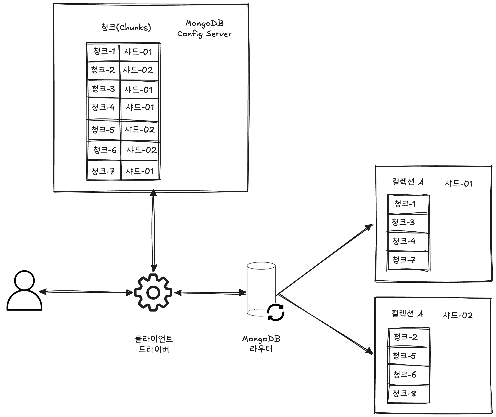
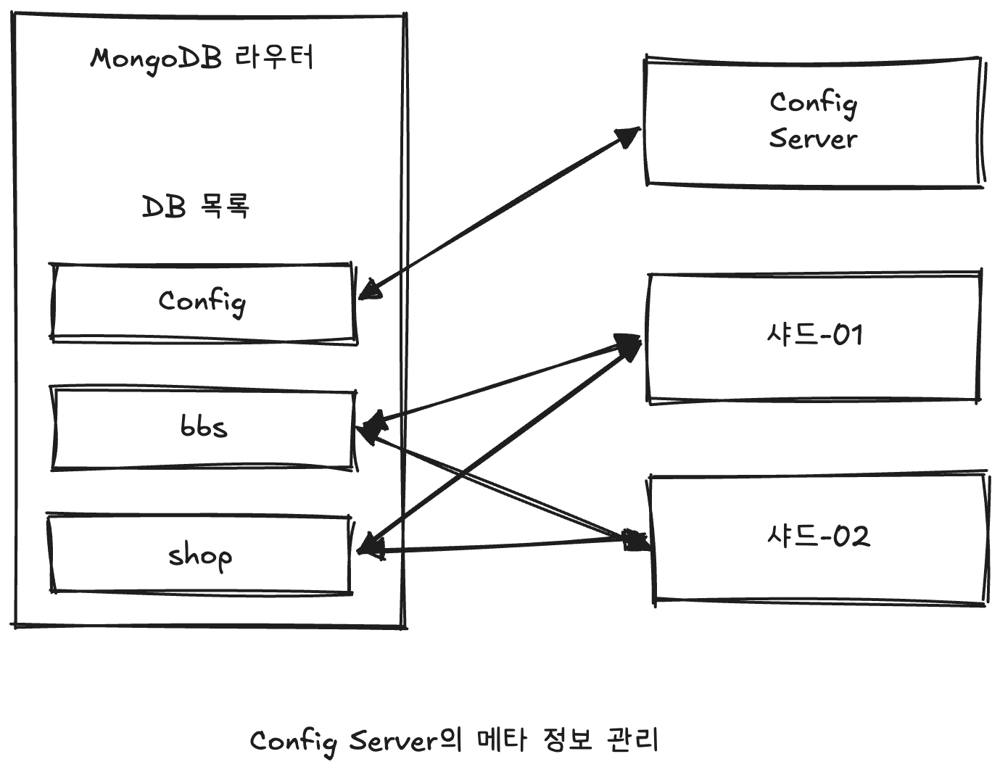
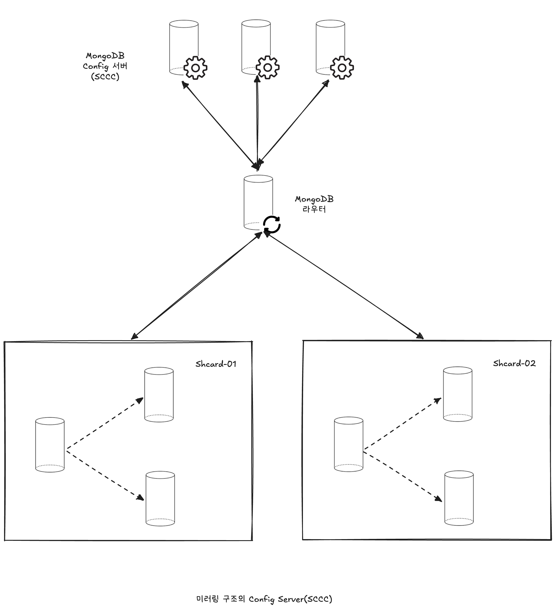
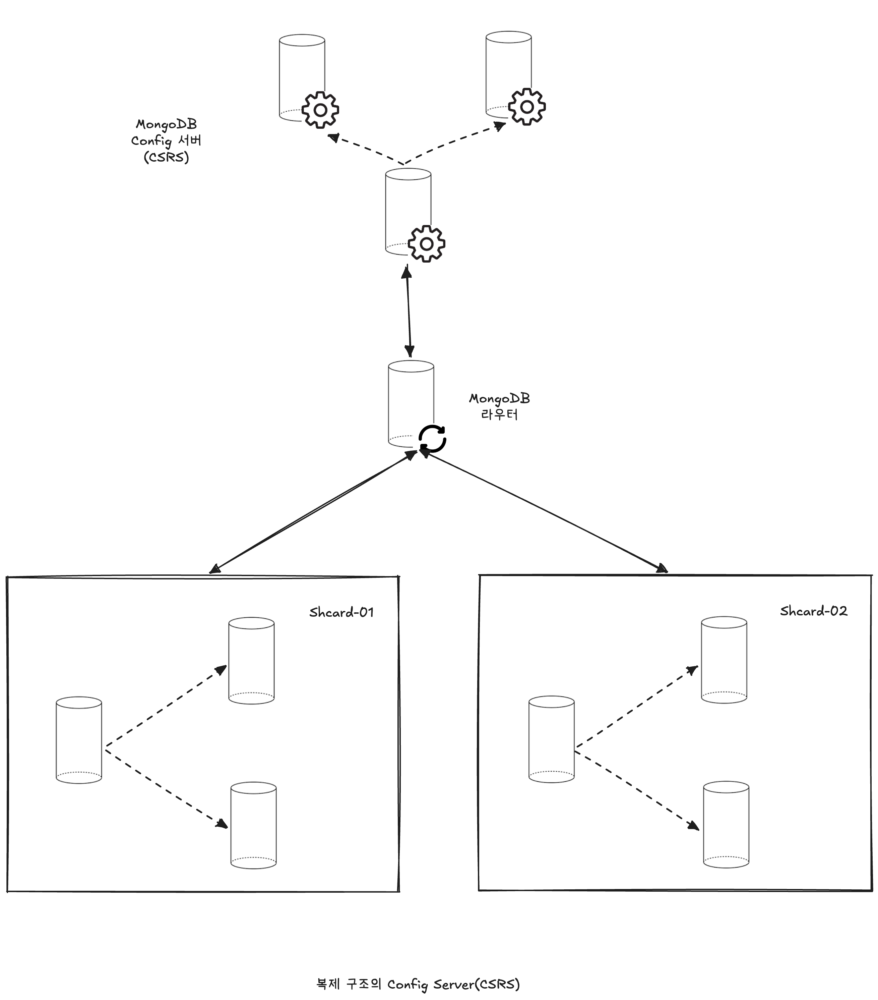
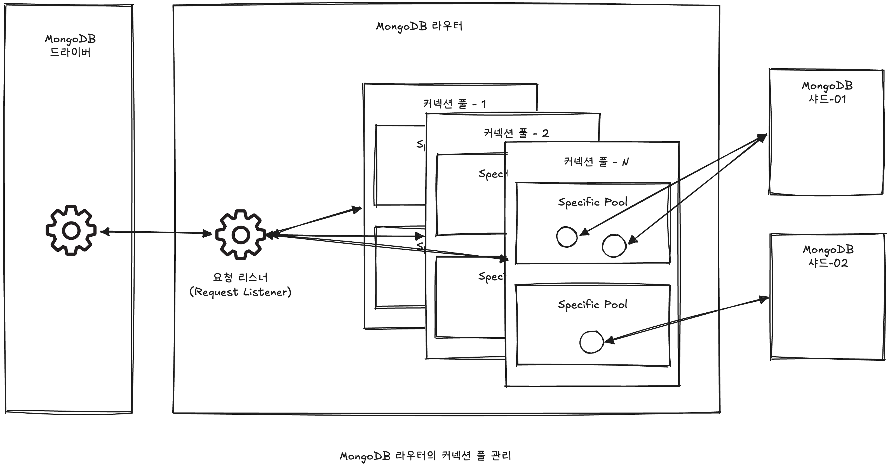

# 🧑🏻‍💻 샤딩(Sharding)
<hr>

- [✅ 샤딩의 종류](#-샤딩의-종류)
- [✅ MongoDB 샤딩 아키텍처](#-mongodb-샤딩-아키텍처)
- [✅ 샤딩으로 인한 제약](#-샤딩으로-인한-제약)

> [!NOTE]
> 샤딩이란 데이터를 여러 서버에 분산해서 저장하고 처리할 수 있도록 하는 기술을 말한다.  
> MongoDB의 복제는 고가용성을 위한 솔루션이고, 샤딩은 분산 처리를 위한 솔루션이다.  
> ➡️ MongoDB에서 고가용성과 대용량 분선 처리를 하려면 복제와 샤딩 모두 적용해야 한다.

> [!TIP]
> 스케일 아웃은 하나의 서버가 처리할 수 있는 최대 용량으로 여러 대의 서버를 활용하는 것이다.  
> 저렴한 서버를 여러 대 활용하여 각 서버가 처리할 수 있는 만큼의 사용자 요청만 전송함으로써 전체 샤드 클러스터의 처리 용량을 선형적으로 늘리는 것을 샤딩이라고 한다.  
> ❗️ 물론 이렇게 동작하도록 응용 프로그램을 개발하는 것은 상당히 번거로운 작업이며, 개발 생산성 또한 떨어지게 된다.  
> 하지만 샤딩은 더 이상 피할 수 없는 개발의 한 과정이 되어버렸다.

<br>

## ✅ 샤딩의 종류
<hr>

> [!NOTE]
> 수직 샤딩은 주로 기능별로 컬렉션을 그루핑하여 그룹별로 샤드를 할당하는 방식을 의미한다.  
> 주로 수직 샤딩 방법은 구현이 간단하며 응용 프로그램의 변화를 최소화할 수 있기 때문에 일반적으로 서비스 초기에 간단히 샤딩이 필요한 경우에 많이 사용한다.  
> 하지만 컬렉션 별로 쿼리 사용량이 같지는 않아서 이런 샤딩 방식은 샤드 간 부하의 불균형이 자주 발생한다.

> [!NOTE]
> 수평 샤딩은 하나의 컬렉션에 저장된 도큐먼트들을 영역별로 파티셔닝해서 1/N개씩 각 샤드가 나눠 가지는 방식이다.  
> 수평 샤딩은 파티셔닝의 기준이 되는 필드(컬럼) 선정이 매우 중요하며, 이 파티션 키(샤드 키)에 따라서 샤드의 부하가 균등해질 수도 있고 그렇지 않을 수도 있다.




<br>

> [IMPORTANT]
> MySQL 서버와 MongoDB는 각각의 고유의 기능을 가지고 있다.  
> 샤딩을 필요로 하지 않고 정교한 트랜잭션이나 관리가 필요한 데이터는 MySQL 서버와 같은 RDBMS를 활용하고, 아주 대용량으로 증가할 수 있는 데이터는 MongoDB와 같은 분산 처리가 지원되는 DBMS를 활용하는 것이 이상적인 형태의 데이터베이스 구성이 될 것이다.

> [!NOTE]
> 데이터베이스 단위로 Primary Shard가 각각 할당되고, 데이터베이스별로 Primary Shard는 각 샤드별로 분산돼서 배치된다.  
> MongoDB에서는 컬렉션에 대해서 샤딩을 활성화하지 않으면 자동으로 수직 샤딩이 구현되는 것이다.  
> 샤딩을 활성화하면 해당 컬렉션은 수평 샤딩이 적용된다.

<br>

## ✅ MongoDB 샤딩 아키텍처
<hr>

- [💡 샤드 클러스터(Sharded Cluster) 컴포넌트](#-샤드-클러스터sharded-cluster-컴포넌트)
- [💡 샤드 클러스터의 쿼리 수행 절차(라우터와 Config Server의 통신)](#-샤드-클러스터의-쿼리-수행-절차라우터와-config-server의-통신)
- [💡 Config Server](#-config-server)
- [💡 Config Server의 복제 방식](#-config-server의-복제-방식)
- [💡 Config Server 가용성과 쿼리 실행](#-config-server-가용성과-쿼리-실행)
- [💡 커넥션 풀 관리](#-커넥션-풀-관리)

> [!TIP]
> MongoDB 샤드 클러스터의 가장 중요한 3가지 컴포넌트
> 1. Shard Server
> 2. Config Server
> 3. 라우터(Mongos)
> 
> 하나의 샤드 클러스터에 Shard Server는 레플리카 셋 형태로 1개 이상 존재할 수 있으며, 라우터(Mongos)도 한 개 이상 존재할 수 있다.  
> 하지만 Config Server는 하나의 샤드 클러스터에 단 하나만 존재할 수 있다.

<br>

### 💡 샤드 클러스터(Sharded Cluster) 컴포넌트
<hr>

> [!NOTE]
> 샤드 클러스터의 3가지 컴포넌트 중에서 라우터(Mongos)는 영구적인 데이터를 가지지 않으며, 사용자의 쿼리 요청을 어떤 샤드로 전달할지 정하고, 각 샤드로부터 받은 쿼리 결과 데이터를 병합해서 사용자에게 되돌려주는 역할을 한다.  
> Shard Server 와 Config Server는 영구적인 데이터를 저장하는데, Shard Server는 실제 사용자의 데이터를 저장하는 반면, Config Server는 서버에 저장된 사용자 데이터가 어떻게 Split되어서 분산돼 있는지에 관한 메타 정보를 저장한다.  
> ➡️ Shard Server 와 Config Server 모두 손실될 경우 치명적인 문제가 발생할 수 있으므로 레플리카 셋으로 구축할 것을 적극적으로 권장하고 있다.



> [!IMPORTANT]
> 라우터(Mongos) 서버는 사용자의 요청을 각 샤드로 전송하고 결과를 사용자에게 전달하는 역할도 수행하지만, 각 샤드가 균등하게 데이터를 가지고 있는지 모니터링하면서 데이터의 밸런싱 작업도 담당한다.  

> [!TIP]
> Config Server와 Shard Server 모두 사실 동일하게 동작한다.  
> 똑같이 `mongod`라는 프로그램으로 실행되며, 설정이 조금씩 다른 것뿐이다.

<br>

### 💡 샤드 클러스터의 쿼리 수행 절차(라우터와 Config Server의 통신)
<hr>

> [!NOTE]
> Config Server는 샤드 클러스터에서 사용자가 생성한 데이터베이스와 컬렉션들의 목록을 관리한다.  
> 하지만 모든 데이터베이스와 컬렉션의 목록을 관리하는 것이 아니라, 샤딩이 활성화된 데이터베이스와 컬렉션의 정보만 관리한다.  
> 실제 샤드 클러스터에 데이터베이스나 컬렉션을 생성해도 샤딩이 되지 않은 객체들은 Config Server가 아니라 각 Shard Server가 로컬로 관리한다.  
> 그리고 각 컬렉션이 여러 Shard Server로 분산될 수 있게 분산하기 위한 정보를 관리하는데, 이렇게 하나의 큰 컬렉션을 여러 조각으로 파티션하고 각 조각을 여러 Shard Server에 분산해서 저장한다.  
> ➡️ 각 데이터 조각을 MongoDB에서는 청크(Chunk)라고 한다.



> [!NOTE]
> 사용자가 MongoDB 라우터로 쿼리를 요청했을 때의 과정
> 1. 사용자가 쿼리가 참조하는 컬렉션의 청크 메타 정보를 Config Server로부터 가져와서 라우터의 메모리에 캐시
> 2. 사용자 쿼리의 조건에서 샤딩 키 조건을 찾음
>    1. 쿼리 조건에 샤딩 키가 있으면 해당 샤딩 키가 포함된 청크 정보를 라우터의 캐시에서 검색하여 해당 Shard Server로부터만 사용자 쿼리를 요청  
>       샤딩 키 조건에 포함된 청크가 여러 사드에 걸쳐 있다면 대상이 되는 여러 Shard Server에 쿼리를 요청
>    2. 쿼리 조건에 샤딩 키가 없으면 모든 Shard Server로 사용자의 쿼리를 요청
> 3. 쿼리를 전송한 대상 Shard Server로부터 쿼리 결과가 도착하면 결과를 병합하여 사용자에게 쿼리 결과를 반환


> [!TIP]
> 위 과정에서 1번 과정인 Config Server로부터 청크의 메타 정보를 가져오는 과정은 라우터가 청크 메타 정보를 가지고 있지 않거나, 라우터가 가진 청크 메타 정보가 오래돼서 맞지 않을 경우에만 수행된다.  
> Config Server는 일반적으로 서버의 부하가 거의 없는 상태를 유지하도록 설계됐다.


<br>

### 💡 Config Server
<hr>



> [!TIP]
> 위 그림과 같이 Config Server는 샤딩된 클러스터를 운영하는 데 있어서 필요한 모든 정보를 저장한다.  
> 라우터(mongos)의 `config` 데이터베이스가 Shard Server가 아닌 Config Server로 접속해서 결과를 가져온다.

Config Server는 다음과 같은 컬렉션을 가지고 있다.
- databases
- collections
- chunks
- shards
- mongos
- settings
- version
- lockpings
- locks
- changelog

> [!TIP]
> Config Server가 가지는 메타 데이터는 모두 MongoDB 샤드 클러스터를 유지하는 데 필요로 하는 내부 관리 목적의 데이터이므로 사용자가 직접 변경하거나 삭제해서는 안 된다.  
> 만약 현재 Config Server의 데이터 저장이 정상적으로 처리되는지 확인하고자 한다면 다음 명령으로 테스트해볼 수 있다.  
> ```
> use config
> db.testConfigServerWirteAvil.insert( { a : 1 } )
> ```

<br>

### 💡 Config Server의 복제 방식
<hr>

> [!IMPORTANT]
> 클러스터의 메타 정보는 사용자 데이터의 일관성을 유지하기 위한 매우 중요한 정보이므로 MongoDB는 Config Server를 반드시 3대 이상으로 복제할 것을 권장하고 있다.

#### 🖋️ SCCC(Sync Cluster Connection Config)

> [!NOTE]
> 미러링 방식으로 Config Server의 데이터를 동기화하는 방식을 SCCC라고 표현한다.  
> 미러링 방식이란 서로 전혀 관계 없이 작동하는 Config Server를 각각 3대 따로 설치하고, 응용 프고르매에서 3대의 Config Server에 모두 접속하여 각 서버의 데이터를 동기화하는 방식을 말한다.  
> 여기에서 응용 프로그램은 Config Server의 클라이언트인 MongoDB 서버와 라우터(mongos)들을 의미한다.  



> [!TIP]
> 라우터 서버가 청크 정보를 변경하고자 할 때, 3개의 Config Server에 접속하여 청크 정보를 변경(UPDATE)하는 문장을 각각 실행하고, 그 작업이 모두 성공적으로 완료되면 커밋을 수행하는 분산 트랜잭션(2-Phase Commit)을 실행하는 방식으로 처리된다.  
> 하지만 이런 분산 트랜잭션 처리 방식은 Config Server의 데이터가 복잡해지고, 변경 쿼리가 복잡해질수록 구현이 어려워짐과 동시에 Config Server의 동기화 문제들을 자주 유발시키는 원인이 된다.  
> MongoDB 3.4 버전부터는 SCCC 방식의 Config Server 구성은 지원하지 않으며, CSRS 방식으로 Config Server를 구성해야 한다.

<br>

#### 🖋️ CSRS(Config Server as Replica Sets)

> [!TIP]
> 미러링 방식의 복제는 클라이언트 프로그램의 메타 데이터 쿼리나 데이터 변경 절차를 복잡하게 만들면서 문제를 유발할 가능성이 높다.  
> MongoDB 3.2부터는 Config Server도 일반 사용자 데이터를 저장하는 Shard Server처럼 레플리카 셋으로 구현할 수 있도록 개선됐다.



> [!NOTE]
> 레플리카 셋으로 Config Server를 구축할 때 필요한 조건
> - Config Server는 반드시 WiredTiger 스토리지 엔진을 사용해야 한다.
> - 레플리카 셋은 아비터를 가질 수 없다.
> - 레플리카 셋은 지연된 멤버를 가질 수 없다.
> - 최소 3개 이상의 멤버로 구성해야 한다(권장 사항).

> [!IMPORTANT]
> Client는 Config Server의 Primary Member로 접속하여 쿼리나 데이터 변경 명령을 실행하는데, 이때 Read Concern이나 Write Concern 레벨을 `majority`로 설정하여 실행하게 된다.


<br>

### 💡 Config Server 가용성과 쿼리 실행
<hr>

> [!TIP]
> 프로덕션 서비스에서 사용되는 Config Server는 최소 3대 이상을 투입하는 게 좋다.  
> 물론 1대로 Config Server를 구성할 수도 있지만, 이는 개발 및 테스트 환경에서만 사용할 것을 권장한다.  
> 
> 레플리카 셋 방식의 Config Server(CSRS)에서는 모든 메타 정보 조회 및 변경 쿼리의 Read Concern과 Write Concern을 `majority`로 설정하는데, 이는 전체 레플리카 셋 멤버의 과반수에 접근할 수 있어야만 쿼리를 수행할 수 있다는 것을 의미한다.  
> ➡️ Config Server가 2대일 때에는 멤버 중 하나만 연결되지 않아도 메타 정보 조회와 삭제를 할 수 없게 된다.

> [!NOTE]
> 모든 사용자 쿼리는 라우터(mongos)를 통해서 처리돼야 하며, 라우터 서버는 처음 기동될 때 Config Server의 메타 정보를 일괄적으로 로드해서 자신의 캐시 메모리에 적재해 둔다.  

> [!IMPORTANT]
> 샤드 클러스터에 새로운 멤버가 추가되거나 삭제될 때 그리고 컬렉션의 생성 및 삭제도 샤딩되지 않는 경우에는 실제 청크 변화를 유발하지 않아서 Config Server의 메타 데이터 변경을 필요로 하지 않는다.
> - Config Server의 데이터를 변경하는 경우
>   - 청크 마이그레이션 실행 시
>   - 청크 스플릿 실행 시
> - Config Server의 데이터를 조회하는 경우
>   - 라우터 서버가 새로 시작되는 경우(새로운 라우터 시작 또는 기존 라우터 서버 재시작)
>   - Config Server의 메타 데이터가 변경된 경우
>   - 사용자 인증 처리 시

<br>

### 💡 커넥션 풀 관리
<hr>

> [!NOTE]
> MongoDB 라우터는 MongoDB 드라이버와 MongoDB Shard Server를 중계하는 역할을 수행하므로 클라이언트와 서버 쪽의 커넥션을 모두 가지고 있어야 한다.  
> 하지만 클라이언트 쪽 커넥션이 서버 쪽 커넥션에 영향을 미치지 않고 독립적으로 커넥션이 관리되기 때문에 커넥션 풀이 유지되는 커넥션의 개수를 제어하기는 쉽지 않다.

<br>

#### 🖋️ MongoDB 클라이언트

```java
// 단일 서버 접속
ServerAddress server = new ServerAddress("single-mongodb.com", 27017);
MongoClient mongoClient = new MongoClient(server);
```

```java
// 레플리카 셋 접속

// 레플리카 셋의 시드 리스트 준비
List<ServerAddress> seedList = new ArrayList<>();
seedList.add(new ServerAddress("rs-mongodb1.com", 27017));
seedList.add(new ServerAddress("rs-mongodb2.com", 27017));

// 인증 정보 설정
List<MongoClient> credentials = new ArrayList<>();
credentials.add(MongoDredential.createScramSha1Credential(username, DEFAULT_DB, password.toCharArray()));

// 접속 옵션 설정
MongoClientOptions options = new MongoClientOptions.builder()
        .requriedReplicaSetName(ReplSetName).build();

MongoClient client = new MongoClient(seedList, credentials, options);
```

```java
// Mongo 라우터 접속

// Mongo 라우터 리스트 준비
List<ServerAddress> mongosList = new ArrayList<>();
mongosList.add(new ServerAddress("mongos1.com", 27017));
mongosList.add(new ServerAddress("mongos2.com", 27017));

// 인증 정보 설정
List<MongoClient> credentials = new ArrayList<>();
credentials.add(MongoDredential.createScramSha1Credential(username, DEFAULT_DB, password.toCharArray()));

MongoClient client = new MongoClient(mongosList, credentials, options);
```

<br>

#### 🖋️ MongoDB 라우터 - MongoDB 샤드 서버
> [!IMPORTANT]
> MongoDB 라우터는 클라이언트와의 커넥션과는 별개로 MongoDB Shard Server와의 연결을 맺는다.  
> 하지만 MongoDB Shard Server와의 커넥션과 클라이언트와의 커넥션은 직접적인 관계를 맺지는 않는다.  
> ➡️ 클라이언트와 MongoDB 라우터 간의 커넥션이 많이 생성된다고 해서, MongoDB 라우터와 MongoDB 샤드 간의 커넥션도 그만큼 생성되는 것은 아니다.  
> 실제 JAVA 드라이버 커넥션 풀의 초기 커넥션 개수를 100개로 설정해도, 실제 MongoDB 라우터와 MongoDB Shard Server의 연결은 100개까지 생성되지는 않고 10개 정도만 생성된다.



> [!NOTE]
> MongoDB 라우터는 MongoDB 클라이언트로부터 요청되는 쿼리들을 처리하기 위해서 내부적으로 `TaskExecutorPool`을 서버의 CPU 코어 개수만큼 준비한다.  
> `TaskExecutorPool`은 Thread Pool과 동일한 개념으로 이해해도 된다.  
> 그리고 `TaskExecutorPool`은 MongoDB Shard Server와의 연결 정보를 가지는 커넥션 풀을 하나씩 가지며, 커넥션 풀은 다시 서브-커넥션 풀(Sub-ConnectionPool)을 가진다.  
> 위 그림에서도 Shard Server가 2개이므로 하나의 커넥션 풀은 2개씩의 Server-Connection Pool을 가지고 있는 모습을 볼 수 있다.  
> ➡️ 이 서브-커넥션 풀을 MongoDB 소스 코드에서는 `Specific-Pool`이라고 표현한다.

> [!TIP]
> MongoDB 라우터에서 기본적으로 생성되는 `TaskExecutorPool`은 서버에 장착된 CPU 코어의 개수만큼 생성되는데, 만약 `TaskExecutorPool`의 개수를 명시적으로 제한하고 싶다면 설정 파일에서 파라미터를 추가하면 된다.  
> ```text
> ## setParameter 항목 추가
> setParameter:
>   taskExecutorPoolSize: 5
> ``` 
> 만약 다른 응용 프로그램과 같은 서버에서 MongoDB 라우터가 실행되는데 응용 프로그램이 많은 자원을 사용할 것으로 예상된다면 `TaskExecutorPool` 개수를 수동으로 조정하는 것이 도움이 될 것이다.  
> 때로는 CPU 코어가 많은 서버에서 (Hyper Threading까지 활성화되면 더 많은 CPU 코어를 가진 것으로 인식되므로) 커넥션이 과도하게 생성되면 `TaskExecutorPool`의 개수를 조정해서 커넥션의 개수를 제어할 수도 있다.

<br>

> [!CAUTION]
> 서브 커넥션 풀(SpecificPool)은 minConnections, maxConnections, hostTimeout이라는 옵션으로 커넥션 풀의 커넥션을 얼마나 보유할지 결정하는데, MongoDB 라우터의 기본값은 `minConnections = 1`이고, `hostTimeout = 5 minute`으로 설정돼있다.  
> MongoDB 라우터는 각 서브 커넥션 풀에 커넥션이 `minConnections`보다 적다 하더라도 일정 시간 동안 쿼리 요청이 없으면 서브 커넥션 풀 자체를 종료하도록 설계돼 있는데, 그 시간이 `hostTimeout`이다.  
> ➡️ MongoDB 라우터를 실행하고 `hostTimeout` 시간인 5분동안 아무런 쿼리를 실행하지 않으면 MongoDB 라우터는 MongoDB Shard Server와의 모든 연결을 끊어버린다.

<br>

> [!WARNING]
> MongoDB 라우터로 갑자기 쿼리를 전송하기 시작하면 MongoDB 샤드 서버의 커넥션이 갑작스럽게 100 ➡ 3,000으로 증가할 수 있다.  
> 그리고 시간이 지나면 1,000개 정도로 커넥션이 안정화된다.  
> 이러한 스파크는 MongoDB 라우터가 초기에 가진 커넥션이 너무 적어서 유입되는 요청을 모두 처리할 수 없기 때문에 쿼리 요청을 대기 상태로 만들고, 그때 커넥션이 새롭게 생성되면서 많은 시간이 소모되고 이로 인해서 더 많은 커넥션이 급작스러벡 만들어지는 것이다.  
> 그리고 일정 시간이 지나면서 불필요한 커넥션이 정리되면서 최종적으로 1,000개 정도의 커넥션만 남게 되는 것이다.  
> ➡️ 문제는 이렇게 커넥션이 급증하는 시점은 그만큼 사용자 쿼리의 처리가 지연되고, 클라이언트에서는 쿼리 타임아웃이나 큐 타임아웃 등의 현상이 발생할 수 있다.

<br>

> [!TIP]
> 이런 현상을 막으려면 MongoDB 라우터와 샤드 서버 간의 커넥션을 미리 준비해두는 것이 유일한 방법이다.  
> 하지만 MongoDB 드라이버에서 커넥션을 많이 생성한다고 해서 MongoDB 라우터와 MongoDB 샤드 서버 간의 커넥션이 그만큼 많이 생성되는 것이 아니다.  
> 무거운 쿼리를 많이 실행하면 라우터와 샤드 서버 간의 커넥션을 미리 많이 만들어둘 수 있는데, 이 또한 쉬운 것이 아니며, 미리 생성했더라도 `hostTimeout` 시간인 5분만 지나면 모두 끊어져 버릴 것이다.

<br>

> [!NOTE]
> 사용자가 직접 MongoDB 라우터와 샤드 서버 간의 커넥션을 제어할 수 있도록 추가된 옵션은 다음과 같다.
> - ShardingTaskExecutorPoolHostTimeoutMS
> - ShardingTaskExecutorPoolMaxSize
> - ShardingTaskExecutorPoolMinSize
> - ShardingTaskExecutorPoolRefreshRequirementMS
> - ShardingTaskExecutorPoolRefreshTimeoutMS
> 
> 네트워크가 안정적인 IDC 내에서 MongoDB 라우터는 샤드 서버를 운영하는 경우에는 `ShardingTaskExecutorPoolHostTimeoutMS` 값은 30분에서 1시간 정도가 적절한 것으로 보인다.  
> 그리고 `ShardingTaskExecutorPoolMinSize`는 서브 커넥션 풀 단위로 설정되는 값이므로 10 정도의 값도 충분히 큰 값일 것으로 보인다.  
> ➡️ 만약 CPU 코어가 24개이고 `ShardingTaskExecutorPoolMinSize`가 10인 경우 MongoDB 라우터가 가지는 커넥션은 (24 * 10 * 샤드 서버 수)만큼이 될 것이다.

<br>

## ✅ 샤딩으로 인한 제약
<hr>

- [💡 트랜잭션](#-트랜잭션)
- [💡 샤딩과 유니크 인덱스](#-샤딩과-유니크-인덱스)
- [💡 조인과 그래프 쿼리](#-조인과-그래프-쿼리)
- [💡 기존 컬렉션에 샤딩 적용](#-기존-컬렉션에-샤딩-적용)

### 💡 트랜잭션
<hr>

> [!NOTE]
> 일반적으로 트랜잭션 속성으로 ACID(Atomicity, Consistency, Isolation, Durability)를 주로 언급한다.  
> 실제 트랜잭션 지원을 언급할 때는 하나의 쿼리로 구성되든지 여러 개의 쿼리로 구성되든지 모두를 포함해야 한다.  
> ➡️ MongoDB에서 트랜잭션을 지원하지 않는다는 것은 여러 개의 쿼리문으로 구성된 트랜잭션을 지원하지 않는다는 의미다.

```mysql
BEGIN;
UPDATE users SET user_name='Matt' WHERE user_id=1;
COMMIT;

BEGIN;
INSERT INTO comments (article_id, comment_id, ...) VALUES (1, 10, ...);
UPDATE article SET comment_count=comment_count+1 WHERE article_id=1;
COMMIT;
```

> [!IMPORTANT]
> MongoDB에서 단일 도큐먼트(단일 문장이 아니라 단일 도큐먼트라는 것 주의)에 대한 변경은 모두 트랜잭션을 지원한다.  
> 물론 데이터 변경을 의도적으로 롤백하는 방법은 없지만, 성공 또는 실패 둘 중 하나로 결정된다는 것이다.  
> ➡ 즉 MongoDB의 단일 도큐먼트 변경은 원자성을 가지고 처리된다.  
> 하지만 여러 도큐먼트를 변경하는 작업은 원자성을 가지지 않는다.

<br>

### 💡 샤딩과 유니크 인덱스
<hr>

> [!NOTE]
> MongoDB에서 데이터가 샤딩되면 샤딩된 데이터 간의 유니크 인덱스 생성은 제약을 가지게 된다.  
> 샤딩된 컬렉션에서 유니크 인덱스는 샤드 키를 포함하는 인덱스에 대해서만 적용할 수 있다.  
> MongoDB의 Primary Key는 샤딩과 무관하게 항상 유니크해야 하며, Secondary Key 중에서도 유니크 옵션이 설정되는 경우에는 Primary Key와 동일하게 중복을 허용하지 않도록 처리돼야 한다.  
> Primary Key 외에 유니크한 Key를 설정하려면 다른 샤드도 전체를 뒤져야하는데 그러면 성능상 샤딩의 이점이 없어지게 되기 때문이다.


<br>

> [!TIP]
> 실제 유니크 인덱스나 Primary Key의 중복 체크 기능은 샤드 단위로만 체크하고, MongoDB 서버가 전체 샤드에 대해서 체크를 수행하지는 않는다.  

#### 🖋️ Primary Key의 중복 체크 처리

> [!NOTE]
> 아래와 같이 `user_name` 필드로 샤딩된 컬렉션에 동일한 Primary Key(_id) 값을 가지는 여러 개의 도큐먼트를 저장해 보면, 동일 샤드에 저장된 경우에는 중복 에러가 발생하지만, 동일 샤드가 아닌 경우에는 아무런 문제 없이 INSERT되는 것을 확인할 수 있다.

```shell
mongos> db.runCommand({
  shardCollection: "mysns.users",
  key: {user_name: "hashed"},
  unique: false,
  numInitialChunks: 2
});

mongos> db.users.insert({_id: 1, user_name: "matt1"});
mongos> db.users.insert({_id: 1, user_name: "matt2"});
mongos> db.users.insert({_id: 1, user_name: "matt3"});
mongos> db.users.insert({_id: 1, user_name: "matt4"});

# 각 도큐먼트가 어느 샤드에 저장됐는지 확인
mongos> db.users.find({user_name: "matt1"}).explain()

# 컬렉션의 청크 분포 확인
mongos> db.adminCommand({getShardDistribution: "mysns.users"})
```

> [!IMPORTANT]
> Primary Key 값에 자동으로 생성되는 ObjectId 값을 사용하지 않고, 응용 프로그램에서 사용자가 직접 값을 설정하는 경우에는 반드시 Primary Key 값의 중복 발생 여부를 사용자가 검증해야 한다.

<br>

#### 🖋️ Secondary Key의 중복 체크 처리
<hr>

우선 다음과 같이 해시 알고리즘과 레인지 알고리즘을 이용해서 샤딩된 users와 articles 컬렉션을 생각해보자.

|컬렉션|샤딩 알고리즘(샤드 키)|
|---|---|
|users|HASH(user_id)|
|articles|RANGE(user_id, article_id)|

> [!NOTE]
> users 컬렉션은 user_id로 샤딩됐기 때문에 user_id 필드로 시작하는 복합 인덱스에 대해서만 유니크 옵션을 설정할 수 있다.  
> 이때 user_id 필드가 인덱스를 구성하는 필드의 중간이나 마지막에 있다면 유니크 인덱스 생성이 불가능하며, 반드시 user_id로 시작하는 복합 인덱스만 유니크 옵션을 설정할 수 있다.

> [!TIP]
> MongoDB의 해시 인덱스는 유니크 옵션을 설정할 수 없다.  
> 그래서 해시 샤딩을 적용한 users 컬렉션에서 user_id로만 유니크 옵션을 설정하려면 다음과 같이 해시 인덱스 이외에 별도로 B-Tree 인덱스를 생성해서 유니크 옵션을 설정해야 한다.

```shell
## 샤드 키 인덱스 생성
mongos> db.users.createIndex({user_id: "hashed"});

## 유니크 인덱스 생성
# 1이면 B-Tree의 오름차순, -1이면 B-Tree의 내림차순
mongos> db.users.createIndex({user_id: 1}, {unique: true});
```

<br>

> [!TIP]
> articles 컬렉션의 샤드 키는 user_id 필드와 article_id 필드로 구성된 B-Tree 인덱스이다.  
> 이 경우는 해시 인덱스가 아니므로 샤드 키 자체에 대해서 유니크 인덱스를 설정할 수 있다.

```shell
## 샤드 키 인덱스 생성
mongos> db.articles.createIndex({user_id: 1, article_id: 1}, {unique:true});

## 유니크 인덱스 생성
mongos> db.articles.createIndex({user_id:1, article_id: 1, created_at: 1}, {unique: true});
```

<br>

### 💡 조인과 그래프 쿼리
<hr>

> [!TIP]
> MongoDB에서도 여러 컬렉션의 데이터를 조인해서 쿼리할 수 있도록 `$lookup` 오퍼레이션을 제공하고 있으며, 계층형 재귀 쿼리나 그래프 데이터를 쿼리할 수 있도록 `$graphLookup` 오퍼레이션을 지원하고 있다.

```shell
## 조인 쿼리
mongos> db.orders.aggregate([
  {
    $lookup:
      {
        from: "inventory",
        localField: "item",
        foreignField: "sku",
        as: "inventory_docs"
      }
  }
])

## 계층형 재귀 쿼리
mongos> db.employees.aggregate( [
  {
    $graphLookup: {
      from: "employees",
      startWith: "$reportsTo",
      connectFromField: "reportsTo",
      connectToField: "name",
      as: "reportingHierarchy"
    }
  }
])
```

> [!NOTE]
> 계층형 재귀 쿼리와 조인 쿼리 모두 하나 이상의 컬렉션을 대상으로 실행되는데, 결국 계층형 재귀 쿼리는 조인 쿼리의 또 다른 형태로 볼 수 있다.  
> 이때 재귀 쿼리와 조인 쿼리 모두 시작 컬렉션은 Aggregation 대상 컬렉션이며, 룩업 컬렉션(Lookup, 조인 대상 컬렉션)은 Aggregation의 `from` 인자로 명시한다.  
> 이때 `$lookUp`과 `$graphLookup` 오퍼레이션 모두 `from` 인자에 주어지는 컬렉션은 샤딩된 컬렉션은 사용할 수 없다.  
> 이는 `$lookUp`과 `$graphLookup` 스테이지는 MongoDB 라우터가 아니라 MongoDB 샤드 서버에서 실행되는데, MongoDB 샤드 서버는 데이터 처리를 위해서 다른 샤드의 데이터를 참조할 수 없기 때문이다.

<br>

### 💡 기존 컬렉션에 샤딩 적용
<hr>

> [!NOTE]
> 샤딩되지 않은 상태로 데이터를 가지고 있는 컬렉션을 샤딩할 때에는 샤딩을 적용할 수 있는 컬렉션의 사이즈에 제한이 있다.  
> 샤딩되지 않은 컬렉션에 대해서 샤딩을 적용하면 MongoDB는 우선 그 컬렉션에 대해서 청크 스플릿을 실행한다.  
> 청크 스플릿을 위해서 `splitVector` 명령(MongoDB 클러스터 내부적으로 실행되는 명령이다)을 실행하는데, 이때 실행되는 `splitVector` 명령이 반환할 수 있는 결과는 하나의 BSON 도큐먼트로 반환된다.  
> 문제는 `splicVector` 명령의 결과가 BSON 도큐먼트이기 때문에 이 결과는 16MB를 초과(BSON 도큐먼트의 제한 사항)할 수 없다.


<br>

**참고 자료**  
[대용량 데이터 처리를 위한 Real MongoDB](https://product.kyobobook.co.kr/detail/S000001766322)