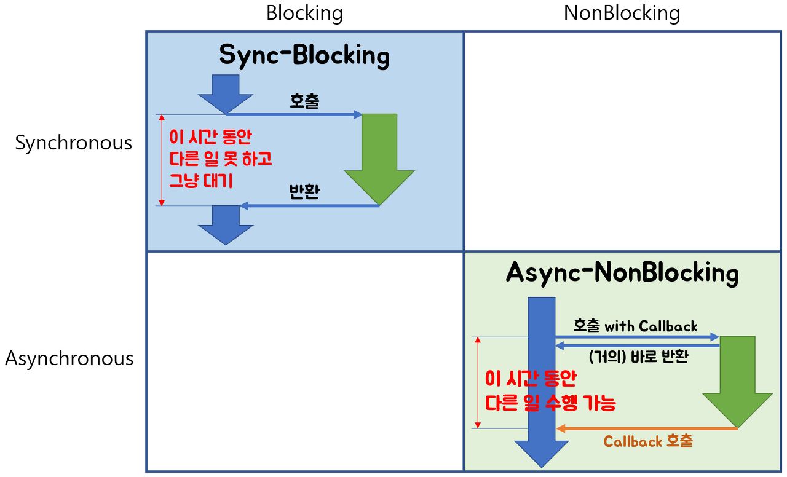
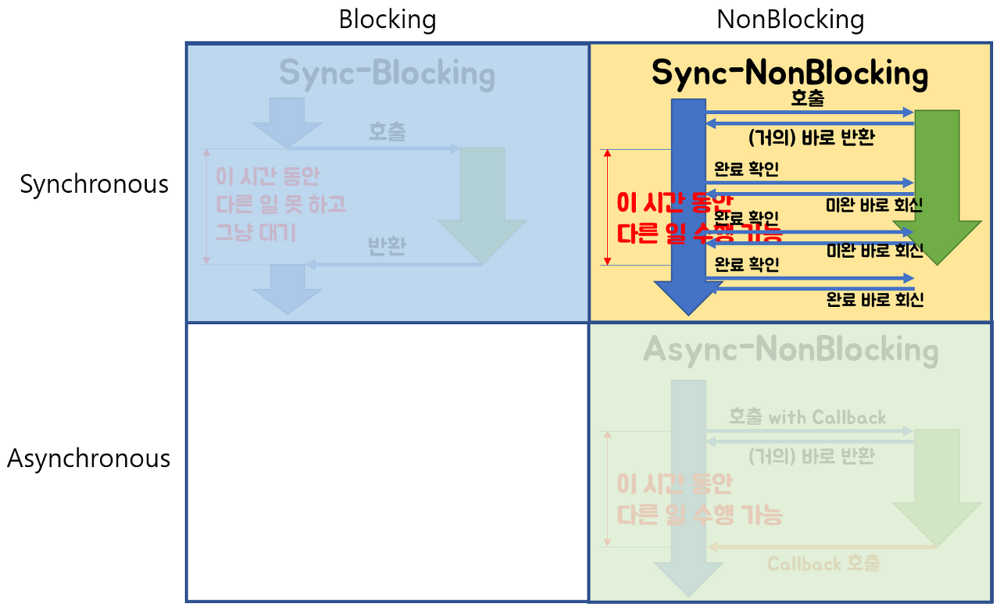
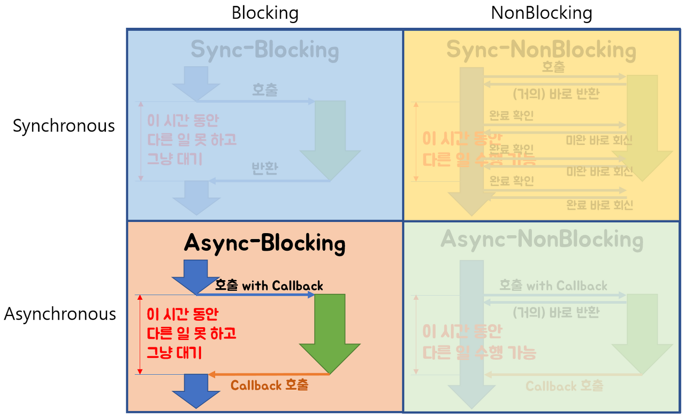

## Blocking
자신의 작업을 진행하다가 다른 주체의 작업이 시작되면 다른 작업이 끝날 때까지 기다렸다가 자신의 작업을 시작하는 것

### Non-Blocking
다른 주체의 작업에 관련없이 자신의 작업을 하는 것

> 블로킹과 논블로킹은 함수 호출 시 제어권과 관련된 개념입니다. 블로킹은 함수가 호출되면 해당 함수의 작업이 끝날 때까지 제어권을 유지하고, 논블로킹은 함수가 호출되면 즉시 제어권을 반환합니다.

### Synchronous
동기라는 뜻으로, 작업을 동시에 수행하거나, 동시에 끝나거나, 끝나는 동시에 시작함을 의미

### Asynchronous
비동기로, 시작 종료가 일치하지 않으며, 끝나는 동시에 시작을 하지 않음을 의미

> 동기와 비동기는 함수 호출과 결과 처리의 관점에서의 차이입니다. 동기는 함수 호출과 결과 처리가 순차적으로 이뤄지며, 비동기는 함수 호출 후 결과 처리를 함수 스스로 처리하거나, 콜백 함수 등을 통해 나중에 처리합니다.

 

Blocking/Non-blocking과 Sync/Async는 서로 다른 개념이며, 이 둘은 함수 호출과 작업 처리 방식에 대한 '관점'의 차이를 나타냅니다.  
이렇게 분리해서 이해하면 각 용어가 지닌 의미와 프로그래밍에서의 적용 방법을 더 명확하게 파악할 수 있습니다.  

1. Sync-Blocking 모델 (동기-블로킹)
   - 전통적인 호출 방식으로, 함수 호출 후 해당 함수의 작업이 완료될 때까지 대기합니다.
   - 호출된 함수의 작업이 끝나야만 호출한 함수가 계속해서 수행됩니다.
   - 대기하는 동안 다른 작업을 수행할 수 없으므로 효율성이 낮을 수 있습니다.
2. Async-Nonblocking 모델 (비동기-논블로킹)
   - 함수 호출 후 바로 다른 작업을 수행할 수 있으며, 호출된 함수의 작업 종료는 해당 함수가 스스로 처리합니다.
   - 호출한 함수는 호출된 함수의 작업 완료를 기다리지 않고 별도의 작업을 진행할 수 있어 효율적입니다.

3. Sync-Nonblocking 모델 (동기-논블로킹)
   - 함수 호출 후 다른 작업을 수행할 수 있지만, 호출된 함수의 결과 처리는 호출한 함수가 담당합니다.
   - 주기적으로 호출된 함수의 완료 여부를 확인해야 할 수 있으며, 결과를 필요로 하지만 호출된 함수의 완료를 기다리지 않고 다른 작업을 수행할 수 있는 유연성을 제공한다.
   - Non-blocking : A 함수가 B 함수를 호출 한 뒤, B 함수가 A 함수에게 제어권을 바로 돌려준다.
   - Synchronous : A 함수가 B 함수를 호출 할 때, B 함수의 결과를 A 함수가 처리하는 것.

4. Async-Blocking 모델 (비동기-블로킹)
   - 일반적으로 비효율적으로 간주되는 방식으로, 함수 호출 후 해당 함수의 작업이 완료될 때까지 대기한다.
   - 호출된 함수가 작업을 수행하는 동안 호출한 함수는 대기하며, 호출된 함수의 결과 처리도 해당 함수가 스스로 한다.
   - 특정 상황에서만 사용되며, 일반적인 경우에는 권장되지 않는다.

 

**참고 출처**  
[Blocking_NonBlocking_Asyn_Syn 정리](https://github.com/cs-study-2023/archive/blob/main/network/Blocking_NonBlocking_Asyn_Syn_jaehwa.md)