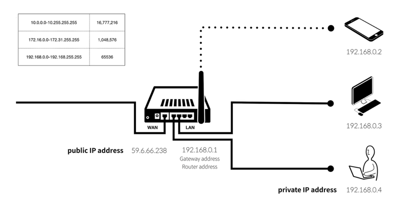
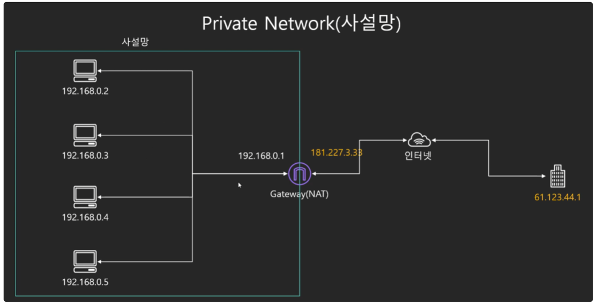

# 🧑🏻‍💻 IP 기초
- [IP 종류](#-ip-종류)
  - [IPv4 (구)](#-ipv4-구)
  - [IPv6 (최신)](#-ipv6-최신)
- [IP 주소의 고갈 위험](#-ip-주소의-고갈-위험)
  - [고정 IP](#-고정-ip)
  - [유동 IP](#-유동-ip)
  - [공인 IP](#-공인-ip)
  - [사설 IP](#-사설-ip)
  - [사설 IP & 사설망 원리](#-사설-ip--사설망-원리)
  - [NAT (사설망 ↔ 외부 통신 방법)](#-nat-사설망--외부-통신-방법)

## ❗️ IP 종류
IP(Internet Protocol)이란, 인터넷에 연결되어 있는 모든 장치들(컴퓨터, 서버 장비, 스마트폰 등)을 식별할 수 있도록 각각의 장비에게 부여되는 고유 주소이다.  
네트워크 데이터가 우리에게 도달해 홈페이지를 띄우기 위해 정확한 주소 정보가 필요한데, 그것이 흔히 말하는 인터넷 주소 IP이다.  
IP 주소는 IPv4, IPv6 2가지 종류가 있는데, 일반적으로 IP 주소라 하면 IPv4 주소를 말한다고 보면 된다.

### ✅ IPv4 (구)
IPv4는 IP version 4의 약자로 전 세계적으로 사용된 첫 번째 인터넷 프로토콜이다.  
IP는 일반적으로 `172.16.254.1`와 같이 마침표로 구분된 4개의 숫자가 있는, 점으로 분리된 10진수 형식으로 표시된다.  
이를 2진법으로 표현한다면, 32비트 숫자 `10101100.00010000.11111110.00000001`이 된다.  

즉, IP는 32비트로 이루어진 주소이며, 약 43억(2^32)개의 주소를 가지게 된다.  
그러나 전세계적으로 인터넷 사용자 수가 급증하면서 IPv4 주소가 고갈될 위기에 처해있다.  
이러한 고갈 문제를 해결하기 위해 등장한 주소가 바로 IPv6이다.

<br>

### ✅ IPv6 (최신)

```text
IPv4가 가지고 있는 주소 고갈, 보안성, 이동성 지원 등의 문제점을 해결하기 위해서 개발된 128bit 주소체계를 갖는 차세대 인터넷 프로토콜  
2^128개의 주소를 갖고 있어 거의 무한대로 사용할 수 있고,  
네트워크 속도, 보안적인 부분뿐 아니라 여러 면에서 뛰어나지만, 기존의 주소 체계를 변경하는 데 비용이 많이 들어서 아직 완전히 상용화가 되진 못했다.
```

#### ❗️ 특징
- IP 주소의 확장
  - IPv4의 기존 32비트 주소 공간에서 벗어나, IPv6는 128비트 주소 공간을 제공한다.
- 이동성
  - IPv6 호스트는 네트워크의 물리적 위치에 제한받지 않고 같은 주소를 유지하면서도 자유롭게 이동가능
- 인증 및 보안 기능
  - 패킷 출처 인증과 데이터 무결성 및 비밀 보장 기능을 IP 프로토콜 체계에 반영
  - IPSec 기능적용 및 IPv4보다 보안성 강화
- 개선된 QoS 지원
  - 흐름 레이블(Flow Label) 개념을 도입. 특정 트래픽은 별도의 특별한 처리(실시간 통신 등)를 통해 높은 품질의 서비스를 제공
- Plug & Play 지원
  - IPv6 호스트는 IPv6 네트워크에 접속하는 순간 자동으로 네트워크 주소를 부여받음
  - 멀티미디어의 실시간처리가 가능
- Ad-hoc 네트워크 지원
  - Ad-hoc 네트워크를 위한 자동 네트워킹 및 인터넷 연결 지원
  - 자동으로 네트워크 환경 구성이 가능
- 단순 헤더 적용
  - IP 패킷의 처리를 신속하게 할 수 있도록 고정 크기의 단순 헤더를 사용하는 동시에, 확장 헤더를 통해 기능에 대한 확장 및 옵션 기능의 사용이 용이한 구조
- 실시간 패킷 추적 가능
  - 흐름 레이블(Flow Label)을 사용하여 패킷의 흐름을 실시간 제공

<br>

## ❗️ IP 주소의 고갈 위험
결론적으로 말하면 이미 43억개의 숫자는 고갈난지 오래이다.  
따라서 새로운 주소체계인 IPv6가 나왔지만, 기존의 주소체계를 변경하는데 천문학적인 비용이 들어서 아직까지도 IPv4를 사용하고 있는 실정이다.  

하지만 고갈되었다는 것 치고는 부족한 IP 할당 때문에 난리치는 곳을 찾아볼 수가 없다.  
지금까지 문제 없이 사용하고 있는 이유는 기존의 주소체계에서 일종의 수학적인 트릭을 고안해서 사용하고 있기 때문이다.  
그 트릭 중 하나가 바로 사설 IP 개념이다.

<br>

먼저 사설 IP를 알기 전에 IP는 4가지로 나뉘어 쓰이는데, 이 부분부터 알고 가자.
- [고정 IP](#-고정-ip)
- [유동 IP](#-유동-ip)
- [공인 IP](#-공인-ip)
- [사설 IP](#-사설-ip)

### ✅ 고정 IP
고정 IP는 말 그대로 변하지 않고 컴퓨터에 고정적으로 부여된 IP다.  
한 번 부여되면 IP 반납을 하기 전까지는 다른 장비에 부여할 수 없는 고유의 IP로 보안성이 우수하기 때문에 보안이 필요한 업체나 기관에서 사용한다.

### ✅ 유동 IP
유동 IP 역시 말 그대로 변하는 IP이다.  
인터넷 사용자 모두에게 고정 IP를 부여해주기는 힘들기 때문에, 일정한 주기 또는 사용자들이 인터넷에 접속하는 매 순간마다 사용하고 있지 않은 IP 주소를 임시로 발급해주는 IP이다.  
대부분의 사용자는 유동 IP를 사용한다.

### ✅ 공인 IP
IP 주소는 임의로 우리가 부여하는 것이 아니라 전세계적으로 ICANN이라는 기관이 국가별로 사용할 IP 대역을 관리하고, 우리나라는 한국인터넷진흥원(KISA)에서 국내 IP 주소들을 관리하고 있다.  
이것을 ISP(Internet Service Provider의 약자. KT, LG, SKT와 같이 인터넷을 제공하는 통신업체)가 부여받고, 우리는 위 회사에 가입을 통해 IP를 제공받아 인터넷을 사용하게 되는 것이다.  
이렇게 발급받은 IP를 공인 IP라고 한다.  

### ✅ 사설 IP
공유기를 사용한 인터넷 접속 환경일 경우 공유기까지는 공인 IP 할당을 하지만, 공유기에 연결되어 있는 가정이나 회사의 각 네트워크 기기에는 사설 IP를 할당한다.  

즉, 사설 IP는 어떤 네트워크 안에서만 내부적으로 사용되는 고유한 주소이다.  
사설 IP는 보통 내 컴퓨터에서 사용하는 로컬 IP라고도 불린다.

공인 IP는 전세계에서 유일하지만, 사설 IP는 하나의 네트워크 안에서 유일하다.  
공인 IP는 외부, 내부 상관 없이 해당 IP에 접속할 수 있으나, 사설 IP는 내부에서만 접근이 가능하다.

|분류|설명|
|---|---|
|loopback(127.0.0.1)|loopback은 호스트에 할당된 IP를 의미 <br>즉, 내가 갖고 있는 노트북에서 localhost 또는 127.0.0.1로 서버를 띄울 경우 서버를 띄운 노트북에서만 접속이 가능|
|공인 IP|공인 IP의 경우에는 어디서나 접속이 가능|
|10.X.X.X<br>192.168.0.X(사설 IP)|사설 IP의 경우에는 같은 대역의 사설 IP를 할당받은 모든 기기에서 접속이 가능.<br>단, 같은 대역의 사설 IP에 붙어있지 않은 경우(쉽게 말해서, 같은 와이파이에 붙어있지 않는 경우)에는 접속이 불가능|



<br>

### ✅ 사설 IP & 사설망 원리
사설망이란, 공유기를 사용한 인터넷 접속 환경일 경우 공유기까지는 공인 IP 할당을 하지만, 공유기에 연결되어있는 가정이나 회사의 각 네트워크 기기에는 사설 IP를 할당하여 그룹으로 묶는 방법이다.

> 게이트웨이는 '관문'이나 '출입구'라는 의미로 다양한 분야에서 일반적으로 사용되는 용어이다.  
> 컴퓨터 네트워크에서의 게이트웨이는 현재 사용자가 위치한 네트워크에서 다른 네트워크로 이동하기 위해 반드시 거쳐야하는 거점을 의미한다.

사설망(Private Network)는 지정된 대역의 IP만 사용이 가능하다.  
리눅스하면서 한 번쯤 봤던 10.0.0.0 번대의 IP와, 톰캣이나 아파치 서버를 설치하면서 한 번쯤 봤던 192.168.0.0 번대의 IP가 바로 사설 IP를 일컫는다.  
앞으로 아래의 표에 나타난 숫자의 IP가 있으면 그 IP는 어느 특정 국가의 지역을 나타내는 인터넷 주소가 아닌 사설 인터넷 주소라고 생각하면 된다.  

|이름|IP address range|         IP 개수         |서브넷 마스크|
|:---:|:---:|:---------------------:|:---:|
|24-bit block|10.0.0.0~10.255.255.255|   16,777,216(2^24)    |(255.0.0.0)|
|20-bit block|172.16.0.0~172.31.255.255| 1,048,576(2^4 * 2^16) |(255.240.0.0)|
|16-bit block|192.168.0.0~192.168.255.255|65,536(2^16|(255.255.0.0)|

<br>


  
사설 IP(로컬 IP)는 어떤 네트워크 안에서 내부적으로 사용되는 고유한 주소이다.  
➡ 성균관대학교에서 사용하는 192.168.10.2 IP와 동국대학교에서 사용하는 192.168.10.2 IPㅁ는 번호는 같을지언정 전혀 다른 목적지 주소를 나타내게 된다.  
같은 번호 IP를 구분하는 수단은 외부에서 할당받은 전세계에서 유일한 공인 IP(181.227.3.33)로 구분한다.  

이처럼 사설망이라는 개념을 쓰면 같은 IP 번호를 중복해서 마구 사용할 수 있고, 이는 곧 IP의 절약과 연관된다.

<br>

### ✅ NAT (사설망 ↔ 외부 통신 방법)
그러면 사설망 안에 있는 컴퓨터는 어떻게 외부와 통신할까?  
여기서 바로 NAT(Network Address Translation)이라는 개념이 등장한다.  
인터넷 주소 번역 기능이다.  

  

인터넷 주소 번역 원리는 간단하다.
1. 공유기(라우터)에 연결되어 있는 각 사내 컴퓨터들의 사설 IP(192.168.0.XXX)를 받아와 유일한 공인 IP로 변환한다.
2. 외부 인터넷으로 공인 IP 주소 정보를 보낸다.

외부 입장에서는 어느 회사의 영업부 사원이 보냈는지 알 수 없다.  
그냥 회사 공유기 주소만 알고 있는 것이다.  
인터넷 정보가 다시 회사 공유기로 오면, 공유기에서는 이전에 요청한 정보들을 다 기억하고 있기 때문에, 확인하고 그대로 요청한 사원 PC로 응답을 넘겨준다.


<br>


**참고 자료**  
[IP 기초 (사설IP / 공인IP / NAT) 개념 정말 쉽게 정리](https://inpa.tistory.com/entry/WEB-%F0%9F%8C%90-IP-%EA%B8%B0%EC%B4%88-%EC%82%AC%EC%84%A4IP-%EA%B3%B5%EC%9D%B8IP-NAT-%EA%B0%9C%EB%85%90-%EC%A0%95%EB%A7%90-%EC%89%BD%EA%B2%8C-%EC%A0%95%EB%A6%AC)