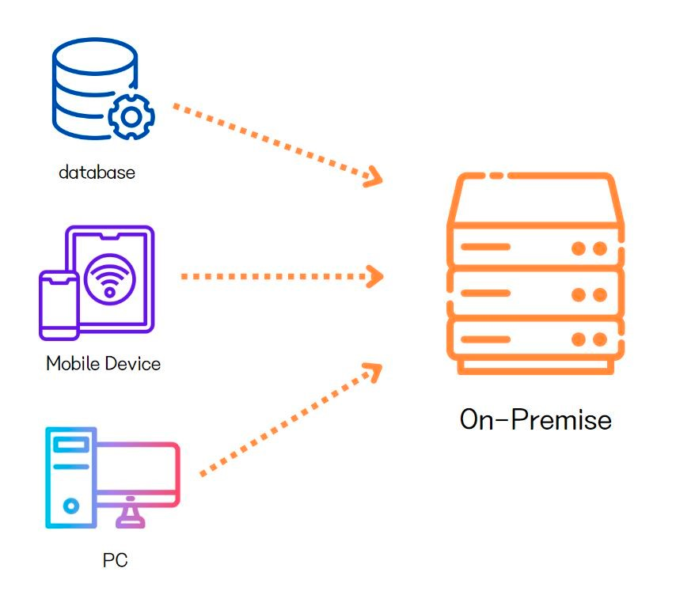

# 💡 온프레미스(On-Premise)

- 외부 인터넷망이 차단된 상태에서 인트라넷 망만을 활용하여 개발환경을 구축하는 방식
- 데이터와 정보의 외부 유출이 민감할 경우 해당 장비를 자체 구매하고 특정 공간에 개발환경을 구축하는 환경
- 클라우드 컴퓨팅 기술이 일반화되기 전까지 많은 기업들이 인프라 구축의 기본적인 방식으로 사용해왔다.
- 온프레미스 방식과 아마존, 구글, 마이크로소프트 등 클라우드 공급 서비스를 하는 회사들의 서비스를 임대하여 개발환경을 구축하는 방식을 혼용한 하이브리드 방식도 있다.
  - 보안이 중요한 서비스와 데이터의 경우 온프레미스 방식으로 한다.
  - 비교적 보안이 덜 중요한 영역은 클라우드 환경으로 IT 인프라를 구축하는 형태를 취한다.

## 🤔 온프레미스 vs 클라우드
1. 초기 투자 비용
   - 클라우드
     - 초기 투자 비용이 거의 발생하지 않는다.
     - 인터넷이 연결된 어디에서든 쉽게 사용할 수 있다.
     - 인프라 시스템을 안정화하기 위한 시간도 필요하지 않다.
   - 온프레미스
     - 인프라에 필요한 하드웨어와 애플리케이션 구매를 해야한다.
     - 물리적인 공간과 구축하고 운영할 인력을 준비해야 한다.
     - 따라서 초기에 많은 비용이 소모된다.
2. 보안
   - 온프레미스
     - 물리적으로 별도의 서버를 회사 내에 구축하고 있기 때문에 안정적이다.
   - 클라우드
     - 해킹 등으로 인해 데이터 유출 등의 보안 이슈가 발생할 수 있다.
     - 특히 다양한 클라우드 서비스를 이용하는 멀티 클라우드의 경우 더욱 더 보안에 취악하다.
       - 서비스별로 다른 보안 도구를 요구하기 때문이다.
3. 유지보수 비용
   - 클라우드
     - 초기 투자 비용이 높지 않아 경제적으로 시작할 수 있지만 장기적으로는 추가적인 비용 상승과 높은 유지비용이 발생할 수 있다.
   - 온프레미스
     - 초기 인프라 구축에는 많은 비용이 필요하지만 이후에는 추가적인 유지보수 비용이 높지 않다.
     - 따라서 장기적인 관점에서 기업에게 비용적으로 효율적일 수 있다.
4. 인프라 운영관리
   - 온프레미스
     - IT 인프라를 운영하기 위한 인력과 관리비용을 기업에서 지불해야 한다.
   - 클라우드
     - IT 인프라 운영을 직접하지 않기 때문에 인프라 운영에 대한 부담이 크게 발생하지 않는다.

출처  
[온프레미스 VS 클라우드 차이점과 앞으로의 발전방향은?](https://boardmix.com/kr/reviews/on-premises-vs-cloud/)