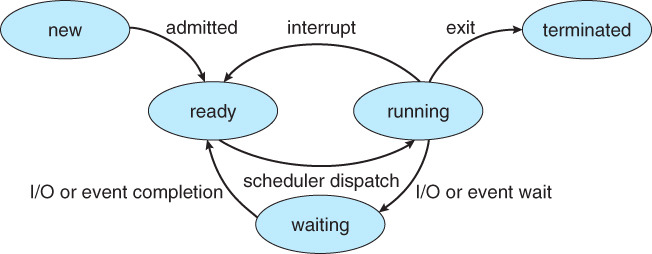
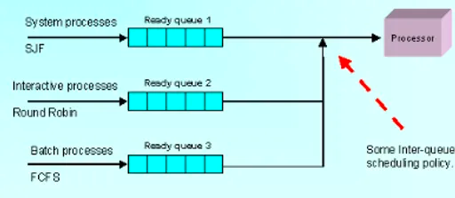
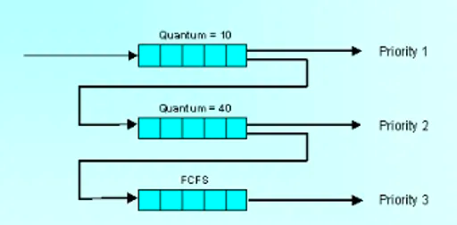

# 🔥 CPU 스케줄링
### 🤔 CPU 스케줄링이 발생하는 상황
1. 실행 상태에 있던 프로세스가 I/O 요청 등에 의해 Block 상태가 되는 경우
2. 실행 상태에 있던 프로세스가 타이머 인터럽트 발생에 의해 준비 상태로 되는 경우
3. I/O 요청으로 Block 상태에 있던 프로세스의 I/O 작업이 완료되어 인터럽트가 발생하고, 그 결과 이 프로세스의 상태가 준비 상태로 바뀌는 경우
4. CPU에서 실행 상태에 있는 프로세스가 종료되는 경우

### 💡 프로세스의 생명주기

- 생성(Create): 프로세스 생성
- 실행(Running): 프로세스가 프로세서를 차지하여 명령어들을 수행
- 준비(Ready): 프로세스가 프로세서를 사용하고 있지는 않지만 언제든 사용할 수 있는 상태로, CPU가 할당되기를 기다리는 중
- 대기(Waiting): 프로세스가 입출력 완료, 시그널 수신 등 어떤 사건을 기다리고 있는 상태
- 종료(Terminated): 프로세스 종료

## ⭐️ 스케줄링 알고리즘
- 선점형 스케줄러(Preemptive Scheduling): 하나의 프로세스가 다른 프로세스 대신에 프로세서(CPU)를 차지할 수 있다.
  - RR 스케줄링(Round Robin Scheduling)
  - SRTF 스케줄링(Shortest Remaining-Time First Scheduling)
  - 다단계 큐 스케줄링(Multilevel Queue Scheduling)
  - 다단계 피드백 큐 스케줄링(Multilevel Feedback Queue Scheduling)
  - RM 스케줄링(Rate Monotonic Scheduling)
  - EDF 스케줄링(Earliest Deadline First Scheduling)
- 비선점형 스케줄러(Non-Preemptive Scheduling): 하나의 프로세스가 끝나지 않으면 다른 프로세스는 CPU를 사용할 수 없다.
  - FCFS 스케줄링(First Come First Served Scheduling)
  - SJF 스케줄링(Shortest Job First Scheduling)
  - HRN 스케줄링(Highest Response Ratio Next Scheduling)

### ✅ 비선점형 스케줄링 알고리즘
- FCFS(First Come First Served)
  - 프로세스가 대기 큐에 도착한 순서에 따라 CPU를 할당함
  - FIFO 알고리즘이라고도 함
- SJF(Shortest Job First)
  - 프로세스가 도착하는 시점에 따라 그 당시 가장 작은 서비스 시간을 갖는 프로세스가 종료 시까지 자원 점유
  - 준비 큐 작업 중 가장 짧은 작업부터 수행, 평균 대기 시간 최소
  - CPU 요구 시간이 긴 작업과 짧은 작업 간의 불평등이 심하여, CPU 요구 시간이 긴 프로세스는 기아 현상 발생
- HRN(Highest Response Ratio Next)
  - 대기 중인 프로세스 중 현재 응답률(Response Ratio)이 가장 높은 것을 선택
  - SJF의 약점인 기아 현상을 보완한 기법으로 긴 작업과 짧은 작업 간의 불평등을 완화
  - HRN의 우선순위 = (대기 시간 + 서비스 시간) / 서비스 시간

### ✅ 선점형 스케줄링 알고리즘
- SRTF(Shortest Remaining Time First)
  - 새로운 프로세스가 도착할 때마다 새롭게 스케줄링을 진행함
  - 새로운 프로세스가 들어온 시점에서 현재까지 남은 실행시간이 가장 적은 프로세스를 먼저 실행함.  
    ➡️ 새로 들어온 가장 짧은 프로세스가 오자마자 실해될 수 있음.
  - SJF와 같은 이유로 실행시간이 긴 프로세스가 영원히 CPU를 할당받을 수 없는 기아 현상 발생
  - 새로운 프로세스가 올 때마다 스케줄링을 다시 하므로, 프로세스의 정확한 CPU Burst Time을 측정할 수 없다.
- RR(Round Robin)
  - 각 프로세스는 동일한 할당 시간(Time Quantum)을 가짐
  - CPU를 할당받고 할당 시간이 지나면 Ready 상태로 돌아가 Ready Queue의 Tail로 들어감
  - 프로세스들이 작업을 완료할 때까지 계속해서 순회한다.
  - 장점
    - Response Time이 빨라진다.
    - 모든 프로세스가 공정하게 CPU를 할당받을 수 있음이 보장된다.
  - 단점
    - 설정한 `time quantum`이 너무 커지면 FCFS와 같아진다.
    - 설정한 `time quantum`이 너무 작아지면 Context Switching으로 인한 Overhead가 증가한다.
- 다단계 큐(Multi Level Queue)
  
  - 작업들을 여러 종류 그룹으로 분할, 여러 개의 큐를 이용하여 상위 단계 작업이 선점
  - 각 큐는 자신만의 독자적인 스케줄링을 가짐
- 다단계 피드백 큐(Multi Level Feedback Queue)
  
  - 입출력 위주와 CPU 위주인 프로세스의 특성에 따라 큐마다 서로 다른 CPU 시간 할당량을 부여
  - FCFS(FIFO)와 라운드 로빈 기법을 혼합
  - 새로운 프로세스는 높은 우선순위를 가지지만 프로세스의 실행 시간이 길어질수록 점점 낮은 우선순위 큐로 이동하며, (이때 우선순위가 낮을수록 시간 할당량을 크게 줌으로써 보완 가능) 마지막 단계에서 FCFS 방식을 적용
  - 유연성이 뛰어나며, turnaround 시간과 response time에 최적화

출처  
[#6 운영체제 스케줄링 알고리즘 | 선점형과 비선점형](https://velog.io/@hyun0310woo/6.-%EC%9A%B4%EC%98%81%EC%B2%B4%EC%A0%9C-%EC%8A%A4%EC%BC%80%EC%A4%84%EB%A7%81-%EC%95%8C%EA%B3%A0%EB%A6%AC%EC%A6%98-%EC%84%A0%EC%A0%90%ED%98%95%EA%B3%BC-%EB%B9%84%EC%84%A0%EC%A0%90%ED%98%95)  
[[운영체제] 스케줄링 알고리즘](https://velog.io/@jeongopo/%EC%9A%B4%EC%98%81%EC%B2%B4%EC%A0%9C-%EC%8A%A4%EC%BC%80%EC%A4%84%EB%A7%81-%EC%95%8C%EA%B3%A0%EB%A6%AC%EC%A6%98)  
[[운영체제] CPU 스케줄링 (선점 & 비선점)](https://eun-jeong.tistory.com/17)  
정보처리기사