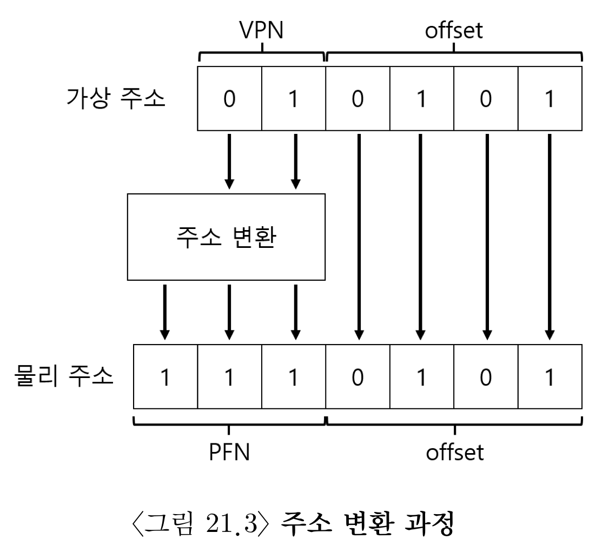
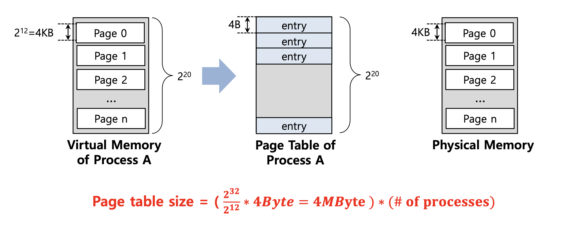
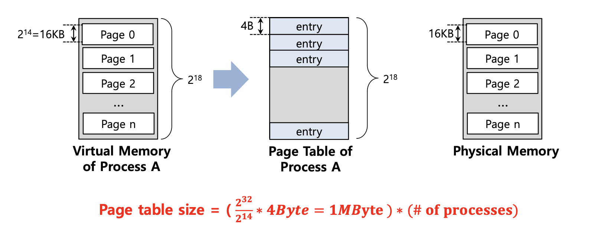
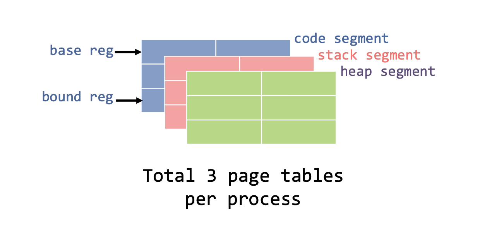
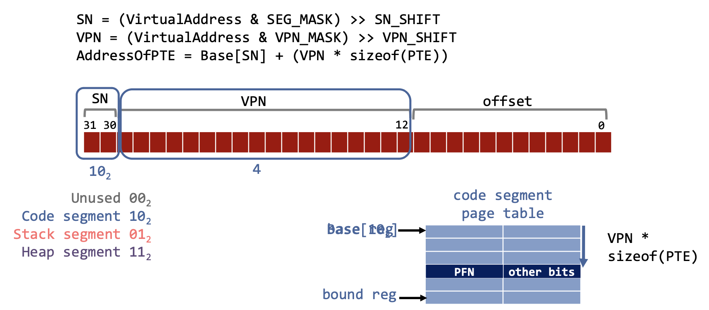
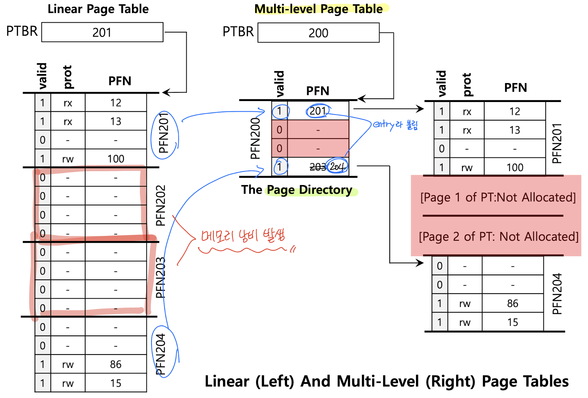

# 💻 Paging : Smaller Table
### Paging의 문제점
> Paging의 장점으로는 base and bound, segmentation과 구분되는 paging은 고정된 페이지 크기를 사용하여 메모리 관리가 편리하다는 장점이 있다.

1. 속도의 문제
   - `page table`이 물리적 메모리에 위치하고 있기 때문에, 하나의 명령어를 수행하기 위해 여러 번 메모리에 접근해야 해서 속도가 느리다.  
     => 이것은 `TLB`로 해결할 수 있다.
2. 크기의 문제
   - `page table`에서 `VPN(Virtual Page Number)`을 인덱스로 `PFN(Page Frame Number)`을 담고있는 entry를 가져오기 위해서는 페이지 테이블이 연속된 공간을 확보해야 한다. => page table이 너무 커진다.  
    
   - 그렇다고 page의 크기를 너무 크게 하면, page table entry 개수는 줄어들지만 internal fragmentation이 생겨버린다.
   - Linear (Page) Table의 경우 모든 process에 대해서 하나의 page table을 가진다.
   - 예를 들어, 4KB(2^12) 크기의 Page와 4B 크기의 Page Table Entry를 가지는 가상 주소가 있다.
     - `Page Table Size`를 구하는 방법: `(가상 주소 공간의 크기 / Page 크기) * Page Table Entry의 크기`
     
     - (2^32 / 2^12) x 2^2 = 2^20 x 2^2 = 1MByte x 4Byte = 4MByte (Process 한개당)
   - 위의 예시에서 Page의 크기를 16KB로 늘린다면?
     - `Page table size` = 1MByte로 이전 예시보다 Page table 크기가 작아져서 메모리를 절약할 수 있다.
       
     - 하지만, Page 자체가 활용도가 낮아서(under-utilized)(= page 자체 크기가 커서) 내부 단편화가 발생하는 문제점이 있다. (낭비하는 공간이 크다는 점)
       - 내부 단편화란 메모리를 할당할 때 프로세스가 필요한 양보다 더 큰 메모리가 할당되어서 프로세스에서 사용하고 남은 공간을 의미한다. (예) 메모리가 10KB가 할당되었고 프로세스가 필요한 양은 7KB일 때, 남는 공간인 3KB가 낭비된다)
     - 더 큰 Page size는 더 적은 page 수를 의미하며 이는 메모리가 빨리 소모된다는 것을 의미한다. 
     - 결론적으로 Page의 크기를 늘리는 방법은 완전한 해결책은 아니다.

> 이런 이슈를 해결하기 위한 두 가지 방법
> 1. Hybrid Approach
> 2. Multi-Level Page Table

## ✅ Hybrid Approach: paging and segments
> segmentation과 paging을 섞어서 장점만 취하는 방법이다.  
> 말 그래도, 주소 체계를 page로만 나누지 말고, segmentation도 함께 사용하는 것이다.

- `base reg`: 실제 주소의 page table을 가리키는 데 사용한다.
  - Process가 실행중 일때 각 Segment의 `base reg`는 해당 Segment에 대한 Linear Page Table의 **실제 주소(Physical Address)`** 가 포함된다.
- `bound reg`: 해당 page table의 끝을 나타내는 데 사용된다.

### ❗️ TLB miss
- 하드웨어는 Page Table로부터 실제 주소를 얻을 수 있다.
  - 하드웨어는 `세그먼트 비트(SN)`를 사용하여 사용할 `base` 및 `bound` 쌍을 결정한다.
  - 하드웨어는 그 다음 실제 주소(Physical Address)를 가져와서 다음과 같이 VPN과 결합하여 Page Table Entry(PTE)의 주소를 형성한다.

- 위 예시는 `Code Segment` (10)과 VPN 값 4를 가지고 있다.
- 여기서 TLB miss가 발생했어도 segment 비트를 사용해서 주소 변환을 진행하면 된다.
- 기존 Paging 기법과의 차이점은 Bound 레지스터가 Page Table의 끝 값을 가지고 있기 때문에 사용하지 않는 Page Table의 공간을 유지할 필요가 없으므로 메모리 낭비를 줄일 수 있다.
  
**Problem**
- 사용 빈도가 낮지만 큰 Heap이 있다면, 너무 많은 Page Table이 낭비가 될 수 있다.
- 이런 문제점은 외부 단편화(External Fragmentation)을 다시 발생시킨다.

## ✅ Multi-level Page Tables
> 실제 OS에서도 사용되며, 아주 효과적으로 작동된다고 한다.

Linear Page Table(선형 페이지 테이블)을 Tree(트리)와 같은 무언가로 바꿔준다.
- Page Table을 Page 크기의 단위로 잘라준다.
- 만약 Page Table Entries 의 전체 Page에 유효하지 않은 경우(하나라도 유효한 Entry가 없다면), 해당 Page Table을 할당하지 않는다.
- Page Table의 Page가 유효한지 아닌지 추적하기 위해 `Page Directory`라는 새로운 구조를 사용한다.

### ❗️ Page Directory

- 위의 개념 설명에서 Page table을 page로 자른 뒤 하나라도 유효한 entry가 없다면, page table을 유지하지 않는다고 했다. 
  - 위의 예시를 확인해보면, PFN202 와 PFN203은 유효하지 않으므로, 해당 Page table을 할당하지 않는 것을 확인할 수 있다.
- Page Directory의 역할은 page table의 page가 어디에 있는지, 해당 page table에 유효한 page가 있는지 알려주는 것이다.

### ❗️ Page directory entries
- Page Directory는 page당 하나의 page entry만 가지고 있다. (즉, page table의 시작부분, base 레지스터와 같은 역할을 한다고 보면 된다)
  - 그리고 Page Directory는 다수의 page directory entries(PDE) 로 구성되어 있다. 
- PDE 는 유효한 `bit`과 `page frame number(PFN)`을 가지고 있다. 
  - Invalid : Page table의 전체 page에 유효한 page가 없는 것을 의미한다. 
  - Valid : 이 PDE가 가리키는 해당 페이지의 PTE가 적어도 하나는 유효하다는 것을 의미한다.

### ❗ Advantage & Disadvantage
**Advantage**
- Only 사용 중인 주소 공간에 비래하여 page-table space(페이지 테이블 공간)만 할당한다. 
- OS가 page table을 할당하거나 확장해야 할 때 다음의 free page(무료 페이지)를 잡을 수 있다.

**Disadvantage**
- TLB miss인 경우, page table에서 올바른 변환 정보를 얻으려면 메모리에서 2개의 load가 필요하다. 
- 여기서 2개의 load에 접근한다 라는 의미는 Page table에 접근하기 위해 Page directory에도 접근할 때의 1번, Page directory 에서 유효한 PFN 정보를 가져오기 위해 접근할 때의 1번 을 의미한다. 
- 이것을 Time-space trade-off 라고 부른다. 
  - Smaller page table size(더 작은 페이지 테이블 크기)
  - TLB miss -> two loads from memory -> one for the page directory, and one for the PTE itself(TLB miss -> 메모리에서 두 개의 로드 -> 페이지 디렉토리에 대한 로드와 PTE 자체에 대한 로드)
- 그리고 기존의 방법보다 복잡하므로 Increased complexity 이라고 부른다.

**출처**  
[Paging: Smaller Table](https://github.com/devSquad-study/2023-CS-Study/blob/main/OS/os_smaller_table.md)  
[paging : smaller table](https://star-peanuts.tistory.com/97)  
[[OS/OSTEP] 18.vm-paging : 메모리 페이징,PFN과 VPN #12](https://devforyou.tistory.com/80)  
