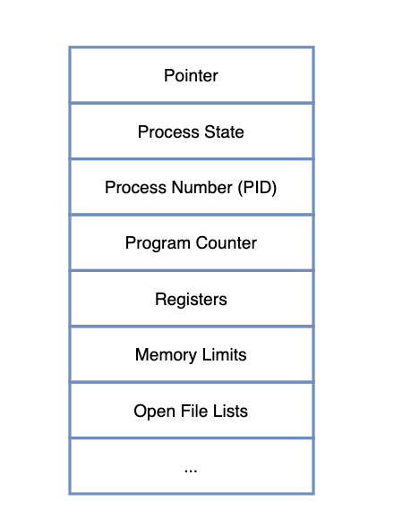
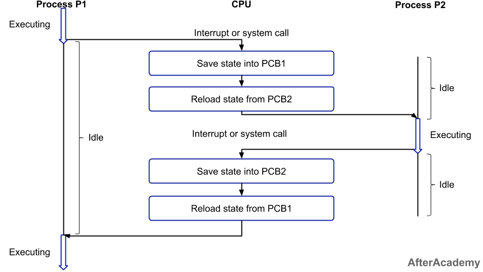

# 📘 PCB와 Context Switching
## ❗️ PCB(Process Controll Block)
> PCB: 프로세스에 대한 정보를 저장한 자료구조
- 프로세스 테이블에 저장된다.
- 주기억장치에서 저장된다.
- 문맥 교환(Context Switching)을 하기 위해 필요하다.

### 프로세스의 상태
프로세스는 여러가지 상태를 가지고 있다.

1. `new` & `terminated`
   - new: 프로세스가 생성된 것을 의미
   - terminated: 프로세스가 종료된 것을 의미
   - 이 두 상태는 임시적인 상태이며, 주로 나머지 세 가지의 경우가 돌아가면서 프로세스를 동작시킨다.
2. `ready`
   - 프로세스의 실행될 준비가 다 된 상태
   - 준비 상태인 것을 스케줄링(scheduling)하여 디스패치(dispatch)한다.
     - 스케줄링(scheduling): 프로세스들 중에 하나를 고르는 것
     - 디스패치(dispatch): 고른 프로세스를 CPU에 할당하는 것
3. `running` & `waiting`
   - running: 프로세스가 실행 중인 상태
   - waiting: 사용자의 입력을 기다리는 상태
   - 예시
     > 터미널에서 프로그램을 다운로드할 때, 프로그램을 다운로드하다가 사용자의 허용이 필요한 상황이 있다.  
   그때 다운로드하는 중이 running 상태이고, 사용자의 허용이 필요한 상태를 waiting이라고 이해하면 된다. 

### PCB의 구조

- 프로세스 식별자: 프로세스를 식별하는 용도
- 프로세스 상태: ready, running, waiting 등의 상태를 가진다.
- 프로그램 카운터: 이 프로세스가 다음에 실행할 명령어의 주소를 가리킨다.
- CPU 레지스터

## ❗️ Context Switching(문맥 교환)
> CPU가 현재 실행하고 있는 Task(Process, Thread)의 상태를 저장하고, 다음 진행할 Task의 상태 및 Register 값들에 대한 정보(Context)를 읽어 새로운 Task의 Context 정보로 교체하는 과정을 말한다.  
다르게 말하면, CPU가 이전의 프로세스 상태를 PCB에 보관하고, 또 다른 프로세스의 정보를 PCB에서 읽어 레지스터에 적재하는 과정이다.  
또 다르게 말하면, 다중 프로그래밍 시스템에서 CPU가 할당되는 프로세스를 변경하기 위해 현재 CPU를 사용하여 실행되고 있는 프로세스의 상태 정보를 저장하고, 제어권을 ISR(인터럽트 서비스 루틴)에게 넘기는 작업을 말한다.

- Context: CPU가 다루는 Task(Process / Thread)에 대한 정보
- 대부분의 정보는 Reigster에 저장되고 PCB로 관리된다.
- Context Switching은 프로세스가 `Ready` -> `Running`, `Running` -> `Ready`, `Running` -> `Block` 처럼 상태 변경 시에 발생한다.

- `idle`: 유휴 상태
- `executing`: 실행 중인 상태
1. `Process P1`에서 interrupt나 System Call을 만나면 PCB1에 프로세스의 정보가 저장이 된다.
2. `Process P2`의 정보를 가지고 오고, 상태를 변경하여 CPU에 할당한다.
3. `Process P2`에서 interrupt나 System Call을 만나면 PCB2에 프로세스의 정보가 저장이 된다. 
4. `Process P1`의 정보를 가지고 오고, 상태를 변경하여 CPU에 할당한다.

### Context Switching이 발생하는 원인
- 선점형 스케줄링의 방식으로 CPU 스케줄링이 진행되기 때문이다.
- CPU에 우선순위가 높은 프로세스가 할당되면, 기존에 실행되고 있는 프로세스를 중지하고, 우선순위가 높은 프로세스가 진행이 된다.
- **중지되는 프로세스의 정보를 저장하고, 우선순위가 높은 프로세스를 실행하는 방식이 `Context Switching`이다.**

### Context Switching의 문제점
- Context Switching이 잦으면 오버헤드(Overhead) 비용이 발생하여 성능이 떨어진다.
- 실행할 프로세스의 정보를 PCB에서 가지고 올 동안 CPU에 할당된 프로세스가 없어서 아무 일도 하지 못하게 된어 성능 저하로 이어진다.

### Context Switching Cost
> Context Switching이 발생하면서 소요되는 Cost
> 1. Cache 초기화
> 2. Memory Mapping 초기화
> 3. 메모리의 접근을 위해서 Kernel 은 항상 실행되어야 한다.
- 여러 프로세스에 Context Switching을 하지 말고, **단일 Process에 여러 Thread를 생성하여 Thread에서 Context Switching을 하면 된다.**
- Thread의 경우, Stack 영역을 제외한 모든 메모리 공간을 공유하고 있어, Stack 영역만 변경하면 되기 때문에 Process보다 비용이 적게 든다.

**출처**  
[os_pcb_and_context_switching](https://github.com/devSquad-study/2023-CS-Study/blob/main/OS/os_pcb_and_context_switching.md)  
[[OS] PCB와 Context Switching](https://m.blog.naver.com/adamdoha/222019884898)