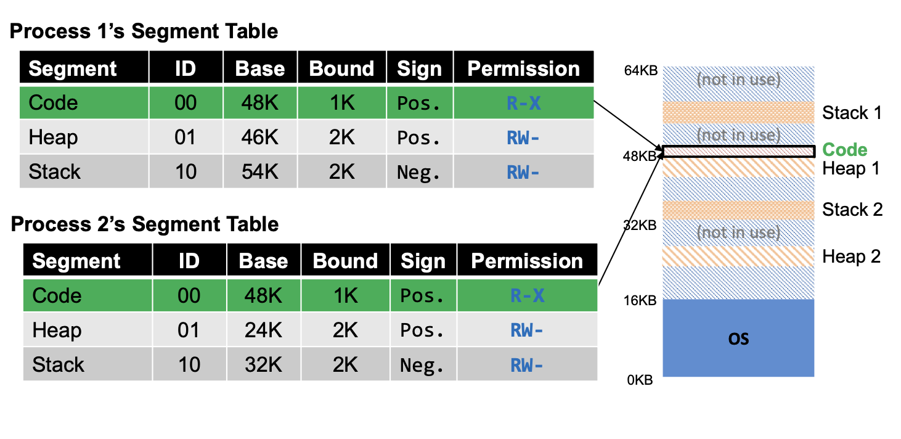

# 💻 세그먼테이션(Segmentation)
주소 변환하면서 몇가지 비효율적인 문제가 발생한다.

- 기존 가상 주소 공간에서는 Heap과 Stack 사이의 사용하지 않는 공간도 할당되므로 비효율성이 발생한다.
  1. 사용하지 않는 크기가 발생하므로 메모리 공간이 낭비된다.
  2. 위으 그림과 같이 (16KB 이상의) 메모리가 큰 주소 공간에는 프로세스를 지원할 수 없다.
  3. Code 공간에 여러 코드가 들어가서 중복이 발생할 수 있다.

## 💡 Segmentation
> 세그먼테이션은 가상 주소 공간을 세그먼트 단위로 실제 메모리 주소 공간에 독립적으로 각각 매핑하는 방식이다.  


- 이로 인해 heap과 stack 사이의 사용하지 않는 비효율적인 문제를 해결하게 되었다.
  1. 더이상 메모리 공간이 낭비되지 않는다.
  2. 이전보다 훨씬 더 많은 주소 공간을 지원할 수 있다.
  3. 세그먼트는 주소 공간 간에 Code를 공유하면서 메모리를 절약할 수 있다.
- 세그먼트(Segment)는 메모리에서 일정 부분을 의미하며, 일반적인 주소 공간은 **3개의 세그먼트(Code, Stack, Heap)** 으로 구성된다.
- OS는 3개의 세그먼트를 메모리에 배치하여 Heap과 Stack 사이의 공간을 낭비하지 않도록 한다.

## ✅ Implementation
### Basic
> 그럼 이제 세그먼테이션에서 **Virtual Memory 주소를 받고 Physical Memory 주소를 찾는 방법(주소 변환)** 에 대해 알아보자.

가상주소는 `segment id + offset`으로 구할 수 있다.
- segment id는 상위 2개 비트로 구분할 수 있고, offset은 하위 12개 비트로 계산할 수 있다.

1. Segment ID가 01인 Heap 영역에 가서 Base 값을 찾는다.(Base = 26K)
2. offset을 계산한다. (16진수 Hex -> 10진수 Decimal)
   - `0x068 -> (Decimal) (16^1 * 6) + (16^0 * 8) = 104`
   - Segmentation Fault 발생하지 않는지 확인한다.
     - Segmentation Fault: 프로그램이 허용되지 않는 메모리 영역에 접근을 시도하거나(free 공간), 허용되지 않은 방법으로 메모리 영역에 접근을 시도할 경우 발생한다.
     - offset 값인 104가 Bound 값인 2K (104 < 2000)보다 작기 때문에 Segmentation Fault가 발생하지 않는다.
3. Physical Memory 주소를 찾는다. (base + offset) 
```text
// get top 2 bits of 14-bit VA 2 (상위 2 비트를 가지고 온다)
Segment = (VirtualAddress & SEG_MASK) >> SEG_SHIFT 3

// now get offset (하위 12 비트로 offset을 구한다)
Offset = VirtualAddress & OFFSET_MASK

// Offset 이 limit 을 넘는지 확인한다.
if (Offset >= Bounds[Segment])
    RaiseException(PROTECTION_FAULT)
else
    PhysAddr = Base[Segment] + Offset
    Register = AccessMemory(PhysAddr)
```

### Stack인 경우

- Stack은 Code, Heap 부분과 다르게 거꾸로 확장되기 때문에 주소 변환을 다르게 해야한다.
  - Code, Heap은 Sign이 Positive인 반면에 Stack은 Sign이 Negative이다.
- Stack 세그먼트의 base 레지스터는 가장 높은 주소에서 시작한다.
1. Segment ID가 10인 Stack 영역에서 Base 값을 찾는다.(Base = 36K)
2. offset을 계산한다. (16진수 Hex -> 10진수 Decimal)
   - `0xA00 -> (Decimal) (16^2 * 10) + (16^1 * 0) + (16^0 * 0) = 2560`
   - Segmentation Fault가 발생하지 않는지 확인한다.
     - offset 값인 104가 Bound 값인 3K (2560 < 3000) 보다 작기 때문에 Segmentation Fault가 발생하지 않는다.
3. Physical Memory 주소를 찾는다.(`base - offset`)
   - Stack에서는 base인 36KB에 offset인 2560을 빼주면 된다.
   - 따라서 실제 메모리 주소는 `36KB - 2560`이 된다.

### Code 경우

- 세그먼트는 추가적인 하드웨어 지원을 통해 주소 공간 사이에서 공유될 수 있다.
- 그래서 다중 프로세스는 Code 세그먼트를 공유할 수 있는데, 읽고 실행은 가능하지만 값을 변경할 수는 없다.
- 즉, 코드가 지정된 영역은 접근 가능하지만, (읽고 실행 가능) 값을 변경할 수는 없다.

## 🤔 Problem of Segmentation(OS Support)
- Context-Switch(문맥 교환) 문제에 대해서는 OS가 어떻게 처리하는가?
  - 세그먼트 레지스터(base & bound 레지스터)의 값들을 저장하고 복원해주는 방식으로 처리한다.
- 세그먼트의 수가 증가하거나 감소할 때 OS와 어떻게 상호작용하는가?
  - 상황: heap 공간이 부족해서 malloc()에 의해 heap 공간을 더 늘려야하는 경우
  - 해결방안: 공간을 늘리기 위해 sbrk() system call을 사용한다.(sbrk(): 힙을 늘리거나 줄이는 함수)
- Physical Memory에 여유공간을 어떻게 관리할 것인가?
  - 프로세스마다 크기가 모두 다르기 때문에 각 세그먼트의 크기도 모두 다르다.
    - 그로 인해 `외부 단편화(external fragmentation)` 문제가 발생한다.
    - `외부 단편화`란 외부가 잘게 쪼개진 형태를 의미한다.
    
  - 상황: 왼쪽 메모리에서 20KB 크기를 갖는 세그먼트를 할당하려고 한다.
    - 전체로 보면 24KB 여유 공간이 있지만, 세그먼트들이 인접하지 않아 20KB 크기를 받는 공간을 할당받을 수 없다.
    - 이를 해결하기 위해 `Compaction`이라는 방법으로 실제 메모리의 기존 세그먼트를 재배치시킨다.
      - 하지만 `Compaction` 방법은 비용이 발생하여 성능이 떨어지는 문제점이 있다.
      - 가운데 그림 참고
    - `Paging`이라는 기법을 통해 고정적인 크기(fixed-size)의 세그먼트로 외부 단편화를 제거하여 여유 공간을 관리할 수 있다.
      - `내부 단편화(Internal fragmentation` 문제가 남아있다.
      - 15KB 요청이 오면 8KB * 2번으로 16KB를 주게 되면 1KB의 안 쓰는 공간이 생긴다. 이때 이 1KB가 내부 단편화의 문제점이다.