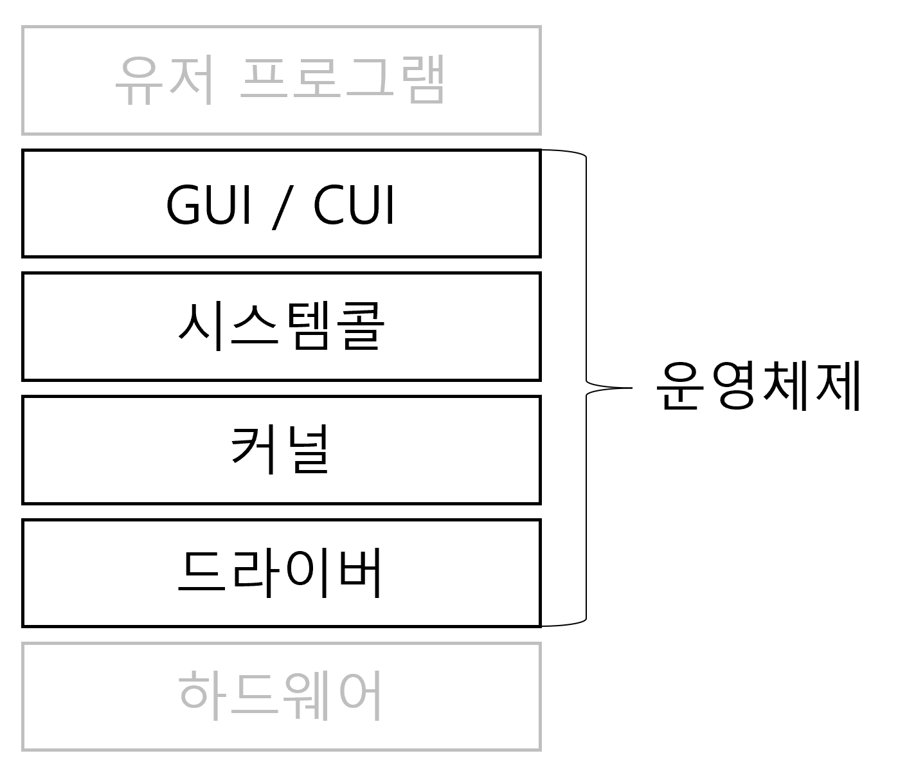

# ❗️ 시스템 콜
## 🤔 운영체제(Operating System)란
- 운영체제는 컴퓨터 시스템의 하드웨어, 소프트웨어 자원들을 효율적으로 운영 및 관리함으로써 사용자가 컴퓨터를 편리하고, 효과적으로 사용할 수 있도록 도와주는 시스템 소프트웨어이다.
- 컴퓨터 하드웨어 바로 위에 설치되어 있다.
- 사용자 및 다른 소프트웨어와 하드웨어를 연결하는 중개자 역할을 하는 프로그램(소프트웨어 계층)이다.


<br>

## 🤔 커널(Kernel)이란
> 커널(Kernel)은 운영체제의 다른 부분 및 응용 프로그램 수행에 필요한 프로세스 관리, 메모리 관리, 저장장치 관리와 같은 운영체제의 핵심부분이다.

### 컴퓨터의 전원을 킨다면
1. 소프트웨어가 컴퓨터 시스템에서 수행되기 위해서는 메모리에 그 프로그램이 올라가있어야 한다.
2. 운영체제 자체도 메모리에 올라가야한다. => 운영체제처럼 규모가 큰 프로그램이 모두 메모리에 올라간다면 메모리 공간이 낭비가 심하게 된다.
3. 운영체제 중 항상 필요한 부분만 메모리에 올려놓고, 가끔 필요한 부분은 필요할 때만 메모리에 올려서 쓰게 된다. => 메모리에 상주하는 운영체제의 부분이 바로 **커널(kernel)** 이다.

### 커널의 역할
- 프로세스 관리: 프로세스에 CPU를 분배하고 작업에 필요한 제반 환경 제공
- 메모리 관리: 프로세스에 작업 공간을 배치하고 실제 메모리보다 큰 가상공간 제공
- 파일 시스템 관리: 데이터를 저장하고 접근할 수 있는 인터페이스 제공
- 입출력 관리: 필요한 입출력 서비스 제공
- 프로세스 간 통신 관리: 공동 작업을 위한 각 프로세스 통신 환경 제공

## 🤔 이중 동작 모드(Dual-mode Operation) 란
> 사용자와 운영체제는 같은 시스템 자원을 공유한다.  
> 따라서, 사용자가 메모리 내 주요 운영체제 자원을 망가뜨리지 않도록 사용자의 시스템 자원 접근을 제한하는 보호장치가 필요하다.  
> 그래서 제공되는 것이 바로 이중 동작 모드(Dual-mode Operation)이다.
1. 커널모드(Mode Bit: 0)
   - 수퍼바이저 모드(Supervisor Mode), 특권 모드(Privileged Mode), 시스템 모드(System Mode)라고도 불린다.
   - 운영체제가 ***CPU의 제어권***을 가지고 운영체제 코드를 실행하는 모드다.
     - 모든 종류의 CPU 명령을 수행할 수 있다.
   - 시스템의 모든 메모리에 접근이 가능하다.
2. 사용자모드(Mode Bit: 1)
   - 사용자가 접근할 수 있는 영역을 제한적으로 두고, 프로그램 자원에 함부로 침범하지 못하는 모드다.
   - 사용자는 사용자 모드에서 코드를 작성하고 프로세스를 실행하는 등의 행위를 할 수 있다.
   - 시스템에 중요한 영향을 미치는 연산은 커널 모드에서만 실행 가능하도록 함으로써 하드웨어의 보안을 유지한다.
   - 접근을 위해서는 **시스템 콜(System Call)**을 사용해야한다.

## 🤔 시스템 콜(System Call)이란
> 운영체제에서 제공하는 서비스들을 사용하기 위한 프로그래밍 인터페이스이다.
- C나 C++ 같은 고급 언어로 작성된 프로그램들은 직접 시스템 콜을 할 수 없기 때문에 고급 API를 통해 시스템 호출에 접근하게 하는 방법이다.
- 운영체제는 메모리에 프로그램 적재, I/O 처리, 파일 시스템 처리 등 여러 서비스들을 제공하고, 사용자 프로세스는 시스템 콜을 통해 서비스를 제공받는다.

### 시스템 콜의 종류
1. 프로세스 제어(Process Control)
   - 끝내기(exit), 중지(abort)
   - 적재(load), 실행(execute)
   - 프로세스 생성(create process) - fork
   - 프로세스 속성 획득과 속성 설정
   - 시간 대기(wait time)
   - 사건 대기(wait event)
   - 사건을 알림(signal event)
   - 메모리 할당 및 해제
2. 파일 조작(File Manipulation)
   - 파일 생성/삭제(create, delete)
   - 열기/닫기/읽기/쓰기(open, close, read, write)
   - 위치 변경(reposition)
   - 파일 속성 획득 및 설정(get file attribute, set file attribute)
3. 디바이스 조작(Device Manipulation)
   - 하드웨어의 제어와 상태 정보를 얻음(ioctl)
   - 장치를 요구(request device), 장치를 방출(release device)
   - 읽기(read), 쓰기(write), 위치 변경
   - 장치 속성 획득 및 설정
   - 장치의 논리적 부착 및 분리
4. 정보 유지(Information Maintenance)
   - getpid(), alarm(), sleep()
   - 시간과 날짜의 설정과 획득(time)
   - 시스템 데이터의 설정과 획득(date)
   - 프로세스 파일, 장치 속성의 획득 및 설정
5. 통신(Communication)
   - pipe(), shm_open(), mmap()
   - 통신 연결의 생성, 제거
   - 메시지의 송신, 수신
   - 상태 정보 전달
   - 원격 장치의 부착 및 분리
6. 보호(Protection)
   - chmod()
   - unmask()
   - chown()

### 시스템 콜 예시
```text
cp in.txt out.txt
```
일반적으로 윈도우 운영체제의 경우 마우스, 리눅스라면 키보드가 사용자의 입력을 받는다. 이 때 I/O 시스템 콜을 사용한다.

위와 같은 문장을 입력 받아서 cp 프로그램을 실행시키면 먼저 in.txt 파일이 현재 디렉터리에서 접근할 수 있는 파일인지를 검사하기 위해 시스템 콜을 호출한다.

만약 파일이 존재하지 않는다면 에러를 발생시켜야 하고 프로그램을 종료하는데 이 때 시스템 콜이 사용된다.

만약 파일이 존재할 경우, 복사한 파일을 저장하기 위해 output.txt 파일명이 있는지 검사한다.

그리고 이 때도 마찬가지로 파일명이 존재하는지 존재하지 않는지 검사하기 위해 시스템 콜을 통해 확인한다.

파일이 이미 존재한다면 덮어 씌워야 할지 아니면 이어 붙여야 하는지 사용자에게 물어볼 수 있다.

만약 저장하고자 하는 파일 이름이 겹치지 않는다면, 파일을 저장해야하는데 이 때도 시스템 콜을 이용한다.

### 참고자료
[os_system_call.md](https://github.com/devSquad-study/2023-CS-Study/blob/main/OS/os_system_call.md)
[SystemCall_hongseo.md](https://github.com/cs-study-2023/archive/blob/main/operatingsystem/SystemCall_hongseo.md)