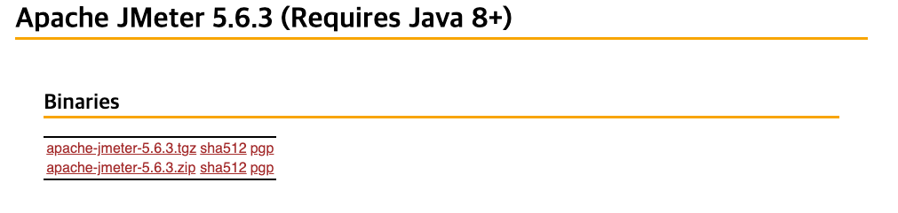

# 💻 Apache Jmeter 실습
> Mac 환경(m1) 기준으로 작성하였습니다.

<br>

설치 경로: https://jmeter.apache.org/download_jmeter.cgi



여기에서 `.tgz`파일을 다운로드한다.

압축 파일을 원하는 경로로 이동시킨 후, 해당 경로에서 다음과 같은 명령어 수행
```shell
# 압축 해제
tar -xzvf apache-jmeter-5.6.3.tgz

# jmeter 설치 경로 이동
cd apache-jmeter-5.6.3

# jmeter 실행
./bin/jmeter
```

그러면 다음과 같은 로그와 창이 뜬다.
```text
================================================================================
Don't use GUI mode for load testing !, only for Test creation and Test debugging.
For load testing, use CLI Mode (was NON GUI):
   jmeter -n -t [jmx file] -l [results file] -e -o [Path to web report folder]
& increase Java Heap to meet your test requirements:
   Modify current env variable HEAP="-Xms1g -Xmx1g -XX:MaxMetaspaceSize=256m" in the jmeter batch file
Check : https://jmeter.apache.org/usermanual/best-practices.html
================================================================================
```


### 💡 Thead Group을 추가해준다.


- Number of Threads
  - 스레드 개수이며, 가상 유저 수라고 생각하면 된다.
  - Http Request Sampler가 2개일 경우, 스레드를 1로 설정해도, 2번의 request가 발생한다. 즉, 가상 유저수가 Http Request Sampler에 비례한다.
- Ramp-up
  - 스레드 당 생성시간으로, 만약 `Number of Threads = 100`이고, `Ramp-up = 10`이라면, 100명의 유저를 생성할 때까지 10초가 걸린다는 말이다.
  - 즉, 1초 동안 10명의 유저가 요청을 하는 것이고, 만약 `Ramp-up = 0`이라면, 동시 접속자 수는 100명이 된다.
- Loo Count
  - 하나의 스레드가 수행할 작업 수이며, 만약 `Number of Threads = 100`이고, `Loop Count = 10`이면, 100명의 유저는 동일한 작업을 10번 수행하게 되며, 총 1,000번이 수행된다.
> **스레드의 수 설정 가이드**  
> Thread Group에서 Thread 수를 조절해가며 테스트를 진행할 수 있다.  
> 초기에는 10~20개 정도의 스레드로 시작해 서버 반응을 확인할 수 있고, 점진적으로 늘려가는 것이 좋다.  
> 이렇게 하면 서버의 성능을 평가할 수 있고, 시스템이 과부하되는 것도 예방할 수 있기 때문이다.


<br>

### 💡 HTTP Request Sampler를 추가해준다.


Sampler를 추가한 후 상세 테스트 정보를 입력한다.
- 프로토콜: http
- 서버 IP: localhost
- port: 8081
- path: /api/products/search
- parameters 추가
  - size: 100
  - search: 냉장고


<br>

**참고 자료**  
- [성능테스트 툴 소개](https://velog.io/@dongvelop/%EC%84%B1%EB%8A%A5%ED%85%8C%EC%8A%A4%ED%8A%B8-%ED%88%B4-%EC%86%8C%EA%B0%9C)
- [[성능테스트도구] 23.04.10 JMeter로 성능 테스트(Mac 기반)](https://velog.io/@wonizizi99/%EC%84%B1%EB%8A%A5%ED%85%8C%EC%8A%A4%ED%8A%B8%EB%8F%84%EA%B5%AC-M1-%EB%A7%A5%EB%B6%81%EC%97%90-JMeter-%EC%84%A4%EC%B9%98%ED%95%98%EA%B8%B0)
- [[JMeter] MacOS(M1)에서 JMeter를 이용한 부하 테스트](https://curiousjinan.tistory.com/entry/mac-m1-jmeter-setup-and-testing)