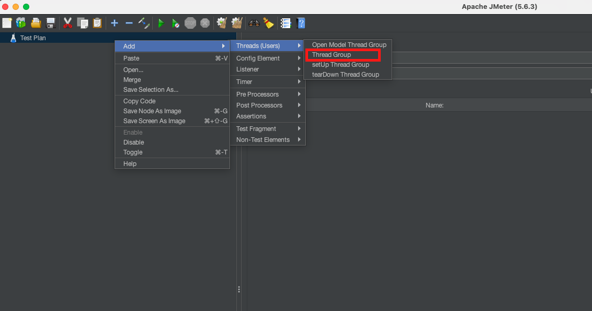
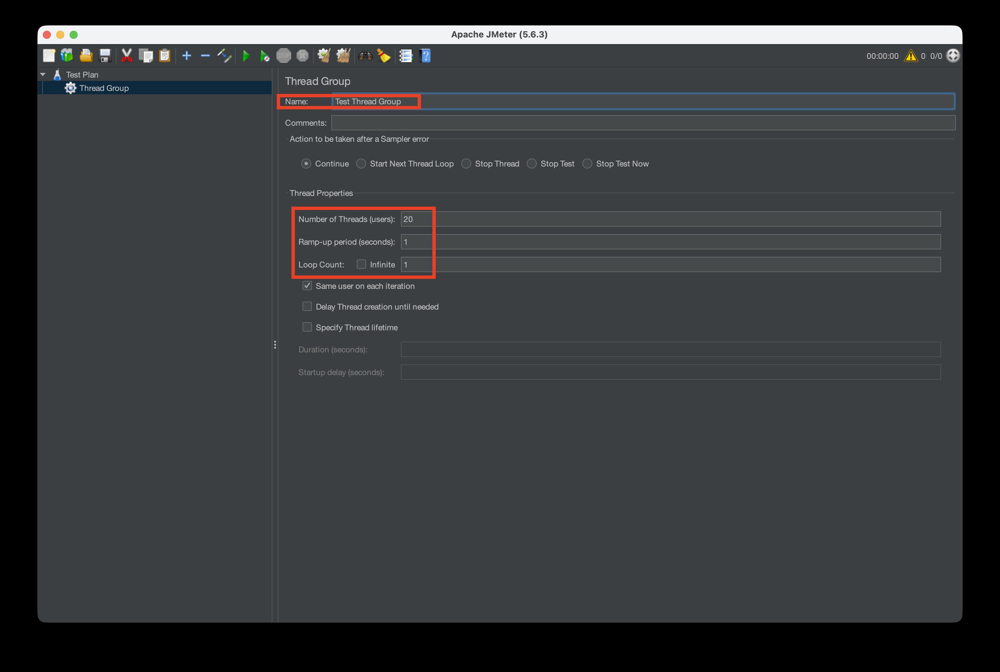
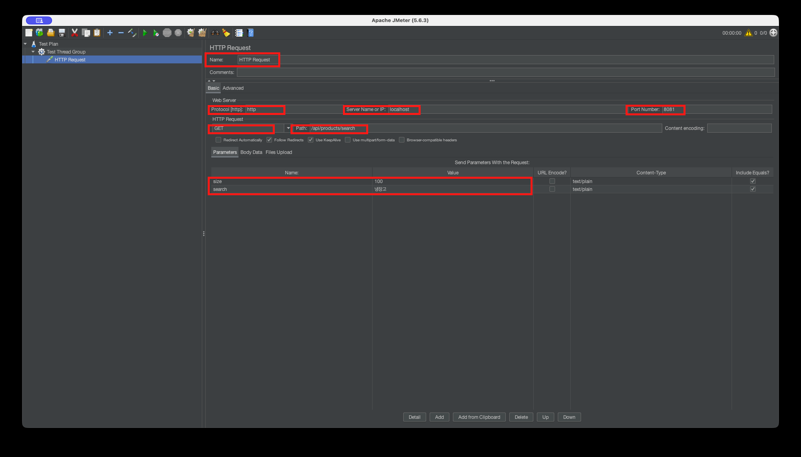
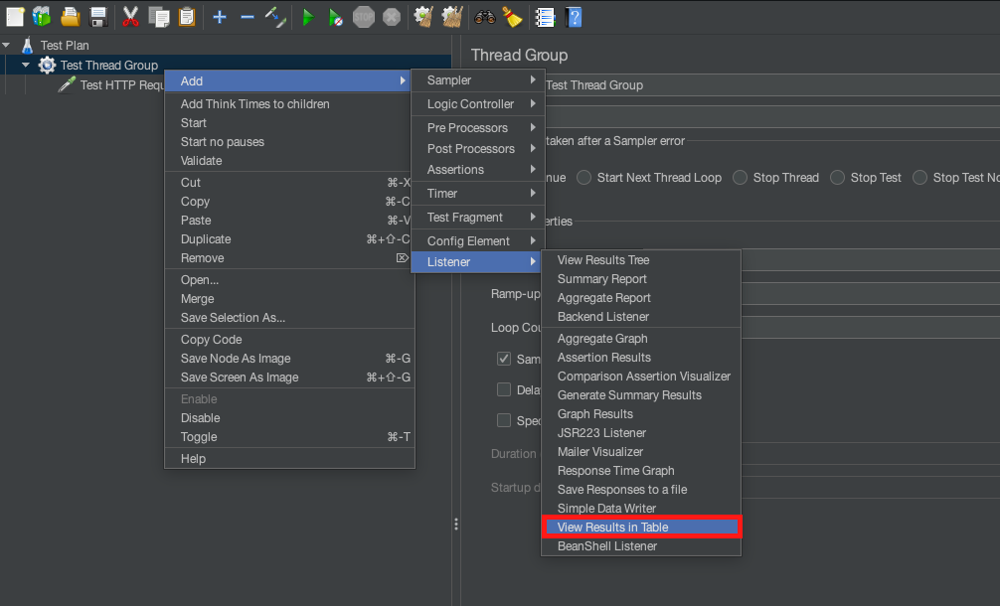
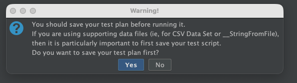
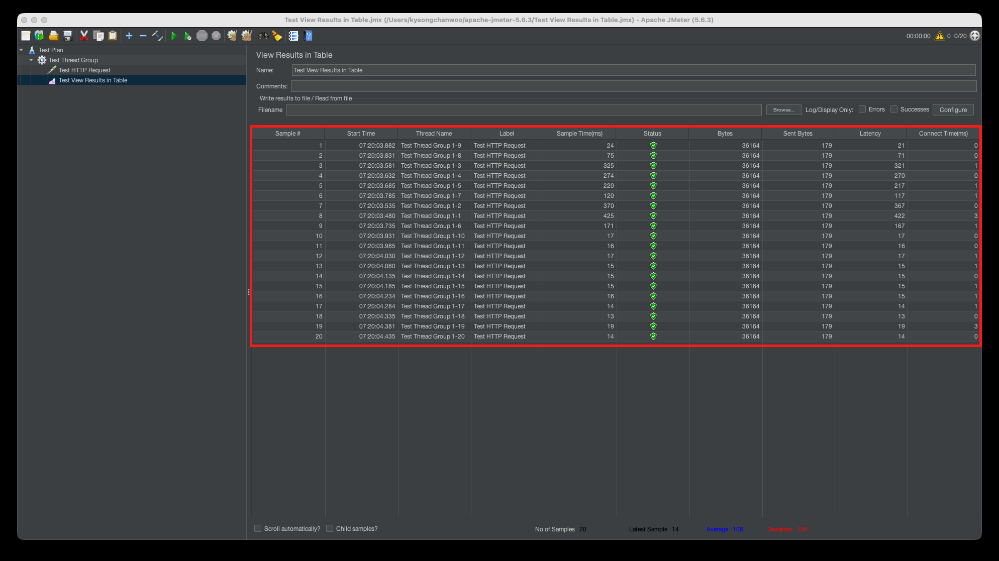
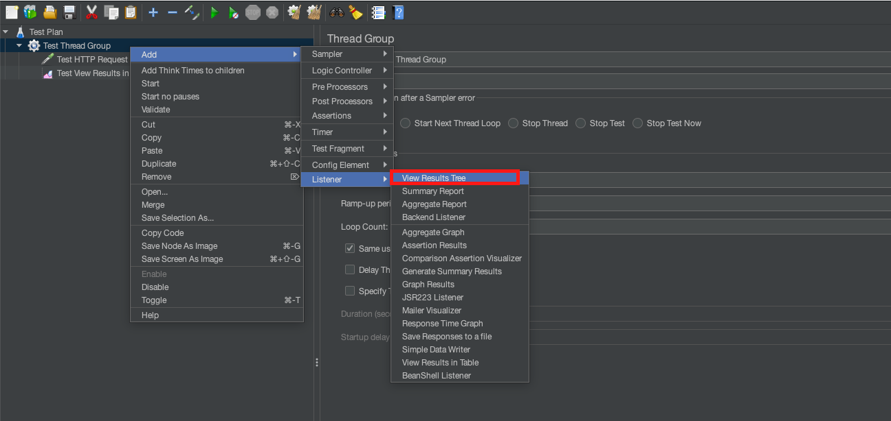
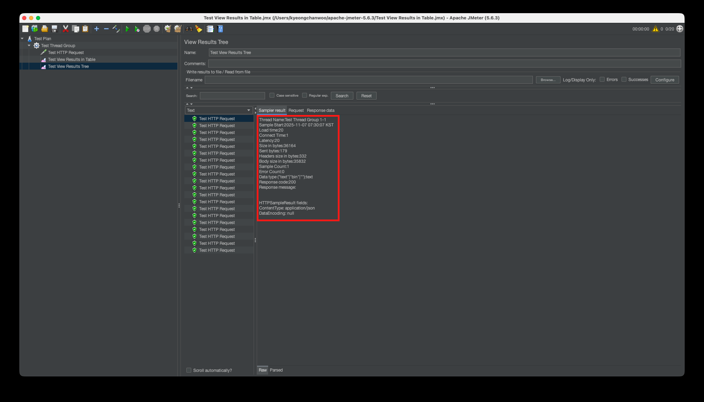
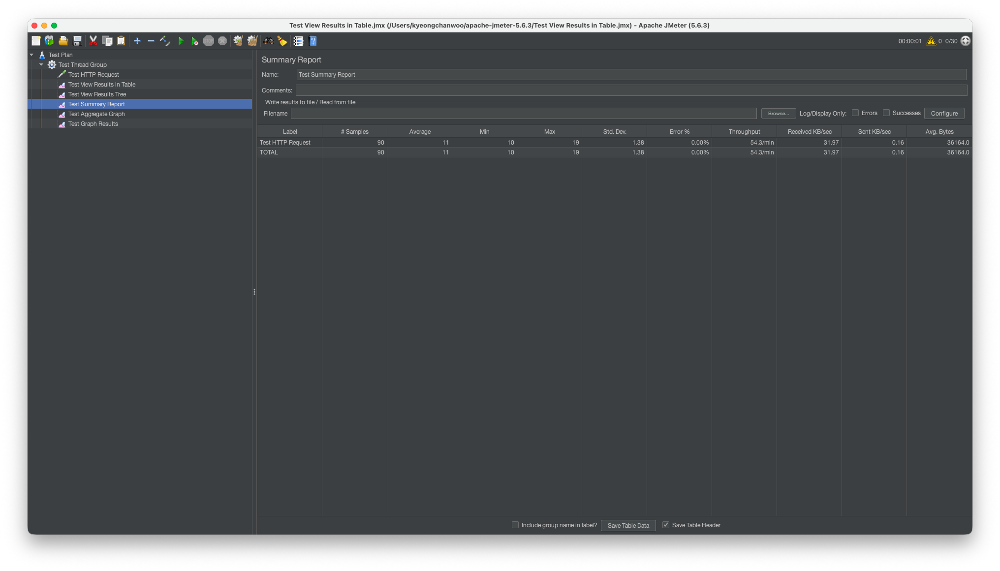

# 💻 Apache JMeter 실습
> Mac 환경(m1) 기준으로 작성하였습니다.

<br>

## ✅ JMeter 설치 및 실행

설치 경로: https://JMeter.apache.org/download_JMeter.cgi


여기에서 `.tgz`파일을 다운로드한다.

압축 파일을 원하는 경로로 이동시킨 후, 해당 경로에서 다음과 같은 명령어 수행
```shell
# 압축 해제
tar -xzvf apache-JMeter-5.6.3.tgz

# JMeter 설치 경로 이동
cd apache-JMeter-5.6.3

# JMeter 실행
./bin/JMeter
```

그러면 다음과 같은 로그와 창이 뜬다.  
정상이니 신경쓰지 않아도 된다.  
```text
================================================================================
Don't use GUI mode for load testing !, only for Test creation and Test debugging.
For load testing, use CLI Mode (was NON GUI):
   JMeter -n -t [jmx file] -l [results file] -e -o [Path to web report folder]
& increase Java Heap to meet your test requirements:
   Modify current env variable HEAP="-Xms1g -Xmx1g -XX:MaxMetaspaceSize=256m" in the JMeter batch file
Check : https://JMeter.apache.org/usermanual/best-practices.html
================================================================================
```


## ✅ JMeter 세팅 - Thread Group


- Number of Threads
  - 스레드 개수이며, 가상 유저 수라고 생각하면 된다.
  - Http Request Sampler가 2개일 경우, 스레드를 1로 설정해도, 2번의 request가 발생한다. 즉, 가상 유저수가 Http Request Sampler에 비례한다.
- Ramp-up
  - 스레드 당 생성시간으로, 만약 `Number of Threads = 100`이고, `Ramp-up = 10`이라면, 100명의 유저를 생성할 때까지 10초가 걸린다는 말이다.
  - 즉, 1초 동안 10명의 유저가 요청을 하는 것이고, 만약 `Ramp-up = 0`이라면, 동시 접속자 수는 100명이 된다.
- Loo Count
  - 하나의 스레드가 수행할 작업 수이며, 만약 `Number of Threads = 100`이고, `Loop Count = 10`이면, 100명의 유저는 동일한 작업을 10번 수행하게 되며, 총 1,000번이 수행된다.
> **스레드의 수 설정 가이드**  
> Thread Group에서 Thread 수를 조절해가며 테스트를 진행할 수 있다.  
> 초기에는 10~20개 정도의 스레드로 시작해 서버 반응을 확인할 수 있고, 점진적으로 늘려가는 것이 좋다.  
> 이렇게 하면 서버의 성능을 평가할 수 있고, 시스템이 과부하되는 것도 예방할 수 있기 때문이다.


<br>

## ✅ JMeter 세팅 - 테스트를 위한 Sampler 등록


Sampler를 추가한 후 상세 테스트 정보를 입력한다.
- 프로토콜: http
- 서버 IP: localhost
- port: 8081
- path: /api/products/search
- parameters 추가
  - size: 100
  - search: 냉장고

<br>

## ✅ JMeter 세팅 - 테스트 결과를 받아볼 리스너 설정


<br>

## ✅ JMeter 테스트 진행
상단위에 테스트 버튼을 누르면 테스트 실행이 된다.  

> 이 경고 메시지는 테스트 계획을 실행하기 전에 먼저 저장하라는 권고다.  
> 특히 CSV 데이터 세트나 '__StringFromFile' 함수와 같이 외부 데이터 파일을 사용하는 경우에는 테스트 스크립트를 먼저 저장하는 것이 중요한데, 이유는 다음과 같다.
> 1. 데이터 파일 경로
>    - JMeter는 테스트 계획을 저장한 위치를 기준으로 외부 데이터 파일의 상대 경로를 찾는다.
>    - 테스트 계획을 저장하지 않고 실행하면, JMeter는 이 파일들의 정확한 위치를 찾지 못할 수도 있다.
> 2. 테스트 재현성
>    - 테스트 계획을 저장하면 나중에 같은 테스트를 다시 실행하거나, 다른 사람과 테스트 계획을 공유할 때 유용하다.
>    - 테스트 결과를 재현하고 비교하는데 도움이 된다.
> 3. 작업 보호
>    - 만약 JMeter나 시스테멩 문제가 생겨서 갑자기 종료된다면, 저장하지 않은 테스트 계획은 모두 사라질 수 있다.
>    - 그래서 장기적으로 테스트 계획을 저장해서 이런 위험을 줄인다.

`Yes`를 누르고 저장 후 실행시키면 된다.

<br>

## ✅ 테스트 결과 확인 - View Results in Table

`View Results in Table` 탭으로 가보면 실행 결과를 볼 수 있다.  

Table 열 데이터
- Sample: 그냥 ID 번호
- Start Time: 보내기 시작한 시간으로, ms 단위까지 나온다.
- Thread Name: 쓰레드 그룹 이름
- Label: 보낸 request 이름
- Sample Time(ms): Load Time, Elapsed Time, Response Time이랑 같은 뜻이다. 요청 시작 시점부터 응답 종료 시점까지의 시간을 의미한다.
- Status: 말 그대로 응답 상태를 확인할 수 있다.
- Bytes: 응답 데이터 바이트
- Sent Byte: 요청 데이터 바이트
- Latency: 지연 속도를 의미하는데 요청 시작 시점부터 응답 시작 시점까지의 시간을 의미한다.
- Connect Time(ms): TCP Handshake를 이용해 연결하는 시간(그냥 TCP 연결 시간)

Table Footer 데이터
- No of Samples: No는 아니다라는 뜻이 아니라 number라는 뜻. 즉 처리한 데이터 수를 의미한다.
- Latest Sample: 가장 마지막 Sample Time
- Average: Sample Time 평균
- Deviation: Sample Time의 표준편차

<br>

## ✅ 테스트 결과 확인 - View Results Tree


- 하나하나의 데이터를 확인할 수 있으며, 당연히 결과를 내보낼 수 있고, 심지어 검색할 수 있다.
- 검색 문자에 포함되는 모든 데이터를 뽑아준다.
- 각각 눌러보면 Request, Response, Header 등의 데이터를 볼 수 있다.

<br>

## ✅ 테스트 결과 확인 - Summary Report

- Label: 우리가 사용했던 request의 이름을 기준으로 모은다. 따라서 다르게 집계하고 싶다면 이름을 반드시 다르게 한다.
- Samples: request 개수
- Average: Sample Time의 최소
- Min: Sample Time의 최소
- Max: Sample Time의 최대
- Std. Dev.: Sample Time의 표준편차
- Error %: 에러율
- Throughput: 시간당 처리량
- Received KB/sec: 시간당(sec) 받은 데이터(KB)
- Sent KB/sec: 시간당(sec) 보낸 데이터(KB)
- Avg. Bytes: 평균 바이트


<br>

**참고 자료**  
- [성능테스트 툴 소개](https://velog.io/@dongvelop/%EC%84%B1%EB%8A%A5%ED%85%8C%EC%8A%A4%ED%8A%B8-%ED%88%B4-%EC%86%8C%EA%B0%9C)
- [[성능테스트도구] 23.04.10 JMeter로 성능 테스트(Mac 기반)](https://velog.io/@wonizizi99/%EC%84%B1%EB%8A%A5%ED%85%8C%EC%8A%A4%ED%8A%B8%EB%8F%84%EA%B5%AC-M1-%EB%A7%A5%EB%B6%81%EC%97%90-JMeter-%EC%84%A4%EC%B9%98%ED%95%98%EA%B8%B0)
- [[JMeter] MacOS(M1)에서 JMeter를 이용한 부하 테스트](https://curiousjinan.tistory.com/entry/mac-m1-jmeter-setup-and-testing)