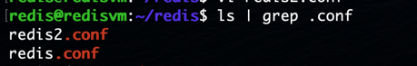
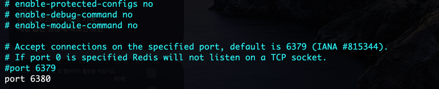
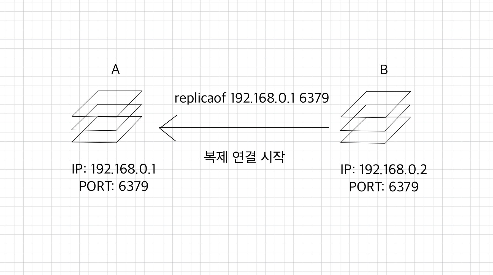
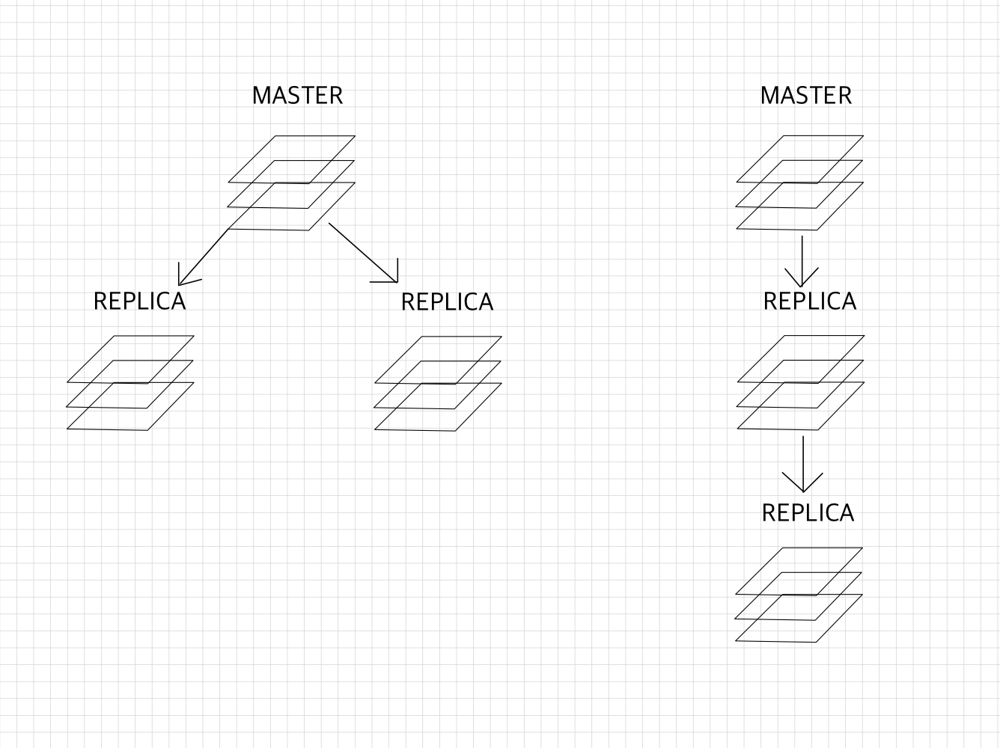
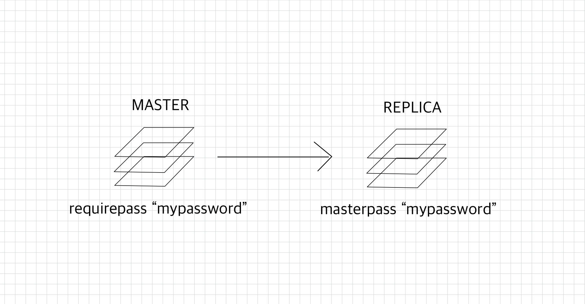
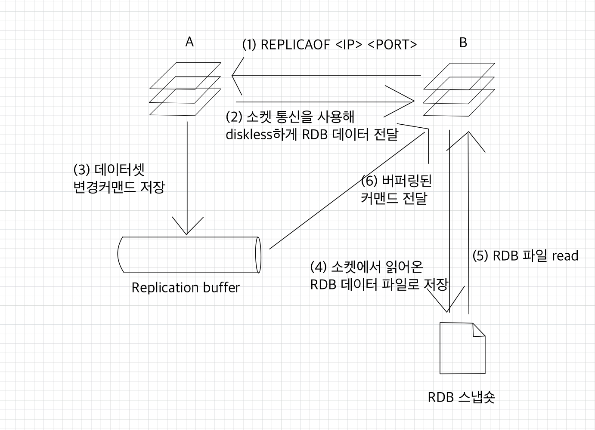
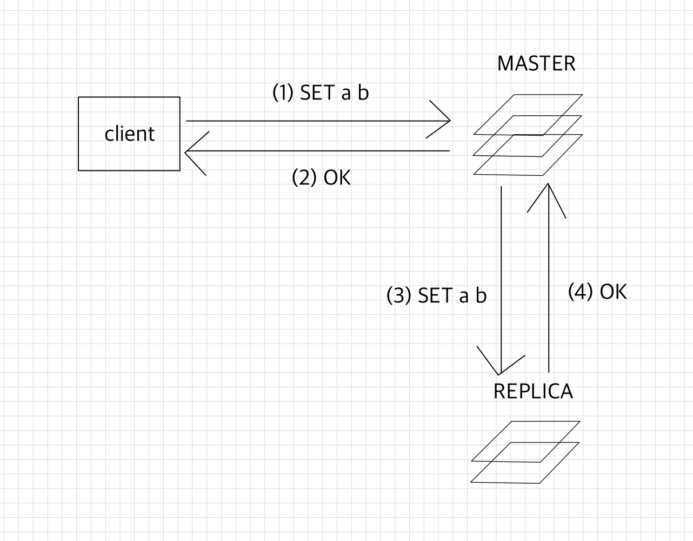

# 🧑🏻‍💻 복제
- [레디스에서 복제 구조 세팅하기](#-레디스에서-복제-구조-세팅하기)
- [레디스에서의 복제 구조](#-레디스에서의-복제-구조)
  - [복제 구조 구성하기](#-복제-구조-구성하기)
- [복제 메커니즘](#-복제-메커니즘)

## ❗️ 레디스에서 복제 구조 세팅하기
먼저 다음 명령어를 통해 `redis.conf`를 복제해서 `redis2.conf` 파일을 생성한다.
```shell
redis@redisvm:~/redis$ pwd
/home/redis/redis

redis@redisvm:~/redis$ cp redis.conf redis2.conf
```


<br>
그리고 `port`를 6380으로 바꾼다.



```shell
# redis2.conf로 레디스 서버 실행
redis@redisvm:~/redis$ bin/redis-server redis2.conf

# redis2 cli 창 켜기
redis@redisvm:~/redis$ redis-cli -h 127.0.0.1 -p 6380
127.0.0.1:6380>
```


## ❗️ 레디스에서의 복제 구조
> 대부분의 데이터 저장소 애플리케이션은 자체적으로 복제 기능을 제공한다.  
> 운영중인 서비스에서 복제본 노드를 추가하는 이유는 대부분 다음과 같다.
> - 애플리케이션이 실행 중인 하드웨어는 언제든지 고장날 수 있으므로, 서비스를 안정적으로 운영하기 위해서는 마스터 데이터베이스가 다운됐을 때 대신 사용할 여분의 복제본이 필요하다.
> - 대규모 서비스에서 복제본은 트래픽을 감소시키는 역할을 할 수 있다.  
>   실시간으로 마스터 노드에 접근해 데이터를 가져가는 서비스가 많을 때, 일부 트래픽이 복제본을 바라보게 한다면 부하 분산을 통해 마스터 노드로의 트래픽을 줄일 수 있게 된다.
> - 운영 중인 마스터 노드에서 매번 데이터의 백업을 받는 것은 부담스러운 작업이다.  
>   백업을 복제본에서 수행하면 백업 작업이 서비스에 미치는 영향도를 최소화할 수 있다.

MySQL이나 PostgreSQL은 멀티 마스터 복제 구조를 제공하기 때문에 모든 노드가 마스터이면서 동시에 복제본이 되는 구조가 될 수 있다.  
하지만 레디스는 멀티 마스터 구조를 지원하지 않으며, 마스터는 복제본이 될 수 없다.  
레디스 버전 2.6 이상부터 복제본 노드는 기본으로 읽기 전용으로 동작하기 때문에 데이터를 읽는 커맨드만 수행할 수 있다.  
➡ 모든 데이터의 입력은 마스터 노드에서 이뤄지는 게 일반적이고, 복제본은 마스터에서 변경된 데이터를 그대로 받아온다.

<br>

### ✅ 복제 구조 구성하기
레디스에서 복제를 사용하는 방법은 굉장히 간단하다.  
```redis
REPLICAOF <master-ip> <master-port>
```
  

```shell
127.0.0.1:6380> REPLICAOF 127.0.0.1 6379
OK
```

위의 그림과 같이 복제본이 될 노드 B에  `REPLICAOF` 커맨드를 입력해 마스터 노드의 정보를 입력하면 복제 연결이 시작된다.  
레디스의 데이터를 업데이트하는 모든 커맨드는 노드 A에서 실행되기 때문에 서비스 애플리케이션은 마스터 노드인 A의 정보를 바라봐야 한다.  
➡ 마스터 A가 예기치 못한 장애로 인해 사용하지 못하게 됐을 때에는 애플리케이션의 연결 설정을 B로 변경하면 서비스를 계속할 수 있다.

<br>

  
레디스에서 마스터에는 여러 개의 복제본이 연결될 수 있으며, 복제본 노드에 새로운 복제본을 추가하는 것도 가능하다.  
하지만 한 개의 복제 그룹에서는 항상 한 개의 마스터 노드만 존재한다.  
가장 상위의 노드인 마스터 노드만 데이터를 업데이트하는 커맨드를 수행할 수 있고, 하위 복제본은 모두 읽기 전용으로 동작하기 때문에 데이터를 일겅가는 커맨드만 수행할 수 있다.

<br>

레디스 6.0 이상부터 도입된 ACL 기능이 아닌 기본적인 패스워드를 사용해서 데이터를 복제할 때에는 `masterauth` 옵션에 패스워드를 입력해야 한다.(ACL 기능은 추후에 다룰 예정)  

    
레디스에서 `requirepass` 옵션을 이용해 패스워드를 설정할 수 있다.  
➡ 복제본 노드는 `masterpass` 옵션에 마스터의 `requirepass`에 설정된 패스워드 값을 입력해야 한다.  
➡ 해당 값이 없을 때에는 master에 연결해 데이터를 받아갈 수 없다.  

복제본 인스턴스의 설정 파일을 직접 수정한 후 인스턴스를 재시작하거나, 실행 중인 복제본 인스턴스에서는 아래와 같은 방법으로 옵션을 수정한 뒤 설정 파일을 다시 작성할 수도 있다.  
```redis
> CONFIG SET masterauth mypassword
OK

> CONFIG REWRITE
OK
```

<br>

## ❗️ 복제 메커니즘
- [버전 7 이전](#-버전-7-이전)
- [버전 7 이후](#-버전-7-이후)

### ✅ 버전 7 이전
버전 7 이전에서는 `repl-diskless-sync` 옵션의 기본값은 `no`이며, 기본적으로 아래의 프로세스 방식으로 복제 연결이 이루어졌다.  

<br>

  
(1) `RPLICAOF` 커맨드로 복제 연결을 시도한다.  
(2) 마스터 노드에서는 `fork`로 자식 프로세스를 새로 만든 뒤 RDB 스냅숏을 생성한다.  
(3) (2)번 과정 동안 마스터 노드에서 수행된 모든 데이터셋 변경 작업은 레디스 프로토콜(RESP) 형태로 마스터의 복제 버퍼에 저장된다.  
(4) RDB 파일이 생성 완료되면 파일은 복제본 노드로 복사된다.  
(5) 복제본에 저장됐던 모든 내용을 삭제한 뒤 RDB 파일을 이용해 데이터를 로딩한다.  
(6) 복제 과정 동안 버퍼링됐던 복제 버퍼의 데이터를 복제본으로 전달해 수행시킨다.

<br>

이와 같은 복제 과정에서 복제 속도는 디스크 I/O 처리량에 영향을 받는다.  
마스터에서 RDB 파일을 저장하는 시간, 복제본에서 RDB 파일을 읽어오는 과정 모두 디스크 I/O 속도에 영향을 받기 때문이다.  
만약 로컬 디스크에 RDB 파일을 쓰는 것이 아니라 NAS와 같은 원격 디스크를 사용한다면 디스크 I/O 속도는 더욱 느려질 수 있다.  

<br>

### ✅ 버전 7 이후
버전 7 이후부터는 `repl-diskless-sync` 옵션의 기본값은 `yes`다.  
디스크를 사용하지 않는 방식에서는 다음과 같은 프로세스로 복제가 이루어진다.  

<br>

  
(1) `REPLICAOF` 커맨드로 복제 연결을 시도한다.  
(2) 마스터 노드는 소켓 통신을 이용해 복제본 노드에 바로 연결하며, RDB 파일은 생성됨과 동시에 점진적으로 복제본의 소켓에 전송된다.  
(3) (2)의 과정 동안 마스터 노드에서 수행된 모든 데이터셋 변경 작업은 레디스 프로토콜(RESP) 형태로 마스터의 복제 버퍼에 저장된다.  
(4) 소켓에서 읽어온 RDB 파일을 복제본의 디스크에 저장한다.  
(5) 복제본에 저장된 모든 데이터를 모두 삭제한 뒤 RDB 파일 내용을 메모리에 로딩한다.  
(6) 복제 버퍼의 데이터를 복제본으로 전달해 수행시킨다.  

<br>

이 과정에서 복제본의 `repl-diskless-load` 옵션은 기본으로 `disabled`이기 때문에 소켓에서 읽어온 RDB 스냅숏 데이터를 바로 메모리에 로드하지 않고, 일단 복제본 노드의 디스크에 저장하는 과정을 거친다.  
복제본 노드는 마스터에서 가져온 데이터를 불러오기 전에 자신의 데이터를 모두 삭제하는 과정을 거쳐야하는데, 이때 소켓 통신으로 받아온 RDB 데이터가 정상적인지를 미리 확인할 수 없다.  
➡ 모두 삭제하기 전 자신의 디스크에 데이터를 저장하는 과정을 선행함으로써 데이터의 안정성을 확보할 수 있다.

<br>

디스크의 I/O가 느리고 네트워크가 빠른 경우 디스크를 사용하지 않는 복제 방식을 사용하는 것이 더 빠르게 복제 연결을 완료할 수 있는 방법이다.  

<br>


기존에 디스크를 사용하는 복제를 사용했을 경우 RDB 파일이 생성되는 도중 다른 노드에서 복제 연결 요청이 들어오면 이 연결은 큐에 저장되며 기존 RDB 파일의 저장이 완료되면 여러 복제본이 한 번에 복제 연결을 시작할 수 있었다.  

하지만 디스크를 사용하지 않는 방식에서 이미 하나의 복제본으로 복제 연결이 시작된 경우에는 복제 과정이 끝나기 전까지 다른 복제본과의 연결은 수행될 수 없으며, 다른 복제본들은 하나의 복제 연결이 끝날 때까지 큐에서 대기해야 한다.  
➡ 이를 방지하기 위해 `repl-diskless-sync-delay` 옵션을 사용할 수 있다.

<br>

```redis
repl-diskless-sync-delay 5
```
기본값은 5초다.  
➡ 새로운 복제 연결이 들어오면 기본 5초를 기다린 뒤 복제 연결을 시작한다는 의미다.  
➡ 이 기간 내에 또 다른 복제 연결이 들어오면 마스터는 여러 복제본으로 소켓 통신을 연결해 한 번에 여러 개의 복제본에 RDB 파일을 전송할 수 있다.  

보통 네트워크가 유실돼 재동기화를 요청할 경우 마스터에는 한 번에 여러 개의 복제본에서 복제 연결이 들어오는 것이 일반적이다.  
➡ `repl-diskless-sync-delay` 옵션을 활성화하는 것이 좋다.

<br>

### ✅ 비동기 방식으로 동작하는 복제 연결
정상적으로 복제 연결이 된 상태에서 마스터에서 복제본으로의 데이터 전달은 비동기 방식으로 동작한다.  

<br>

  
위 그림에서처럼 마스터에서 데이터를 입력하는 커맨드가 수행되면 레디스는 마스터 노드에서 커맨드를 처리한 이후 클라이언트에 OK 응답을 먼저 보낸다.  
➡ 클라이언트는 데이터를 입력할 때마다 복제본에 데이터가 정확하게 전달됐는지 확인하는 과정을 거치지 않기 때문에 복제 구조를 사용하더라도 짧은 지연 시간과 높은 성능을 갖게 된다.  

(2)번 과정 이후로 레디스 마스터 노드가 비정상 종료된 경우 이 데이터는 복제본 노드에 전달되지 않은 상태이기 때문에 유실될 가능성이 존재한다.  
하지만 실제로 데이터가 복제본에 전달되는 속도는 굉장히 빠르기 때문에 이런 데이터의 유실이 빈번하게 발생되진 않는다.

<br>

### ✅ 복제 ID
모든 레디스 인스턴스는 복제 ID를 가지고 있다.  
복제 기능을 사용하지 않는 인스턴스라도 모두 랜덤 스트링 값의 복제 ID를 가지며, 복제 ID는 오프셋과 쌍으로 존재한다.  
➡ 레디스 내부의 데이터가 수저되는 모든 커맨드를 수행할 때마다 오프셋이 증가한다.  

<br>

`INFO REPLICATION` 커맨드를 사용하면 복제 연결 상태를 확인할 수 있다.  
```redis
127.0.0.1:6379> INFO Replication
# Replication

# 마스터 역할
role:master

# 연결된 복제본 없음
connected_slaves:0
master_failover_state:no-failover

# 복제 ID
master_replid:75c167e9e8702c2085299f06c3a7d242aa58f3d2
master_replid2:0000000000000000000000000000000000000000

# 오프셋
master_repl_offset:9
second_repl_offset:-1
repl_backlog_active:0
repl_backlog_size:1048576
repl_backlog_first_byte_offset:0
repl_backlog_histlen:0
```

<br>

```shell
# 복제본을 생성한 후
127.0.0.1:6379> INFO Replication
# Replication
role:master
connected_slaves:1
slave0:ip=127.0.0.1,port=6380,state=online,offset=247,lag=1
master_failover_state:no-failover
master_replid:b20cd293995be06a9afa97001c63ca385760c513
master_replid2:0000000000000000000000000000000000000000
master_repl_offset:247
second_repl_offset:-1
repl_backlog_active:1
repl_backlog_size:1048576
repl_backlog_first_byte_offset:10
repl_backlog_histlen:238
```


<br>

**참고 자료**  
[개발자를 위한 레디스](https://product.kyobobook.co.kr/detail/S000210785682)