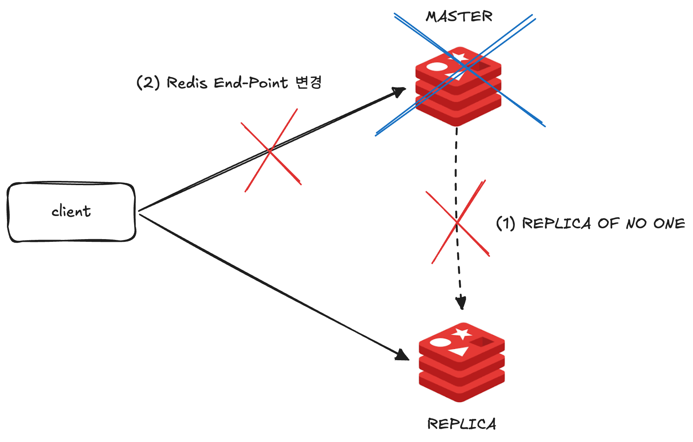
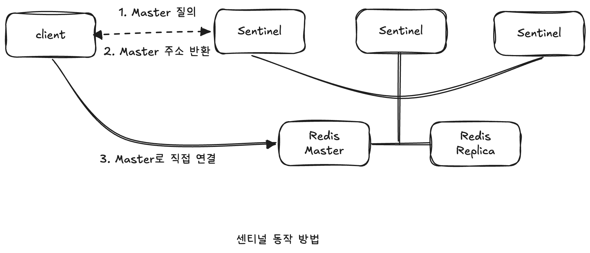
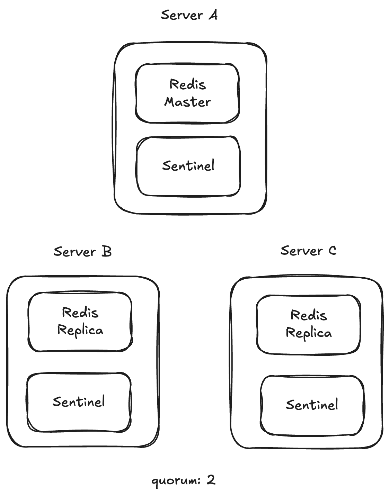
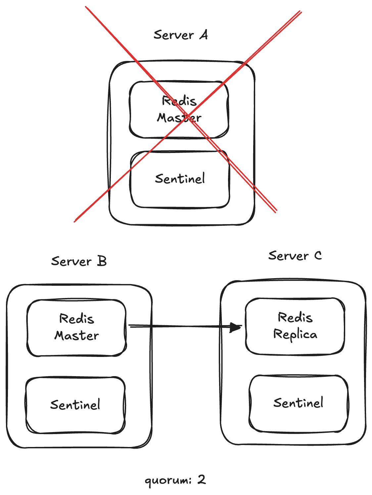
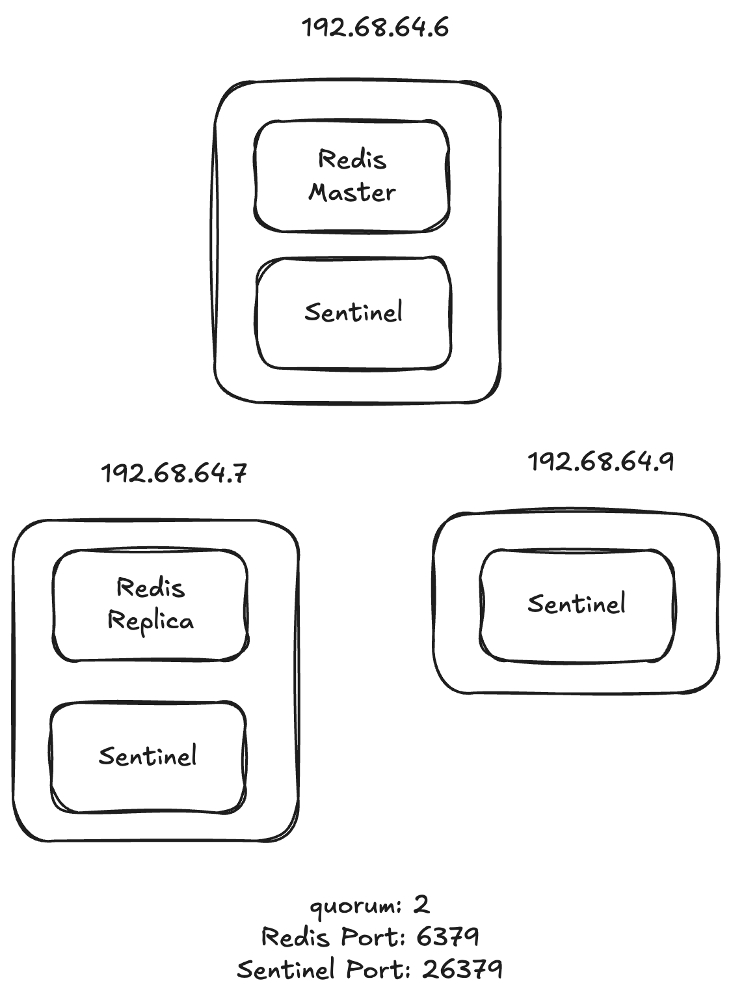

# 🧑🏻‍💻 레디스 센티널

---

- [✅ 고가용성 기능의 필요성](#-고가용성-기능의-필요성)
- [✅ 센티널이란?](#-센티널이란)
- [✅ 센티널 인스턴스 실행하기](#-센티널-인스턴스-실행하기)


## ✅ 고가용성 기능의 필요성

> [!NOTE]
> 레디스는 인메모리 데이터베이스다.  
> 모든 데이터는 메모리에서 관리하며, 따로 백업 설정을 하지 않았을 때 레디스 인스턴스가 재시작된다면 레디스에 있던 모든 데이터는 유실된다.  
> 복제본을 구성했을 때 마스터에 장애가 발생한 경우 아래와 같은 과정을 거쳐야 장애 상황을 복구할 수 있다.



> [!NOTE]
> 1. 복제본 노드에 직접 접속한 뒤 `REPLICA OF NO ONE` 커맨드를 입력해 읽기 전용 상태 해제
> 2. 애플리케이션 코드에서 레디스의 엔드포인트를 복제본의 IP로 변경
> 3. 배포

<br>

> [!CAUTION]
> 만약 운영 환경에서 별다른 고가용성 기능의 도입 없이 위와 같은 복제 구성으로만 레디스를 사용하고 있었다면 마스터 노드에 발생한 장애 처리가 지연돼 곧바로 서비스 기능의 문제로 이어질 수 있다.

<br>

> [!IMPORTANT]
> 레디스를 look aside 구성의 캐시로 사용할 경우에도 주의해야 한다.  
> 애플리케이션이 캐시에 접근할 수 없을 때, 레디스에서 데이터를 요청하던 세션들이 모두 원본 소스에 집중되면 서버 부하가 급증하고, 급격한 커넥션 증가는 운영 중인 서비스에 영향을 끼칠 수 있기 때문이다.

<br>

## ✅ 센티널이란?

> [!TIP]
> 레디스의 자체 고가용성 기능인 센티널을 사용하면 앞선 장애 상황을 대비할 수 있다.  
> 센티널은 데이털르 저장하는 기존 레디스 인스턴스와는 다른 역할을 하는 별도의 프로그램이며, 센티널의 자동 페일오버 기능을 사용하면 마스터 인스턴스에 장애가 발생하더라도 레디스를 계속 사용할 수 있도록 동작해 레디스의 다운타임을 최소화할 수 있다.

<br>

### ⭐️ 센티널 기능
> [!NOTE]
> - 모니터링: 마스터, 복제본 인스턴스의 상태를 실시간으로 확인한다.
> - 자동 페일오버: 마스터의 비정상 상태를 감지해 정상 상태의 복제본 중 하나를 마스터로 승격시킨다.  
>   기존 마스터에 연결된 복제본은 새롭게 승격된 마스터에 연결된다.
> - 인스턴스 구성 정보 안내: 센티널은 클라이언트에게 현재 구성에서의 마스터 정보를 알려준다.  
>   페일오버가 발생하면 마스터 정보를 재전달하기 때문에 페일오버가 발생하더라도 레디스의 엔드포인트 정보를 변경할 필요가 없다.

<br>



<br>

### ⭐️ 분산 시스템으로 동작하는 센티널

> [!TIP]
> SPOF(Single Point Of Failure는 하나의 서비스에 문제가 생겼을 때 전체 시스템의 영향을 받는 지점을 뜻한다.  
> 복제와 자동 페일오벌르 이용해 고가용성을 확보하는 이유는 레디스가 SPOF가 되는 것을 방지하기 위함이다.  
> 하지만 고가용성을 위해 도입하는 서비스가 SPOF가 돼버린다면 이는 도입할 필요가 없는 시스템이라고 할 수 있다.  
> ➡ 센티널은 그 자체로 SPOF가 되는 것을 방지하기 위해 최소 3대 이상일 때 정상적으로 동작할 수 있도록 설계됐으며, 하나의 센티널에 이상이 생기더라도 다른 센티널이 계속해서 역할을 수행할 수 있게 된다.

<br>

> [!NOTE]
> 센티널은 오탐을 줄이기 위해 쿼럼(quorum)이라는 개념을 사용한다.  
> 쿼럼은 마스터가 비정상 동작을 한다는 것에 동의해야하는 센티널의 수로, 쿼럼을 만족하는 경우 페일오버를 시작한다.  
> 일반적으로 센티널 인스턴스가 3개일 때 쿼럼은 2로 설정하며, 이 경우 최소 2개 이상의 센티널 인스턴스가 마스터 비정상 상태에 동의한다면 페일오버를 시작시킨다.

<br>

> [!TIP]
> 센티널은 쿼럼을 이용한 과반수 선출 개념을 사용하기 대문에 3대 이상의 홀수로 구성하는 것이 좋다.  
> 보통 3대로 구성하며, 좀더 견고하게 장애에 대처하고자 한다면 5대로 구성할 수 있다.

<br>

### ⭐️ 센티널 인스턴스 배치 방법
> [!TIP]
> 기본적으로 센티널 인스턴스는 물리적으로 영향받지 않는 서버에서 실행하는 것이 좋다.  
> 마스터의 장애를 감지할 수 있어야하기 때문에 서로 다른 가용 영역에 배치하는 것이 일반적이다.

<br>



> [!NOTE]
> 센티널은 최대 3대 이상 사용해야하며, 각각은 다른 물리 서버에 배치하는 것이 좋기 때문에 위와 같은 구조가 센티널을 사용할 때의 가장 일반적인 배치 방법이다.  
> 보통 하나의 서버에 레디스 프로세스와 센티널 프로세스를 동시에 실행시킨다.

<br>



> [!NOTE]
> 위와 같이 서버 A에 문제가 생겨 마스터 노드와 센티널에 접근할 수 없게 되면 서버 B, C에 있는 센티널 인스턴스가 마스터 인스턴에 접근이 불가능한 상태라는 것을 동의한 뒤, 페일오버를 진행시킨다.  
> 서버 B와 서버 C의 센티널 인스턴스는 새롭게 마스터가 될 복제본을 선출한 뒤, 해당 복제본 인스턴스를 마스터로 승격시킨다.

<br>

> [!TIP]
> 이 상황에서 서버 A가 복구된다면 센티널 인스턴스들은 기존 마스터였던 서버 A의 레디스 인스턴스를 새롭게 마스터가 된 서버 B의 복제본이 되도록 연결시킨다.  
> 이 과정은 센티널 인스턴스의 판단으로 자동으로 구성되며, 운영자의 개입이 필요하지 않는다.

<br>

> [!TIP]
> 경우에 따라서 1개의 복제본으로도 충분한 서비스가 있을 수 있는데, 이 경우에는 2대의 서버에는 레디스와 센티널 인스턴스를 동시에 실행시키고, 나머지 1대의 서버에는 센티널 프로세스만 실행시키도록 배치할 수 있다.  
> 이때 센티널만 실행될 서버는 데이터를 직접 저장하지도, 클라이언트의 요청을 받지도 않는 서버이기 때문에 최저 사양의 스펙으로 구성돼도 괜찮다.

<br>

## ✅ 센티널 인스턴스 실행하기



<br>

먼저 복제 연결을 시작해야한다.  
192.68.64.7에서 다음과 같은 커맨드를 통해 복제 연결을 하였다.  
```shell
REPLICAOF 192.168.64.6 6379
```

<br>

`sentinel.conf`에 다음과 같은 내용이 있어야한다.  
```text
port 26379
sentinel monitor mymaster 192.168.64.6 6379 2
daemonize yes
```
> [!TIP]
> sentinel monitor는 모니터링할 마스터의 이름을 지정하고, 마스터에 이름을 부여하며, 쿼럼 값을 지정한다.  

<br>

마스터 노드의 redis.conf에서 다음과 같이 bind에 기존 ip에서 본인 IP를 하나 더 추가시키고, protected-mode를 no로 바꾼다.

```shell
# 마스터노드와 복제본 노드 각각 다 수행 필요
redis-cli config set bind "127.0.0.1 -::1 {본인 IP}(예: 192.168.64.6)"

redis-cli config set protected-mode no
```


<br>

> [!NOTE]
> 센티널은 마스터와 복제본을 포함한 모든 레디스 프로세스를 모니터링하지만, 구성 파일에는 복제본 정보를 직접 입력하지 않아도 된다.  
> 센티널 프로세스가 시작하면 마스터에 연결된 복제본을 자동으로 찾아내는 과정을 거친다.  

<br>

`sentinel.conf` 파일을 이용해 센티널 인스턴스를 시작하기 위해서는 아래 두 명령어 중 하나를 사용하면 된다.
```shell
# redis-sentinel을 이용하는 방법
bin/redis-sentinel sentinel.conf

# redis-server를 이용하는 방법
bin/redis-server sentinel.conf --sentinel
```

<br>

센티널에 접속은 다음과 같이 할 수 있다.
```shell
# 실행 명령어
redis-cli -p 26379

# 종료 명렁어
redis-cli -p 26379 shutdown
```

<br>


```shell
# SENTINEL master 커맨드를 통해 원하는 마스터의 IP, 포트, 복제본의 개수 등을 다양하게 알 수 있다.
127.0.0.1:26379> SENTINEL master mymaster
 1) "name"
 2) "mymaster"
 3) "ip"
 4) "192.168.64.6"
 5) "port"
 6) "6379"
 7) "runid"
 8) "d2116ec542fb3ae840f29b745b07274af9e114fd"
 9) "flags"
10) "master"
11) "link-pending-commands"
12) "0"
13) "link-refcount"
14) "1"
15) "last-ping-sent"
16) "0"
17) "last-ok-ping-reply"
18) "808"
19) "last-ping-reply"
20) "808"
21) "down-after-milliseconds"
22) "30000"
23) "info-refresh"
24) "258"
25) "role-reported"
26) "master"
27) "role-reported-time"
28) "502415"
29) "config-epoch"
30) "0"
31) "num-slaves"
32) "1"
33) "num-other-sentinels"
34) "2"
35) "quorum"
36) "2"
37) "failover-timeout"
38) "180000"
39) "parallel-syncs"
40) "1"
```

<br>

> [!NOTE]
> - `num-other-sentinels`
>   - 마스터를 모니터링하고 있는 다른 센티널의 정보를 나타낸다.
>   - 위에서는 2로, 현재 `mymaster` 마스터를 모니터링하고 있는 다른 센티널 노드가 추가로 2대가 더 존재한다는 것을 인지하고 있음을 의미한다.
> - `flags`
>   - 마스터의 상태를 뜻한다.
>   - 마스터의 상태가 정상 상태가 아니면 `s_down` 또는 `o_down` 등으로 값이 변경된다.
> - `num-slaves`
>   - 현재 마스터에 연결된 복제본의 개수를 의미한다.
>   - 위의 경우에는 1로, 마스터에 연결된 복제본이 1개 존재한다는 것을 센티널이 인지하고 있음을 뜻한다.

<br>

```shell
# 마스터에 연결된 복제본의 자세한 정보 확인
127.0.0.1:26379> SENTINEL replicas mymaster
1)  1) "name"
    2) "192.168.64.7:6379"
    3) "ip"
    4) "192.168.64.7"
    5) "port"
    6) "6379"
    7) "runid"
    8) ""
    9) "flags"
   10) "s_down,slave,disconnected"
```

<br>

```shell
# 마스터에 연결된 센티널의 자세한 정보 확인
127.0.0.1:26379> SENTINEL sentinels mymaster
1)  1) "name"
    2) "5f356f32f4925897f83792d167f75abd4c9d6afc"
    3) "ip"
    4) "192.168.64.6"
    5) "port"
    6) "26379"
    7) "runid"
    8) "5f356f32f4925897f83792d167f75abd4c9d6afc"
    9) "flags"
   10) "sentinel"
```

<br>

> [!NOTE]
> `SENTINEL ckquorum` 커맨드를 통해 마스터를 바라보고 있는 센티널 인스턴스가 설정한 쿼럼 값보다 큰지 확인할 수 있다.  
> 예를 들어 정상 상태의 센티널이 3대, 쿼럼이 2일 경우 모두 정상이라면 다음과 같은 값을 반환한다.

```shell
127.0.0.1:26379> SENTINEL ckquorum mymaster
OK 3 usable Sentinels. Quorum and failover authorization can be reached
```

<br>

> [!TIP]
> 1대의 센티널에 문제가 생겨 정상적인 세닡널이 2대가 됐을 경우를 생각해보자.  
> 정상적인 센티널 대수가 쿼럼 값인 2 이상이기 때문에 전체 센티널 구성은 정상적이라 판단할 수 있다.
```shell
127.0.0.1:26379> SENTINEL ckquorum mymaster
OK 2 usable Sentinels. Quorum and failover authorization can be reached
```

<br>

> [!CAUTION]
> 만약 이 상황에서 다른 1대의 센티널이 또 비정상적인 상태가 된다면, 정상적인 센티널의 수는 1대로, 설정한 쿼럼 값보다 작아지게 된다.  
> 이런 상황에서 레디스 마스터에 장애가 발생해도 쿼럼 이상의 센티널 인스턴스에게 동의를 받을 수 없기 때문에 비정상적인 센티널의 상태라 볼 수 있다.

```shell
127.0.0.1:26379> SENTINEL ckquorum mymaster
(error) NOQUORUM 1 usable Sentinels. Not enough available Sentinels to reach the specified quorum for this master
```

> [!WARNING]
> 정상적인 센티널의 대수가 쿼럼보다 작기 때문에 마스터 노드에 장애가 발생해도 투표를 진행할 수 없어 페일오버를 자동으로 실행할 수 없다.  

<br>

> [!TIP]
> 센티널을 연결을 해제하기 위해서는 다른 두 노드에서 `redis-cli -p 26379 shutdown` 커맨드를 수행 후, 살아있는 노드에서 `SENTINEL RESET mymaster` 커맨드를 수행하면 된다.

<br>

### ⭐️ 페일오버 테스트
```shell
# 수동 페일오버
SENTINEL FAILOVER mymaster
```
> [!NOTE]
> 센티널에 접속한 뒤 이 커맨드를 사용하면 다른 센티널의 동의를 구하지 않고도 페일오버를 발생시킬 수 있다.  
> 실제 마스터의 상태가 정상이었을 때도 이 커맨드를 사용하면 마스터와 복제본 간 롤 체인지가 발생한다.  

<br>

> [!IMPORTANT]
> 센티널과 복제본 노드 간 네트워크 단절 등의 이슈로 인해 페일오버가 살패하진 않는지, 센티널에 연결된 애플리케이션의 커넥션이 정상적으로 롤 체인지된 마스터에 연결되는지 등의 정보를 확인할 수 있다.

```shell
# 마스터가 192.168.64.7 노드로 바뀌었다. 
127.0.0.1:26379> SENTINEL master mymaster
 1) "name"
 2) "mymaster"
 3) "ip"
 4) "192.168.64.7"
 5) "port"
 6) "6379"
```

<br>

```shell
# 마스터 노드를 동작 중지시켜 페일오버 발생(자동 페일오버)
redis-cli -h 192.168.64.6 -p 6379 shutdown
```
```shell
# 대략 30초 뒤 확인해보면 마스터 노드 변경
127.0.0.1:26379> SENTINEL master mymaster
 1) "name"
 2) "mymaster"
 3) "ip"
 4) "192.168.64.7"
```

> [!NOTE]
> 센티널은 주기적으로 마스터 노드에 PING을 보내 응답이 정상적으로 돌아오는지 확인함으로 마스터 인스턴스의 상태를 파악한다.  
> 이때 `sentinel.conf`에 지정한 `down-after-milliseconds` 시간 동안 마스터에서 응답이 오지 않으면 마스터의 상태가 정상적이지 않다고 판단해 페일오버를 트리거한다.

<br>

## ✅ 센티널 운영하기

> [!NOTE]
> 마스터와 복제본 노드에 `requirepass/masterauth` 옵션을 이용해 패스워드를 설정한 경우 센티널의 설정 파일에서도 패스워드를 지정해야 한다.  
> 센티널을 이용한 구성에서는 장애 상황에 센티널이 자동으로 페일오버를 시키기 때문에 복제 구성 내의 모든 레디스 노드는 마스터 노드가 될 가능성이 있다고 볼 수 있어, 하나의 복제 그룹에서는 모두 `requirepass`와 `masterauth` 값을 동일하게 설정해야 한다.
```text
# sentinel.conf
sentinel auth-pass <master-name> <password>
```

<br>

> [!NOTE]
> 모든 레디스 인스턴스는 `replica-priority` 파라미터를 가지고 있다.  
> 센티널은 페일오버를 진행할 때 복제본 노드의 `replica-priority`를 확인하며, 가장 작은 값을 가진 노드를 마스터로 선출한다.  
> 기본값은 100이며, 0인 복사본은 절대로 마스터로 선출되지 않는다.

<br>

### ⭐️ 운영 중 센티널 구성 정보 변경
> [!IMPORTANT]
> 센티널은 실행 도중 모니터링할 마스터를 추가, 제거, 변경할 수 있다.  
> 설정을 변경했다고 해서 그 정보들이 다른 센티널로 전파되진 않기 때문에, 각각의 센티널에 모두 설정을 적용해야 한다.

<br>

```shell
# 센티널이 새로운 마스터를 모니터링하게 설정
SENTINEL MONITOR <master name> <ip> <port> <quorum>
```

<br>

```shell
# 더이상 지정하는 마스터를 모니터링하지 않도록 설정
SENTINEL REMOVE <master name>
```

<br>

```shell
# 특정 마스터에 대해 지정한 파라미터를 변경할 수 있다.
SENTINEL SET <name> [<option> <value> ...]

# 마스터가 다운됐는지 판단하는 시간을 1000ms 이후로 변경
SENTINEL SET mymaster down-after-milliseconds 1000

# 쿼럼 값 변경
SENTINEL SET mymaster quorum 1
```

<br>

```shell
# 센티널의 고유한 설정값 확인
SENTINEL CONFIG GET <configuration name>

# 센티널의 고유한 설정값 런타임 중 변경
SENTINEL CONFIG SET <configuration name> <value> 

SENTINEL CONFIG GET announce*
1) "announce-hostnames"
2) "no"
3) "announce-ip"
4) ""
5) "announce-port"``
6) "0"
```

### ⭐️ 센티널 초기화


> [!NOTE]
> 192.68.64.6을 1번 노드, 192.68.64.7을 2번 노드, 192.68.64.9를 3번 노드라고 가정하자.  
> 1번 노드에 장애가 발생한 뒤, 2번 노드가 마스터 노드로 승격되었다.  
> 2번, 3번 노드의 센티널은 1번 노드의 레디스 인스턴스에 주기적으로 PING을 하며 상태를 확인하고 있다.  
> 만약 해당 인스턴스에 대한 모니터링을 중단하려면 `SENTINEL RESET` 커맨드를 통해 센티널 인스턴스의 정보를 초기화해야 한다.  
> 위에 [센티널 인스턴스 실행하기](#-센티널-인스턴스-실행하기)에 마지막에서도 사용해본적이 있다.  
> 
> 마스터 이름 대신 `*`를 입력해 센티널이 모니터링하고 있는 전체 마스터 정보를 초기화할 수도 있다.


<br>


<br>

**참고 자료**  
[개발자를 위한 레디스](https://product.kyobobook.co.kr/detail/S000210785682)