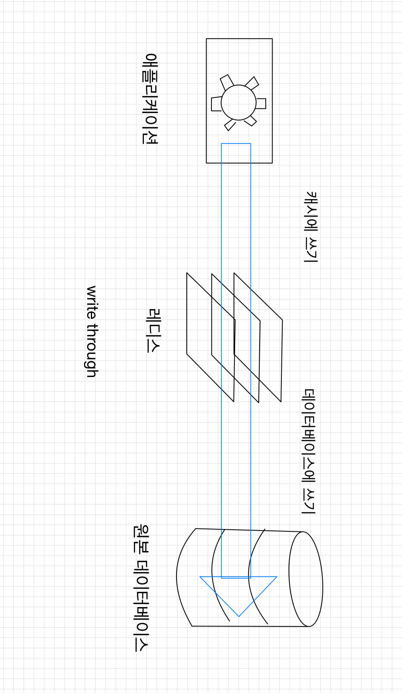
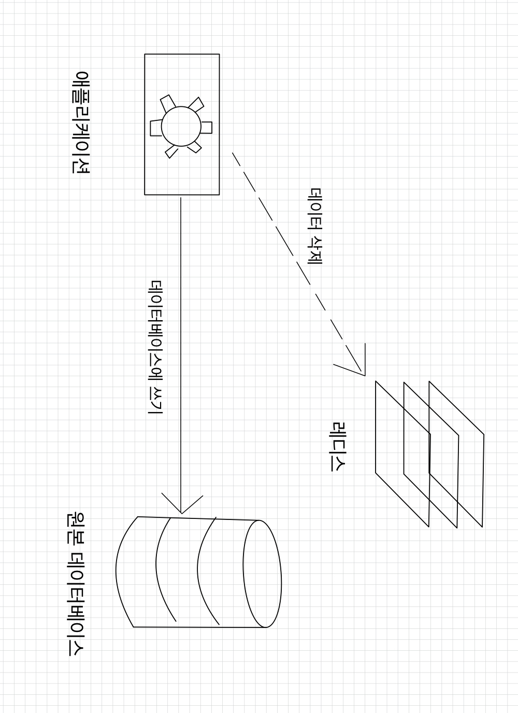
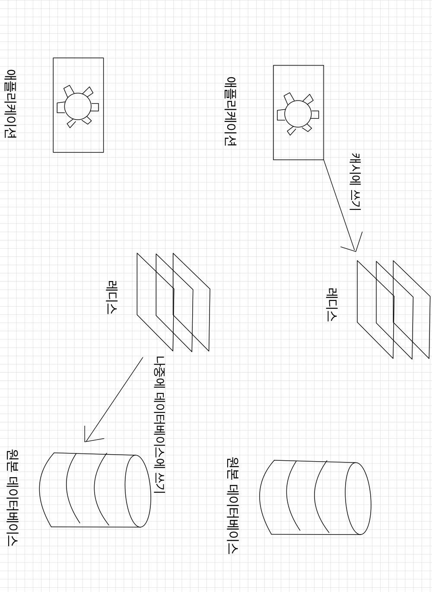
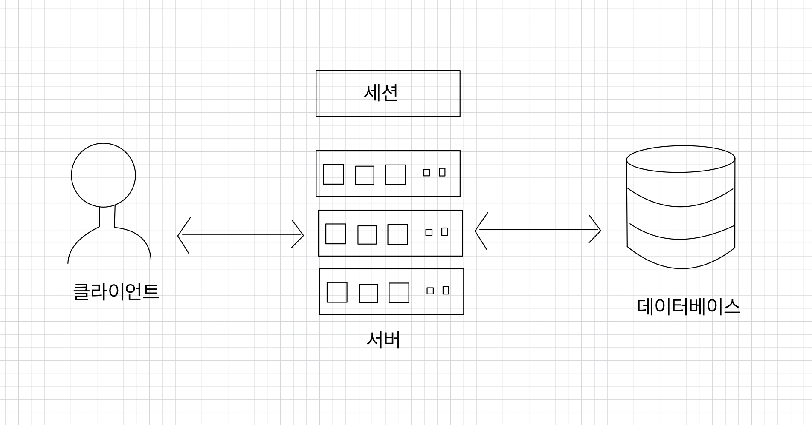
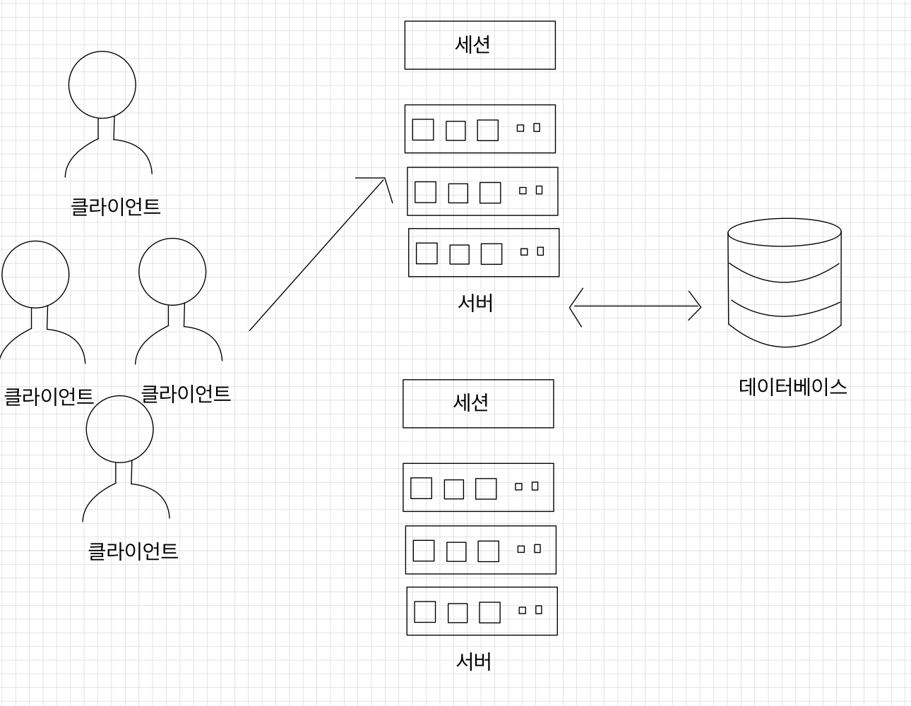
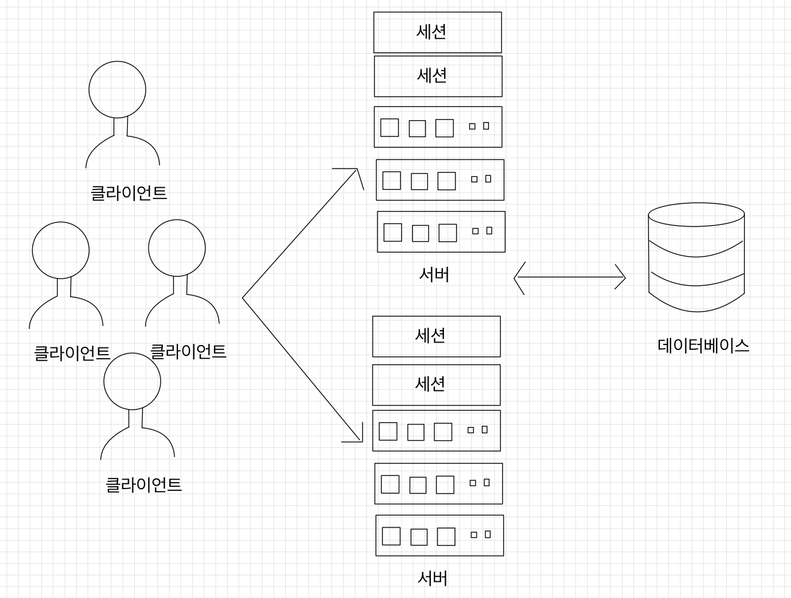
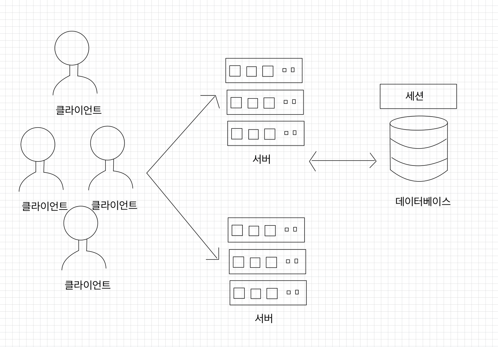
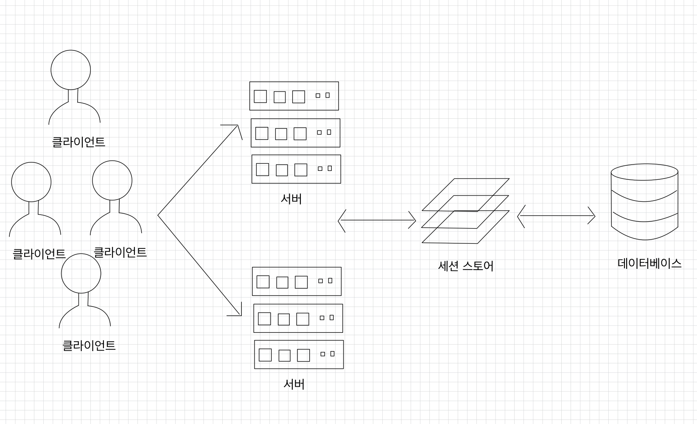

# 💻 레디스를 캐시로
- [레디스와 캐시](#-레디스와-캐시)
  - [캐시란?](#-캐시란)
  - [캐시로서의 레디스](#-캐시로서의-레디스)
  - [캐싱 전략](#-캐싱-전략)
- [캐시에서의 데이터 흐름](#-캐시에서의-데이터-흐름)
  - [만료 시간](#-만료-시간)
  - [메모리 관리와 maxmemory-policy 설정](#-메모리-관리와-maxmemory-policy-설정)
  - [캐시 스탬피드 현상](#-캐시-스탬피드-현상)
- [세션 스토어로서의 레디스](#-세션-스토어로서의-레디스)
  - [세션이란?](#-세션이란)
  - [세션 스토어가필요한 이유](#-세션-스토어가필요한-이유)
  - [캐시 vs 세션](#-캐시-vs-세션)

## 💡 레디스와 캐시
### ✅ 캐시란?
캐시란, 데이터의 원본보다 더 빠르고 효율적으로 액세스할 수 있는 임시 데이터 저장소를 의미한다.  

<br>

캐시를 도입했을 때 성능을 효과적으로 개선할 수 있는 조건
- 원본 데이터 저장소에서 원하는 데이터를 찾기 위해 검색하는 시간이 오래 걸리거나, 매번 계산을 통해 데이터를 가져와야 한다.
- 캐시에서 데이터를 가져오는 것이 원본 데이터 저장소 데이터를 요청하는 것보다 빨라야 한다.
- 캐시에 저장된 데이터는 잘 변하지 않는 데이터다.
- 캐이세 저장된 데이터는 자주 검색되는 데이터다.

<br>

이상적인 캐시가 해결하는 문제점
- 원본 데이터 저장소 데이터를 가지고 오는 시간을 단축시킨다.
- 원본 데이터 저장소에서 데이터를 읽는 커넥션을 줄일 수 있다.
- 캐시를 적절하게 배치함으로써 애플리케이션의 확장 또한 가능하다.
- 원본 데이터 저장소에서 데이터를 가져올 때 CPU와 메모리 등의 리소스를 많이 사용했다면 캐시를 사용함으로써 애플리케이션 자체의 리소스를 줄일 수 있다.  
  ➡ 같은 값을 도출하기 위해 계속 같은 계산을 할 필요가 없으므로 리소스를 최적화시킬 수 있게 된다.
- 원본 데이터 저장소에 장애가 발생해 접근할 수 없는 상황이 발생하더라도 캐시에서 데이터를 가지고 올 수 있기 때문에 장애 시간을 줄일 수 있다는 장점이 있다.

<br>

### ✅ 캐시로서의 레디스
레디스의 장점
1. 단순하게 키-값 형태로 저장하므로 데이터를 저장하고 반환하는 것이 굉장히 간단하며, 자체적으로 다양한 자료 구조를 제공하기 때문에 애플리케이션에서 사용하던 list, hash 등의 자료 구조를 변환하는 과정 없이 레디스에 바로 저장할 수 있다.
2. 레디스는 모든 데이터를 메모리에 저장하는 인메모리 데이터 저장소이기 때문에 데이터를 검색하고 반환하는 것이 굉장히 빠르다.  
   ➡ 평균 읽기 및 쓰기 작업 속도가 1ms 미만이며, 초당 수백만 건의 작업이 가능하다.
3. 레디스는 자체적으로 고가용성 기능을 가지고 있는 솔루션이다.  
   ➡ 레디스의 센티널 또는 클러스터 기능을 사용하면 마스터 노드의 장애를 자동으로 감지해 페일오버를 발생시키기 때문에 운영자의 개입 없이 캐시는 정상적으로 유지될 수 있다.
4. 레디스의 클러스터를 사용하면 캐시의 스케일 아웃 또한 쉽게 처리할 수 있다.  
   ➡ 서비스의 규모에 따라 캐시 자체의 규모도 늘어나야 할 상황이 발생할 수 있는데, 자체 샤딩 솔루션인 클러스터를 사용하면 수평 확장이 굉장히 간단해진다는 장점이 존재한다.

<br>

### ✅ 캐싱 전략
**읽기 전략 - look aside**  
애플리케이션은 찾고자 하는 데이터가 먼저 캐시에 있는지를 확인한다.  
➡ 캐시에 데이터가 있으면 캐시에서 데이터를 읽어온다(캐시 히트).  
➡ 캐시에 데이터가 없으면 애플리케이션은 직접 데이터베이스에 접근해 찾고자 하는 데이터를 가져오고, 이를 다시 캐시에 저장한다(캐시 미스).

<br>

look aside 구조
- 장점: 레디스에 문제가 생겨 접근을 할 수 없는 상황이 발생하더라도 바로 서비스 장애로 이어지지 않고 데이터베이스에서 데이터를 가지고 올 수 있다.
- 단점: 기존에 애플리케이션에서 레디스를 통해 데이터를 가져오는 연결이 매우 많았다면 모든 커넥션이 한꺼번에 원본 데이터베이스로 몰려 많은 부하를 발생시키고, 이로 인해 원본 데이터베이스의 응답이 느려지거나, 리소스를 많이 차지하는 등의 이슈가 발생해 애플리케이션의 성능에 영향을 미칠 수 있다.  
  ➡ 캐시 스탬피드

<br>

`lazy loading`: 찾고자 하는 데이터가 레디스에 없을 때에만 레디스에 데이터를 저장하는 구조  
만약 기존에 사용 중인 서비스에 처음 레디스를 투입하거나 데이터베이스에만 새로운 데이터를 저장한다면?  
➡ 애플리케이션은 데이터를 찾기 위해 레디스에 매번 먼저 접근하고, 그때마다 캐시 미스가 일어나 데이터베이스와 레디스에 재접근하는 과정을 통해 지연이 초래돼 성능에 영향을 미칠 수 있다.  


<br>

캐시 워밍(cache warming): 이럴 때에는 미리 데이터베이스에서 캐시로 데이터를 밀어넣는 작업을 하기도 한다.  
➡ 공연 예매를 하는 애플리케이션에서 새로운 공연 정보 상품이 오픈하기 전에 데이터베이스에 저장된 데이터를 레디스로 밀어넣는 캐시 워밍 작업을 거치는 것이 효율적일 수 있다.

<br>

**쓰기 전략과 캐시의 일관성**  
**1. write through**  
  
`write through` 방식은 데이터베이스에 업데이트할 때마다 매번 캐시에도 데이터를 함께 업데이트시키는 방식이다.  
캐시는 항상 최신 데이터를 가지고 있을 수 있다는 장점이 있지만, 데이터는 매번 2개의 저장소에 저장돼야하기 때문에 데이터를 쓸 때마다 시간이 많이 소요될 수 있다는 단점이 있다.  
이 방식의 경우 다시 사용되지 않을 데이터가 저장될 수 있기 때문에, 일종의 리소스 낭비가 발생할 수 있다.  
➡ 이 방식을 사용할 경우 데이터를 저장할 때 만료 시간을 사용할 것을 권장한다.

<br>

**2. cache invalidation**  
  
데이터베이스게 값을 업데이트할 때마다 캐시에서는 데이터를 삭제하는 전략이다.  
저장소에서 특정 데이터를 삭제하는 것이 새로운 데이터를 저장하는 것보다 훨씬 리소스를 적게 사용하기 때문에 앞선 `write through`의 단점을 보완한 방법이다.

<br>

**3. write behind(write back)**  
  
만약 쓰기가 빈번하게 발생하는 서비스라면 `write behind` 방식을 고려해볼 수 있다.  
데이터베이스에 대량의 쓰기 작업이 발생하면 이는 많은 디스크 I/O를 유발해, 성능 저하가 발생할 수 있다.  
➡ 따라서 먼저 데이터를 빠르게 접근할 수 있는 캐시에 업데이트한 뒤, 이후에는 건수나 특정 시간 간격 등에 따라 비동기적으로 데이터베이스에 업데이트하는 것이다.

<br>

예를 들어 유튜브와 같은 스트리밍 사이트의 좋아요 수는 매번 실시간 집계가 필요하진 않다.  
좋아요를 누른 데이터를 우선 레디스에 저장해둔 다음 5분 간격으로 이를 집계해 데이터베이스에 저장하는 과정을 거친다면 데이터베이스의 성능을 향상시켜 애플리케이션의 성능도 향상시킬 수 있다.  
물론 이 방법에서는 캐시에 문제가 생겨 데이터가 날아갈 경우 최대 5분 동안의 데이터가 날아갈 수 있다는 위험성이 있음을 감수해야 한다.


<br>

## ❗️ 캐시에서의 데이터 흐름
> 기본적으로 캐시는 데이터 스토어가 갖는 데이터 중 사용자가 자주 사용할만한 데이터를 갖고 와서 임시로 저장하는 저장소다.  
> 따라서 데이터 스토어보다 적응 양을 보관하는 데이터베이스의 서브셋이라고 볼 수 있다.  
> 레디스는 특히 메모리에 모든 데이터를 저장하며, 기본적으로 메모리는 서버의 스토리지보다 훨씬 적은 양을 보관할 수밖에 없다.

캐시로 레디스를 사용할 때에는 데이터를 저장함과 동시에 적절한 시간의 TTL 값을 지정하는 것이 좋다.

### ✅ 만료 시간
레디스에서 만료 시간, 즉 TTL(Time To Live)은 데이터가 얼마나 오래 저장될 것인지를 나타내는 시간 설정이다.  
만료 시간은 일반적으로 초(second) 단위로 표현되며, 지정된 시간이 지난 후에 레디스에서 자동으로 삭제된다.  

<br>

- `EXPIRE` 커맨드: 레디스에 저장된 키에 `EXPIRE` 커맨드를 사용하면 만료 시간을 설정할 수 있다.  
- `SET` 커맨드: `string` 데이터를 저장할 때에는 `EX` 옵션을 함께 사용해 데이터의 저장과 동시에 만료 시간을 설정할 수도 있다.  
- `TTL` 커맨드: 키에 대한 만료 시간을 확인할 수 있다.
  - 만료 시간이 남아있다면 남은 시간 반환
  - 키가 존재하지 않을 때에는 -2 반환
  - 키에 대해 만료 시간이 지정되지 않았을 경우에는 -1 반환
- 모두 초 단위로 동작하며, `PTTL`, `PEXPIRE` 커맨드를 통해 밀리세컨드(millisecond) 단위로 동작시킬 수 있다.

```shell
# a에 100 셋팅
127.0.0.1:6379> SET a 100
OK
# a에 TTL 60초 지정
127.0.0.1:6379> EXPIRE a 60
1
# a 만료시간 조회
127.0.0.1:6379> TTL a
58
# a 증가
127.0.0.1:6379> INCR a
101
# 여전히 a 만료시간은 흐르는 중
127.0.0.1:6379> TTL a
48
# a 키 이름 변경
127.0.0.1:6379> RENAME a apple
OK
# 여전히 apple 만료시간은 흐르는 중
127.0.0.1:6379> TTL apple
39
# 만료시간이 만료되면 -2 반환
127.0.0.1:6379> TTL apple
-2
# EX 옵션을 통해 한 번에 만료시간 지정
127.0.0.1:6379> SET a 100 EX 60
OK
# a 만료시간 조회
127.0.0.1:6379> TTL a
57

# b에 100 셋팅
127.0.0.1:6379> SET b 100
OK
# b에 만료시간이 지정이 안 됐으므로 -1 반환
127.0.0.1:6379> TTL b
-1
# b에 TTL 60초 지정
127.0.0.1:6379> EXPIRE b 60
1
# b 만료시간 조회
127.0.0.1:6379> TTL b
58
# b에 새로운 값을 덮어씀
127.0.0.1:6379> SET b banana
OK
# TTL 자체가 없어짐
127.0.0.1:6379> TTL b
-1
```

<br>

> 레디스에서 키가 만료됐다고 해도 바로 메모리에서 삭제되는 것은 아니다.  
> - passive 방식
>   - 클라이언트가 키에 접근하고자 할 때 키가 만료됐다면 메모리에서 수동적으로 삭제한다.
>   - 사용자가 접근할 때에만 수동적으로 삭제되기 때문에 이를 passive 방식의 만료라고 한다.
>   - 사용자가 다시 접근하지 않는 만료된 키도 있어 이 방식만으로는 충분하지 않다.
> - active 방식
>   - TTL 값이 있는 키 중 20개를 랜덤하게 뽑아낸 뒤, 만료된 키를 모두 메모리에서 삭제한다.
>   - 만약 25% 이상의 키가 삭제됐다면 다시 20개의 키를 랜덤하게 뽑은 뒤 확인한다.
>   - 아니라면, 뽑아놓은 20개의 키 집합에서 다시 확인한다.
>   - 이런 과정을 1초에 10번씩 수행한다.

<br>

### ✅ 메모리 관리와 maxmemory-policy 설정
레디스의 메모리는 제한적이기 때문에 모든 키에 만료 시간을 설정하더라도 너무 많은 키가 저장되면 메모리가 가득 차는 상황이 발생할 수 있다.  
메모리의 용량을 초과하는 양의 데이터가 저장되면 레디스는 내부 정책을 사용해 어떤 키를 삭제할지 결정한다.  
➡ 레디스에서는 데이터의 최대 용량을 설정하는 `maxmemory` 설정과 이 용량을 초과할 때의 처리 방식을 결정하는 `maxmemory-policy` 설정값을 사용해 메모리를 관리한다.  

<br>

**Noeviction**  
기본값은 `noeviction`이다.  
이 값은 레디스에 데이터가 가득 차더라도 임의로 데이터를 삭제하지 않고 더 이상 레디스에 데이터를 저장할 수 없다는 에러를 반환하는 설정 값이다.  
➡ 캐시에 데이터를 저장하지 못해 에러가 발생할 경우, 로직에 따라 장애 상황으로 이어질 수 있다.  
➡ 관리자가 레디스의 데이터를 직접 지워야 하기 때문에 레디스를 캐시로 사용할 때 권장하지 않는 설정값이다.  

<br>

데이터의 관리를 캐시에게 맡기지 않고, 애플리케이션 측에서 관리하겠다는 것을 의미하며, 데이터가 가득 차더라도 캐시 내부적 판단으로 데이터를 삭제하는 것이 위험하다고 판단될 때 이 옵션을 사용할 수 있다.  

<br>

**LRU eviction**  
`LRU(Least-Recently Used) eviction`이란 레디스에 데이터가 가득 찼을 때 가장 최근에 사용되지 않은 데이터부터 삭제하는 정책이다.  
캐시는 나중에 사용될 가능성이 있는 데이터를 유지하는 것을 목표로 하기 때문에 효율적인 관리 방법이다.
- `volatile-LRU`
  - 만료 시간이 설정돼 있는 키에 한해서 LRU 방식으로 키를 삭제한다.
  - 이미 만료 시간이 설정돼 있는 키는 언젠가 삭제될 키라는 것이고, 그 중 가장 오래 사용되지 않은 키를 삭제하는 방식이다.
  - 레디스를 사용할 때 임의적인 방식으로 삭제되면 안 되는 값에 대해서는 만료 시간을 지정하지 않는다면 적합하다.
  - 만약 레디스 내부에 저장된 키에 모두 만료 시간이 지정돼 있지 않다면 이는 `noeviction` 상황과 동일하게 된다.
- `allkeys-LRU`
  - 레디스 공식 문서에 의거, 잘 모르겠다면 `allkeys-LRU` 방식을 사용하기를 권장한다.
  - 모든 키에 대해 LRU 알고리즘 방식을 적용하기 때문에 적어도 메모리가 꽉 찼을 때 장애가 발생할 상황은 방지할 수 있다.

<br>

**LFU eviction**  
`LFU(Least-Frequently Used) eviction`이란 레디스에 데이터가 가득 찼을 때 가장 자주 사용되지 않은 데이터부터 삭제하는 정책이다.  
LFU는 LRU와 유사하지만 키를 액세스하는 패턴에 따라 우선순위가 유동적으로 바뀐다는 점에서 특정 케이스에서는 LRU보다 효율적일 수 있다.
- `volatile-LFU`: 만료 시간이 설정돼 있는 키에 한해서 LFU 방식으로 키를 삭제한다.
- `allkeys-LFU`: 모든 키에 대해 LFU 알고리즘을 이용해 데이터를 삭제한다.

<br>

> 레디스에서 키를 삭제하기 위해 사용되는 LRU, LFU 알고리즘은 모두 근사 알고리즘으로 구현됐다.  
> 메모리가 가득찬 상황에서 가장 오래 사용되지 않거나 자주 사용되지 않은 키를 정확하게 찾아내는 것이 불필요하게 CPU 및 메모리 리소스를 소비할 수 있기 때문이다.  
> 저장된 모든 데이터는 특정 상황에서 삭제될 수 있다는 가정하에 이 알고리즘이 동작한다.

<br>

**RANDOM eviction**  
레디스에 저장된 키 중 하나를 임의로 골라내 삭제한다.  
알고리즘을 사용하지 않아 삭제될 키 값을 계산하지 않아도 된다는 점에서 레디스의 부하를 줄여줄 수 있는 방법이다.  

사용하는 것을 권장하지 않는다.
- 나중에 사용될 수도 있는 데이터를 삭제할 가능성이 높아진다.  
  ➡ 데이터 저장소에서 다시 데이터를 갖고 와서 캐시에 넣어주는 작업이 오히려 불필요함을 유발할 수 있다.
- 레디스는 근사 알고리즘을 사용하기 때문에 LRU, LFU 데이터를 찾는 데에 큰 리소스를 사용하지 않는다.

<br>

- `volatile-random`: 만료 시간이 설정돼 있는 키에 한해 랜덤하게 키를 삭제한다.
- `allkeys-random`: 모든 키에 대해 랜덤하게 키를 삭제한다.

<br>

**volatile-TTL**  
`volatile-TTL` 방식은 만료 시간이 가장 작은 키를 삭제한다. 즉, 삭제 예정 시간이 얼마 남지 않은 키를 추출해 해당 키를 미리 삭제하는 옵션이다.    
LRU, LFU 알고리즘과 마찬가지로 근사 알고리즘을 사용한다.  
➡ 모든 키를 스캔하면서 만료 시간을 비교하지 않아도 돼 간단하게 키를 찾아낼 수 있다.

<br>

### ✅ 캐시 스탬피드 현상
대규모 트래픽 환경에서 만료 시간을 어떻게 설정하느냐에 따라 캐시 스탬피드(cache stampede)와 같이 예상하지 못한 문제 상황이 발생할 수 있다.

<br>

만약 여러 개의 애플리케이션에서 바라보던 키가 레디스에서 만료돼 삭제된다면 이 서버들은 한꺼번에 데이터베이스에 가서 데이터를 읽어오는 과정을 거친다.  
이를 중복 읽기(duplicate read)라고 한다.  
각 애플리케이션에서는 읽어온 데이터를 레디스에 쓰게 되는데, 이 또한 여러 번 반복되기 때문에 중복 쓰기(duplicate write)가 발생한다.  

<br>

레디스에 데이터가 없다는 것을 인지한 여러 애플리케이션에서 동시에 데이터베이스에 접근해 무거운 쿼리를 실행하는 중복 읽기 작업은 데이터베이스에 부하를 줄 수 있으며, 이는 곧 서비스 이슈로도 이어질 수 있다.  
➡ 한 번 캐시 스탬피드 현상이 발생하면 결과적으로 더 많은 데이터가 이 현상의 영향을 받게 돼, 더 큰 문제로 이어질 수 있다. 계단식 실패(cascading failure)라고도 부른다.


<br>

**1. 적절한 만료 시간 설정**    
캐시 스탬피드를 줄이기 위한 가장 간단한 방법은 만료 시간을 너무 짧지 않게 설정하는 것이다.  
여러 애플리케이션에서 한꺼번에 접근해야 하는 데이터며, 반복적으로 사용돼야 하는 데이터라면 저장 시점부터 만료 시간을 충분히 길게 설정해주는 것이 좋다.  
➡ 캐시 스탬피드가 발생하는 시점을 없애는 게 아니라 뒤로 미루는 전략인 거 같지만, 발생 빈도를 줄인다는 점에서 의미가 있는 방식이다.


<br>

**2. 선 계산**  
`look aside` 방식으로 캐시를 사용할 때 애플리케이션은 다음 코드와 비슷하게 동작할 것이다.  
캐시에 데이터가 있는지 확인한 뒤 없으면 데이터베이스에서 데이터를 가져온 뒤 다시 레디스에 저장하는 과정을 거친다.
```java
public String fetch(String key, DataSource dataSource) {
    try (Jedis jedis = jedisPool.getResource()) {
        String value = jedis.get(key);
        
        if (value == null) {
            // 캐시미스 ➡ DB에서 조회
            value = dataSource.fetch(key);
            jedis.setex(key, DEFAULT_TTL, value);
        }
        return value;
    }
}
```
캐시 스탬피드가 문제가 되는 이유는 데이터가 만료되는 시점에 여러 애플리케이션에서 동시다발적으로 이를 인지하고, 이후 작업을 동시에 진행하기 때문이다.  
만약 키가 실제로 만료되기 전에 이 값을 미리 갱신해준다면 여러 애플리케이션에서 한꺼번에 데이터베이스에 접근해 데이터를 읽어오는 과정을 줄여 불필요한 프로세스를 줄일 수 있다.  
➡ 애플리케이션마다 데이터 갱신 기준이 다르기 때문에, 1번 서버가 미리 갱신해놓은 데이터를 2번 서버는 캐시 히트가 가능하므로 유의미한 전략


<br>

다음 코드에서는 레디스가 실제로 만료되기 전 랜덤한 확률로 데이터베이스에 접근해서 데이터를 읽어와 캐시의 값을 갱신하는 과정을 거친다.
```java
public String fetch(String key, int expireGap, DataSource dataSource) {
    try (Jedis jedis = jedisPool.getResource()) {
        // Redis TTL 조회 (초 단위로 반환)
        Long ttl = jedis.ttl(key);
        
        // TTL 확인 및 확률적 판단
        // ttl - (random * expireGap) > 0 이면 캐시 사용
        // 그렇지 않으면 재계산
        double randomFactor = random.nextDouble(); // 0.0 ~ 1.0
        double threshold = ttl - (randomFactor * expireGap);
        
        if (threshold > 0) {
            // 캐시 히트 - 기존 값 반환
            String value = jedis.get(key);
            if (value != null) {
                return value;
            }
        }
        
        // 캐시 미스 또는 임계값 도달 - DB에서 재계산
        String value = dataSource.fetch(key);
        
        // Redis에 저장 (KEY_TTL 만큼 유지)
        jedis.setex(key, KEY_TTL, value);
        
        return value;
    }
}

// Usage
fetch("hello", 2, dataSource);
```

위 함수를 통해 랜덤한 확률로 키가 만료되기 전 데이터를 갱신한다.  
만약 `ttl - (randomFactor * expireGap)` 값이 0보다 작다면 애플리케이션은 데이터베이스에 접근해 데이터를 가지고 온 뒤 레디스의 값을 갱신한다.  
단순하게 데이터를 갖고 오는 방법보다 더 많은 리소스를 사용한다고 볼 수도 있지만, 상황에 따라 캐시 스탬피드 현상을 줄일 수 있기 때문에 전체적인 성능을 향상시킬 수 있다.  

<br>

이때 `expire_gap` 값을 적절히 설정해주는 것이 중요하다.  
이 값에 따라 오히려 불필요한 작업이 늘어나 성능을 줄일 수 있기 때문이다.

<br>

**PER 알고리즘**  
PER(Probabilistic Early Recomputation) 알고리즘은 캐시 값이 만료되기 전에 언제 데이터베이스에 접근해서 값을 읽어오면 되는지 최적으로 계산할 수 있다.

<br>

`currentTime - (timeToCompute * beta * log(rand())) > expire`  
- currentTime: 현재 남은 만료 시간
- timeToCompute: 캐시된 값을 다시 계산하는 데 걸리는 시간
- beta: 기본적으로 1. 0보다 큰 값으로 설정 가능
- rand(): 0과 1 사이의 랜덤 값을 반환하는 함수
- expire: 키를 재설정할 때 새로 넣어줄 만료 시간

<br>

이 알고리즘은 만료 시간에 가까워질수록 false를 반환할 확률이 증가하므로, 이는 불필요한 재계산을 효과적으로 방지하는 가장 효율적인 방지일 수 있다.  
데이터를 가져오는 과정에서 GET 대신 이 함수를 사용하는 것은 캐시 스탬피드 현상을 줄이고, 성능을 최적화하는 데 도움이 된다.


<br>

## ❗️ 세션 스토어로서의 레디스
### ✅ 세션이란?
세션이란, 서비스를 사용하는 클라이언트의 상태 정보를 의미한다.  
애플리케이션은 현재 서비스에 로그인돼 있는 클라이언트가 누구인지, 그 클라이언트가 어떤 활동을 하고 있는지 저장하고 있으며, 유저가 서비스를 떠난다면 세션 스토어에서 유저의 정보를 삭제한다.  

<br>

**쇼핑몰 사이트**  
- 예를 들어 쇼핑몰 사이트에서 유저가 장바구니에 어떤 물건을 담았는지, 
- 혹은 최근에 봤던 아이템은 어떤 것인지 등의 정보를 세션에 저장해두면 사용자가 로그인한 동안에는 해당 정보가 계속 유지된다.  
- 혹은 사용자가 서비스의 각 페이지에서 보내는 시간을 저장한 뒤 이를 이용해 사용자 행동을 분석해 비즈니서 개선에 사용할 수 있다.

<br>

많은 서비스에서 레디스를 세션 스토어로 사용하고 있다.
- 유저가 로그인해 있는 동안에는 세션의 데이터를 읽고 쓰게 되므로 빠른 응답 속도는 필수적이다.
- 레디스는 키-값 형식으로 사용이 간단하며 `sting`, `set`, `hash` 등의 자료 구조를 제공하기 때문에 사용자 데이터를 저장하기 용이하다.

<br>

### ✅ 세션 스토어가필요한 이유
  
위와 같이 서비스 초창기, 혹은 프로토타입용 서비스에는 굳이 별도의 세션 스토어가 필요하지 않다.  
각 웹 서버에 세션 스토어를 두고 자체적으로 세션을 관리할 수 있기 때문이다.  
[로그인 처리하기 - 서블릿 HTTP 세션](https://github.com/kyeoungchan/spring-study-set/blob/main/login/src/main/java/hello/login/web/HomeController.java) 참고   

<br>

  
웹서버를 늘리면 여러 개의 웹 서버에 트래픽을 분배할 수 있기 때문에 더 많은 유저를 수용할 수 있게 된다.  
각 웹 서버별로 세션 스토어를 따로 관리하면 유저는 위와 같이 유저의 세션 정보를 갖고 있는 웹 서버에 종속돼야한다.  
그렇지 않으면 유저 데이터 정합성에 문제가 생기기 때문이다.   
쇼핑 카트에 분명히 아이템을 저장했는데, 서버에 접속할 때마다 아이템이 사라진다면 정상적인 서비스 이용이 불가능하다.  
➡ 유저는 다른 서버를 사용할 수 없어, 결국 트래픽을 분산시킬 수 없는 상황을 `sticky session`이라고 한다.  

<br>

  
유저의 세션 정보를 모든 웹 서버에 복제해서 저장하는 방법을 `all-to-all` 방법이라고 한다.  
유저를 여러 웹 서버에 분산시킬 수 있지만, 유저의 세션 데이터는 여러 서버로 복사돼 저장되기 때문에 불필요한 저장 공간을 차지하게 된다.  
하나의 유저는 하나의 웹 서버에만 접속하기 때문에, 다른 웹 서버에 저장된 유저의 세션 정보는 무의미하게 되기 때문이다.  

<br>

  
위와 같이 데이터베이스를 세션 스토어로 사용하는 방법도 고려해볼 수 있다.  
하지만 각 유저는 세션이 활성화돼 있는 동안 세션 스토어에 활발하게 액세스한다.  
서비스가 커져 유저가 많아질수록 데이터베이스를 세션 스토어로 사용하는 것은 서비스 전반적인 응답 속도를 저하시키는 요인이 될 수 있다.

<br>

  
위와 같이 레디스를 세션 스토어로 사용해 세션을 서버, 데이터베이스와 분리시켜 놓은 뒤 여러 서버에서 세션 스토어를 바라보도록 구성한다면 모든 이슈를 해결할 수 있다.  
- 세션 스토어에 구애받지 않고 어떤 웹 서버에 연결되더라도 동일한 세션 데이터를 조회할 수 있다.
  - 트래픽을 효율적으로 분산시킬 수 있다.
  - 데이터의 일관성도 고려할 필요 없다.
- 레디스는 관계형 데이터베이스보다 훨씬 빠르고 접근하기도 간편하므로 데이터를 가볍게 저장할 수 있다.

레디스의 hash 자료 구조는 세션 데이터를 저장하기에 알맞은 형태다.  
```shell
127.0.0.1:6379> HMSET usersession:1 Name Charles IP 10:20:104:30 Hits 1
OK
127.0.0.1:6379> HINCRBY usersession:1 Hits 1
2
127.0.0.1:6379> HGETALL usersession:1
Name
Charles
IP
10:20:104:30
Hits
2
```

<br>

### ✅  캐시 vs 세션
캐시
- 데이터베이스의 완벽한 서브셋으로 동작한다.
  - 즉, 캐시가 갖고 있는 데이터는 모두 데이터베이스에 저장돼 있다.
  - 캐시가 내부의 데이터를 유실하더라도 해당 데이터는 데이터베이스에서 찾을 수 있다.
- 캐시에 저장된 데이터는 여러 애플리케이션에서 함께 사용할 수 있다.

<br>

세션 스토어
- 유저가 로그인하면 세션 데이터는 세션 스토어에 저장된다.
  - 유저가 로그인해있는 동안, 즉 세션이 활성화돼 있는 동안에는 애플리케이션은 유저의 데이터를 데이터베이스가 아닌 세션 스토어에만 저장한다.
  - 예를 들어, 유저가 최근 봤던 아이템, 혹은 장바구니에 담긴 아이템은 세션 스토어에만 담겨 있다.
    - 유저가 로그아웃할 때 세션은 종료되며 이때 데이터의 종류에 따라 데이터베이스에 저장해 영구적으로 보관할 것인지, 삭제할 것인지 결정된다.
    - 최근에 봤던 상품 리스트는 휘발시켜도 되지만, 장바구니에 담아 놨던 상품들은 데이터베이스에 저장시켜 다음에 로그인했을 때도 확인할 수 있도록 한다.
  - 세션 스토어에 장애가 발생하면 내부 데이터가 손실될 가능성이 있으므로 레디스를 세션 스토어로 활용할 때에는 레디스를 캐시로 사용할 때보다 더 신중한 운영이 필요하다.
- 세션 스토어에 저장된 데이터는 여러 사용자 간 공유되지 않으며, 특정 사용자 ID에 한해 유효하다. 


<br>

**참고 자료**  
[개발자를 위한 레디스](https://product.kyobobook.co.kr/detail/S000210785682)