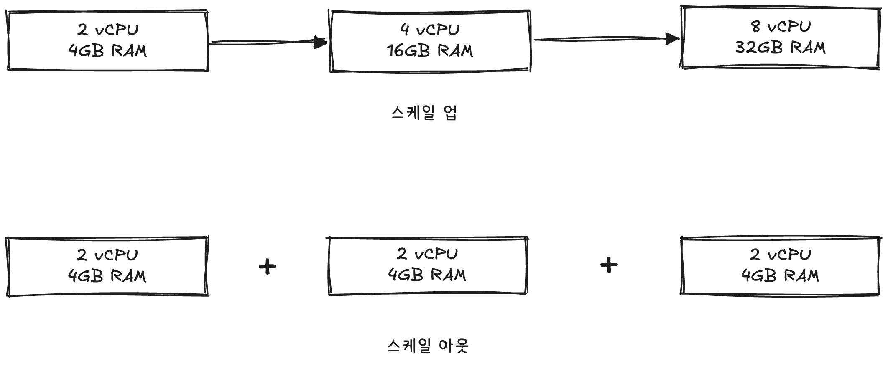
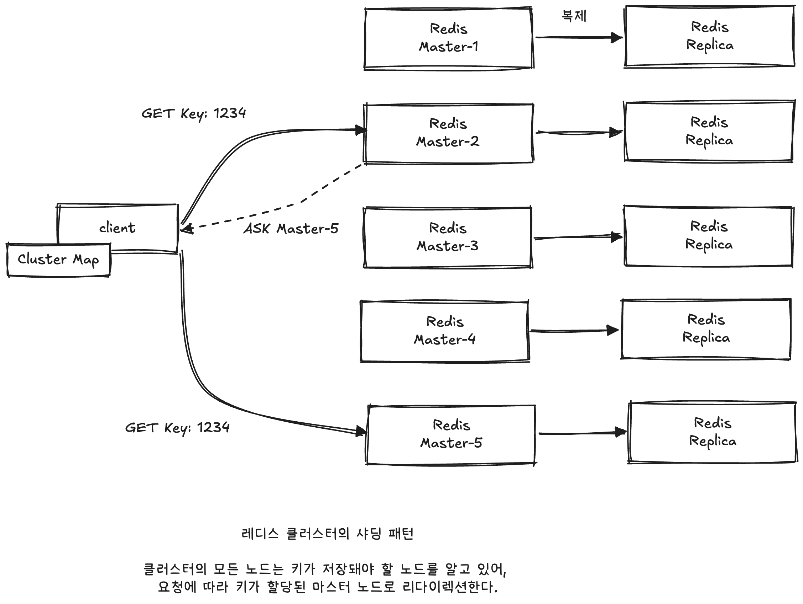

# 🧑🏻‍💻 클러스터

---

- [✅ 레디스 클러스터와 확장성](#-레디스-클러스터와-확장성)
  - [🚀 스케일 업 vs 스케일 아웃](#-스케일-업-vs-스케일-아웃)
  - [🚀 레디스에서의 확장성](#-레디스에서의-확장성)
  - [🚀 레디스 클러스터의 기능](#-레디스-클러스터의-기능)

## ✅ 레디스 클러스터와 확장성

---

### 🚀 스케일 업 vs 스케일 아웃

> [!NOTE]
> 확장성(scalability)은 운영 중인 시스템에서 증가하는 트래픽에 유연하게 대응할 수 있는 능력을 말한다.  

> [!TIP]
> 스케일 업이란 서버의 하드웨어를 높은 사양으로 업그레이드하는 것을 말한다.  
> 보통 서버에 디스크를 추가하거나 CPU나 메모리를 업그레이드함으로써 서버 능력을 증강시키기 때문에 이를 수직 확장(vertical scaling)이라고도 한다.

 

> [!TIP]
> 스케일 아웃은 장비를 추가해 시스템을 확장시키는 방식을 말한다.  
> 기존 서버의 사양을 업그레이드하는 것만으로 한계가 있다면, 비슷한 사양의 서버를 추가로 연결해 용량뿐만 아니라 처리량도 나눠 성능을 높일 수 있다.  
> 서버의 대수가 증가하는 것이므로 이를 수평 확장(horizontal scaling)이라고도 한다.  
> 
> 스케일 아웃을 사용했을 때에는 데이터가 여러 대의 서버에 분산 처리돼야 하므로 분산 처리에 대한 로직이 추가 개발돼야 한다.

 

### 🚀 레디스에서의 확장성

> [!NOTE]
> 만약 레디스를 운영하는 도중 키의 `eviction`이 자주 발생한다면 서버의 메모리를 증가시키는 스케일 업을 고려할 수 있다.  
> 하지만 레디스의 처리량을 증가시키고자 할 때 스케일 업만으로는 한계가 있다.  
> ➡️ **레디스는 단일 스레드로 동작**하기 때문에 서버에 CPU를 추가한다고 해도 여러 CPU 코어를 동시에 활용할 수 없다.  
> 그러나 데이터를 여러 서버로 분할해 관리하면 다수의 서버에서 요청을 병렬로 처리할 수 있으므로, 서버 대수를 늘림으로써 처리량을 선형적으로 확장시킬 수 있다.

 

### 🚀 레디스 클러스터의 기능

> [!IMPORTANT]
> 레디스를 클러스터 모드로 사용하면 추가적인 애플리케이션 아키텍처의 변경 없이 여러 레디스 인스턴스 간 수평 확장이 가능해지며, 데이터의 분산 처리와 복제, 자동 페일오버 기능 또한 사용할 수 있다.

 

#### 💡 데이터 샤딩
> [!NOTE]
> 데이터 저장소를 수평 확장하며 여러 서버 간에 데이터를 분할하는 데이터베이스 아키텍처 패턴을 샤딩이라고 한다.  
> 레디스에서 클럭스터 기능을 사용하면 마스터를 최대 1,000개까지 확장시킬 수 있다.  
> 데이터의 샤딩과 관련된 모든 기능은 레디스 내뷍서 자체적으로 관리되며, 이를 위한 프록시 서버 등의 추가 아키텍처는 필요치 않다.  
> ➡️ 데이터를 분할 저장할 때 애플리케이션의 소스 코드 로직이 변경될 필요가 없기 때문에 샤딩 처리에 들어가는 번거로움을 줄일 수 있다는 장점이 있다.

 

 

> [!NOTE]
> 클러스터에서 노드가 추가/변경되지 않는 이상 하나의 키는 특정 마스터에 매핑된다.  
> 매번 레디스에 키를 저장할 노드를 질의하지 않게 하기 위해 클라이언트에서는 클러스터 내에서 특정 키가 어떤 마스터에 저장돼 있는지의 정보를 캐싱할 수 있다.  
> 이를 이용해 키를 찾아오는 시간을 단축시킬 수 있다.

 

#### 💡 고가용성
> [!TIP]
> 클러스터는 각각 최소 3대의 마스터, 복제본 노드를 갖도록 구성하는 것이 일반적이며, 하나의 클러스터 구성에 속한 각 노드는 서로를 모니터링한다.  
> 마스터 노드에 장애가 발생하면 이를 인지한 다른 노드들이 마스터에 연결됐던 복제본 노드를 마스터로 자동 페일오버시키기 때문에 사용자의 추가적인 개입 없이 레디스의 가용성을 증가시킬 수 있다.

 

> [!NOTE]
> 위 그림과 같이 클러스터 내의 노드들은 **클러스터 버스라는 독립적인 통신**을 이용한다.  
> 모든 레디스 클러스터 노드는 다른 레디스 클러스터 노드에서 들어오는 연결을 수신하기 위한 추가 TCP 포트가 열려 있다.  
> ➡️ 클라이언트로부터 커맨드를 받는 TCP 포트와 독립적으로 동작한다.  
> ❗️ 구성 파일에서 `cluster_bus_port` 값을 정의하지 않았다면 일반 포트에 10000을 더한 값으로 자동 설정된다.  
> ➡ 레디스 노드가 6379 포트로 띄워졌다면, 클러스터 버스 포트는 16379 포트를 이용해 통신한다.

 

> [!TIP]
> 클러스터는 모든 노드가 TCP 연결을 사용해 모든 노드와 연결돼 있는 full-mesh 토폴로지 형태다.  
> 1개 노드에서 다른 노드로 PING을 보냈을 때 PONG 응답이 늦는다면 해당 노드로의 연결을 새로 시도한다.  
> ➡️ 가십 프로토콜과 구성 업데이트 메커니즘을 이용해 클러스터가 정상적인 상태에서는 너무 많은 메시지를 교환하는 오버헤드가 발생하지 않는다.  

 

**참고 자료**  
[개발자를 위한 레디스](https://product.kyobobook.co.kr/detail/S000210785682)