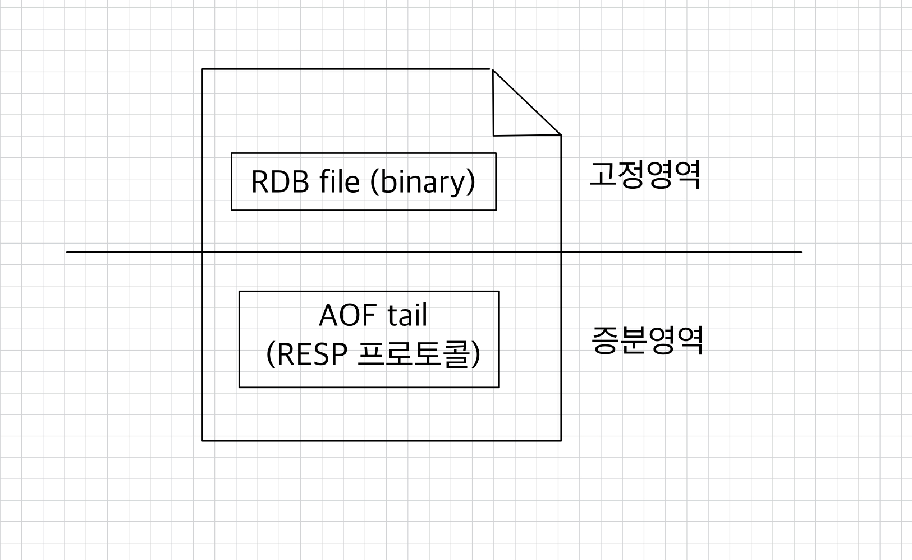
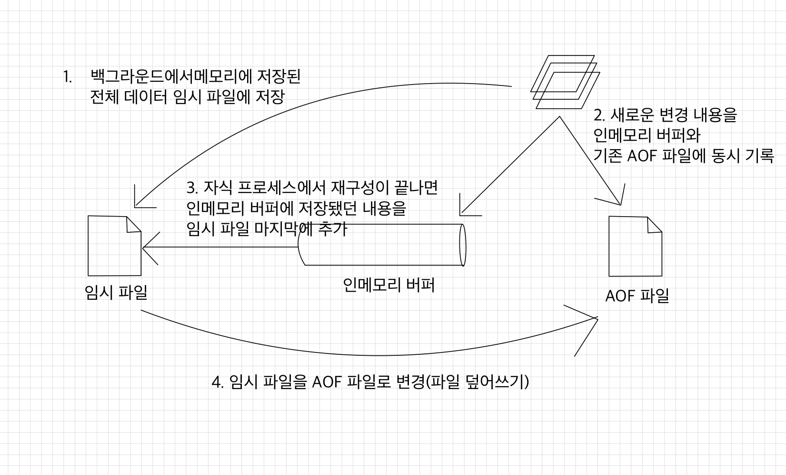

# 🧑🏻‍💻 레디스 데이터 백업 방법

- [레디스에서 데이터를 영구 저장하기](#-레디스에서-데이터를-영구-저장하기)
- [RDB 방식의 데이터 백업](#-rdb-방식의-데이터-백업)
  - [특정 조건에 자동으로 RDB 파일 생성](#-특정-조건에-자동으로-rdb-파일-생성)
  - [수동으로 RDB 파일 생성](#-수동으로-rdb-파일-생성)
  - [복제를 사용할 경우 자동으로 RDB 파일 생성](#-복제를-사용할-경우-자동으로-rdb-파일-생성)
- [AOF 방식의 데이터 백업](#-aof-방식의-데이터-백업)
  - [AOF 파일을 재구성하는 방법](#-aof-파일을-재구성하는-방법)

## ❗️ 레디스에서 데이터를 영구 저장하기
> 레디스에서 모든 데이터는 메모리에서 관리된다.  
> ➡ 레디스 인스턴스 혹은 레디스가 실행되는 서버의 장애로 인해 레디스 인스턴스가 재시작될 경우 메모리에 상주해 있던 레디스의 모든 데이터는 손실 위험이 있다.

> 레디스를 복제 구조로 사용할 경우, 복제본이 있으니 데이터 백업의 필요성을 못 느낄 수 있다.  
> 하지만 백업과 복제는 목적부터가 다르다.  
> - 복제: 가용성을 위함
> - 백업: 장애 상황에서 데이터의 복구
> 
> 만약 개발자의 실수나 프로그램의 버그로 인해 마스터 노드에서 의도치 않은 데이터 손상이 일어날 경우, 이는 바로 복제본으로 전달된다.  
> ➡ 복제 구조만으로는 데이터를 안전하게 유지 ❌

데이터를 안전하게 저장하기 위해 레디스에서는 `RDB`와 `AOF` 2가지의 백업 방식을 지원한다.
1. `AOF`(Append Only File): 레디스 인스턴스가 처리한 모든 쓰기 작업을 차례대로 기록한다.  
   ➡ 복원 시에는 파일을 다시 읽어가며 데이터 세트 구성
2. `RDB`(Redis Database): 일정 시점에 메모리에 저장된 데이터 전체를 저장(snapshot 방식)

<br>

```redis
127.0.0.1:6379> SET key1 a
OK
127.0.0.1:6379> SET key1 apple
OK
127.0.0.1:6379> SET key2 b
OK
127.0.0.1:6379> DEL key2
1
```
위 커맨드가 실행됐을 경우, `AOF`와 `RDB` 파일에는 데이터가 아래와 같이 저장된다.
```text
# AOF
set key1 a
set key1 apple
set key2 b
del key2
```
```text
# RDB
key1 -> apple
```

> 참고로, 실제로 둘 다 우리가 읽을 수 없는 형태의 파일이다.  
> - `RDB`: 바이너리 형태
> - `AOF`: 레디스 프로토콜(RESP) 형태

각각 장단점이 있다.  

|구분| `RDB`                                             |`AOF`|
|:---:|---------------------------------------------------|---|
|장점| 시점 단위로 여러 백업본을 저장할 수 있다. <br> `AOF` 파일보다 복원이 빠르다. |원하는 시점으로 복구할 수 있다.|
|단점|특정 시점으로의 복구는 불가능하다.|크기가 크고, 주기적으로 압축해 재작성해야 한다.|

하나의 인스턴스에서 `RDB`와 `AOF` 옵션을 동시에 사용하는 것도 가능하며, 일반적인 `RDB` 만큼의 데이터 안정성을 원하는 경우, 2가지 백업 방식을 동시에 사용하기를 권장한다.

<br>

레디스에서 데이터를 복원할 수 있는 시점은 서버가 재시작될 때뿐이며, 레디스 인스턴스의 실행 도중에 데이터 파일을 읽어올 수 있는 방법은 없다.  
레디스 서버는 재시작될 때 `AOF` 파일이나 `RDB` 파일이 존재하는지 확인한 뒤, 파일이 있을 때에는 파일을 로드한다.  
레디스는 `RDB` 파일보다 `AOF` 파일이 더 내구성이 보장된다고 판단하기 때문에, 2개 다 있으면 `AOF`의 데이터를 로드한다.

<br>

## ❗️ RDB 방식의 데이터 백업
- [특정 조건에 자동으로 RDB 파일 생성](#-특정-조건에-자동으로-rdb-파일-생성)
- [수동으로 RDB 파일 생성](#-수동으로-rdb-파일-생성)
- [복제를 사용할 경우 자동으로 RDB 파일 생성](#-복제를-사용할-경우-자동으로-rdb-파일-생성)

RDB 파일은 레디스에서 데이터를 백업하기 위한 가장 단순한 방법이다.  
예를 들어, 한 시간에 한 번씩 RDB 파일을 생성할 수 있다.  
RDB 파일이 저장될 때마다 원격 저장소로 파일을 옮겨 2차 백업을 수행한다면 데이터 센터 장애 등 더 큰 장애에도 대처할 수 있다.

<br>

그러나 사용자가 지정한 시간 단위로 파일이 저장되기 때문에, 저장 시점부터 장애가 발생한 직전까지의 데이터는 손실될 수 있다는 리스크가 있다.

### ✅ 특정 조건에 자동으로 RDB 파일 생성
```text
save <기간(초)> <기간 내 변경된 키의 개수>
dbfilename <RDB 파일 이름>
dir <RDB 파일이 저장될 경로>
```

레디스의 설정 파일에서 `save` 옵션을 사용해 원하는 조건에 RDB 파일을 저장하도록 설정할 수 있다.  
- `save`: 일정한 기간(초) 동안 변경된 키의 개수가 조건에 맞을 때 레디스 서버는 자동으로 RDB 파일을 저장한다.
- `dbfilename`: RDB 파일 이름이 해당 옵션값으로 지정되고, 기본 값은 `dump.rdb`이다.
- `dir`: 파일이 저장될 경로다.

```text
# redis.conf

# 900초(15분) 동안 1개 이상의 키가 변경된 경우 RDB 파일 생성
save 900 1

# 300초(5분) 동안 10개 이상의 키가 변경된 경우 RDB 파일 생성
save 300 10

# 60초(1분) 동안 10,000개 이상의 키가 변경된 경우 RDB 파일 생성
save 60 10000
```

> 이미 레디스 인스턴스가 실행 중인 상태에서 RDB 저장을 비활성화하고 싶다면 `CONFIG SET` 커맨드를 통해 `save` 파라미터를 `""`로 초기화시키면 된다.

```redis
# 현재 적용된 save 옵션 확인
127.0.0.1:6379> CONFIG GET save
save
3600 1 300 100 60 10000

# save 옵션 초기화
127.0.0.1:6379> CONFIG SET save ""
OK

# 현재 적용된 save 옵션 확인
127.0.0.1:6379> CONFIG GET save
save

# redis.conf 파일 재작성
127.0.0.1:6379> CONFIG REWRITE
OK
```

> `CONFIG REWRITE`  
> 레디스 인스턴스가 실행 중인 상태에서 설정 파일을 변경하는 것은 실행 중인 레디스 인스턴스에는 반영되지 않는다.  
> 실행 중인 레디스 인스턴스에서 파라미터를 수정할 때에는 `redis-cli`에서 직접 `CONFIG SET` 커맨드로 설정을 변경한 뒤, `CONFIG REWRITE` 커맨드를 이용해 설정 파일을 재작성하는 과정을 거쳐야 한다.  

<br>

### ✅ 수동으로 RDB 파일 생성
`SAVE`, `BGSAVE` 커맨드를 이용하면 원하는 시점에 직접 RDB 파일을 생성할 수 있다.  
- `SAVE`
  - 동기 방식으로 파일을 저장한다.
  - 파일 생성이 완료될 때까지 다른 모든 클라이언트의 명령을 차단한다.
  - 메모리 전체를 스캔해 파일이 저장되기까지 1분이 걸린다면, 그 1분 동안 레디스 인스턴스에 연결된 다른 클라이언트는 아무런 명령도 수행할 수 없다.
  - 🚫 따라서 일반적인 운영 환경에서는 `SAVE` 커맨드를 되도록 사용하지 않는 것이 좋다.
- `BGSAVE`
  - `fork`를 호출해 자식 프로세스를 생성하며, 생성된 자식 프로세스가 백그라운드에서 RDB 파일을 생성한 뒤 종료된다.
  - 레디스를 이용하는 다른 클라이언트는 원래대로 부모 프로세스를 이용해서 처리되기 때문에 파일 저장에는 영향을 받지 않는다.

> `BGSAVE`를 통해 백그라운드로 데이터가 저장되고 있을 때 `BGSAVE` 커맨드를 또 호출하면 에러를 반환한다.  
> 이런 상황에서는 `BGSAVE`와 함께 `SCHEDULE` 옵션을 사용할 수 있는데, 이미 파일이 백그라운드에서 저장 중일 때 이 커맨드를 입력받은 레디스는 일단 OK를 반환한 뒤, 기존에 진행 중이던 백업이 완료됐을 때 다시 `BGSAVE`를 실행한다.

```redis
127.0.0.1:6379> bgsave
Background saving started

# RDB 파일이 정상적으로 저장됐는지 확인
# 마지막으로 RDB 파일이 저장된 시점을 유닉스 타임스탬프로 반환한다.
127.0.0.1:6379> LASTSAVE
1766009952

# 같다.
127.0.0.1:6379> LASTSAVE
1766009952

# 수동으로 저장
127.0.0.1:6379> BGSAVE
Background saving started

# 달라졌다.
127.0.0.1:6379> LASTSAVE
1766010744
```

<br>

### ✅ 복제를 사용할 경우 자동으로 RDB 파일 생성
복제본에서 `REPLICAOF` 커맨드를 이용해 복제를 요청하면 마스터 노드에서는 RDB 파일을 새로 생성해 복제본에 전달한다.  
혹은 이미 복제 연결이 돼 있는 상태에서 네트워크 등의 이슈로 복제가 끊어졌다가 복구된 경우 복제 재 연결이 발생하면서 마스터 노드에서 복제본으로 RDB 파일이 전송된다.  

<br>

## ❗️ AOF 방식의 데이터 백업
- [AOF 파일을 재구성하는 방법](#-aof-파일을-재구성하는-방법)

AOF는 레디스 인스턴스에서 수행된 모든 쓰기 작업의 로그를 차례로 기록한다.  
➡ 실수로 `FLUSHALL` 커맨드로 데이터를 모두 날려버렸다 해도, AOF 파일을 직접 열어 `FLUSHALL` 커맨드만 삭제한 뒤, 레디스를 재시작시킨다면 커맨드를 실행하기 직전까지로 데이터를 바로 복구할 수 있다.  

<br>

```text
appendonly yes
appendfilename "appendonly.aof"
appenddirname "appendonlydir"
```
- `appendonly`: 설정 파일에서 `appendonly` 옵션을 `yes`로 지정하면 AOF 파일에 주기적으로 데이터가 저장된다.  
- `appendfilename`: AOF 파일은 `appendfilename` 옵션에 설정한 이름으로 생성된다.
  - 디폴트는 `appendonly.aof`다.
- `appenddirname`
  - 경로가 아닌 디렉토리 이름만 지정할 수 있으며, 해당 디렉토리 하위에 저장된다.
  - `dir` 옵션 하위에 생성된다.
  - 확인해보니 `dir "/home/redis/redis"` 이렇게 되어있다.

```redis
# 레디스 인스턴스가 실행되는 동안 설정 파일 수정
127.0.0.1:6379> CONFIG GET appendonly
appendonly
no
127.0.0.1:6379> CONFIG SET appendonly yes
OK
127.0.0.1:6379> CONFIG GET appendonly
appendonly
yes
127.0.0.1:6379> CONFIG REWRITE
OK
```

<br>

```redis
# 레디스 명령어 수행 결과

127.0.0.1:6379> SET key1 apple
OK
127.0.0.1:6379> SET key1 beer
OK
127.0.0.1:6379> DEL key1
1
127.0.0.1:6379> DEL no_existing_key
0
```

```shell
# appendonly.aof 파일 찾기

redis@redisvm:~/redis/appendonlydir$ cd /home/redis/redis/appendonlydir

# appendonly.aof에 일련 번호가 추가돼서 저장되는 거 같다.
redis@redisvm:~/redis/appendonlydir$ ll
total 20
drwxr-xr-x  2 redis redis 4096 Dec 17 22:51 ./
drwxrwxr-x 11 redis redis 4096 Dec 17 22:48 ../
-rw-rw-r--  1 redis redis 2946 Dec 17 22:46 appendonly.aof.1.base.rdb
-rw-r--r--  1 redis redis  113 Dec 17 22:47 appendonly.aof.1.incr.aof
-rw-r--r--  1 redis redis  102 Dec 17 22:46 appendonly.aof.manifest
```
```aof
// appendonly.aof.1.incr.aof 내용
*3
$3
SET
$4
key1
$5
apple
*3
$3
SET
$4
key1
$4
beer
*2
$3
DEL
$4
key1
```

> `DEL no_existing_key` 커맨드는 메모리가 수정되는 작업이 아니다.  
> AOF 파일은 메모리상의 데이터가 변경되는 커맨드만 기록되기 때문에 해당 커맨드 작업은 기록하지 않는다.


<br>

하지만 AOF 파일은 사용자가 실행한 커맨드를 그대로 저장하지는 않는다.  
예를 들어 list에서 블로킹 기능을 지원하는 `BRPOP` 커맨드는 AOF에서 굳이 블로킹 기능을 명시할 필요는 없기 때문에 `RPOP`으로 기록된다.
```redis
127.0.0.1:6379> RPUSH mylist a b c d e
(integer) 9
127.0.0.1:6379> BRPOP mylist 1
1) "mylist"
2) "e"
```
```text
*7
$5
RPUSH
$6
mylist
$1
a
$1
b
$1
c
$1
d
$1
e
*2
$4
RPOP
$6
mylist
```

<br>

레디스가 실행되는 아키텍처에 따라 부동소수점을 처리하는 방식이 다를 수 있기 때문에 AOF 파일에는 증분 후의 값을 직접 SET하는 커맨드로 변경돼 저장된다.
```redis
127.0.0.1:6379> SET counter 100
OK
127.0.0.1:6379> INCRBYFLOAT counter 50
"150"
```
```text
*3
$3
SET
$7
counter
$3
100
*4
$3
SET
$7
counter
$3
150
$7
KEEPTTL
```

<br>

### ✅ AOF 파일을 재구성하는 방법
AOF 파일을 이용한 백업 기능을 안정적으로 사용하려면 점점 커지는 파일을 주기적으로 압축시키는 재구성(rewrite) 작업이 필요하다.  
RDB에서와 마찬가지로 특정 조건에 자동으로 재구성되도록 설정할 수도 있으며, 사용자가 원하는 시점에 커맨드를 이용해 재구성시킬 수 있다.

<br>

이때 압축, 즉 재구성은 기존 디스크에 저장됐던 AOF 파일을 사용하는 것이 아니라 레디스 메모리에 있는 데이터를 읽어와서 새로운 파일로 저장하는 형태로 동작한다.  
설정 파일에서 기본 옵션인 `aof-use-rdb-preamble yes`를 `no`로 변경하지 않는다면 이 데이터는 RDB 파일 형태로 저장한다.  
RDB 파일을 저장할 때와 마찬가지로 AOF 파일을 재구성할 때에도 `fork`를 이용해 자식 프로세스를 생성하며, 이 자식 프로세스가 AOF 파일을 재구성해 저장한다.

<br>

  

버전 7 이전까지 AOF는 하나의 파일로 관리됐다.  
- AOF 파일의 앞 부분은 메모리의 데이터를 읽어와 바이너리 형태로 저장한 RDB 파일이 위치한다.
- 이후 레디스의 메모리를 변경한 커맨드 로그들은 RESP 형태로 RDB 파일의 뒤에 쌓이는 형태로 증가한다.

<br>

버전 7 이전까지 AOF 파일이 재구성되는 과정을 하기와 같다.  
  
1. 레디스는 `fork`를 이용해 자식 프로세스를 생성한다.  
   생성된 자식 프로세스는 레디스 메모리의 데이터를 읽어와 신규로 생성한 임시 파일에 저장한다.
2. 백그라운드로 1. 과정이 진행되는 동안 레디스 메모리의 데이터가 변경된 내역은 기존의 AOF 파일과 인메모리 버퍼에 동시에 저장된다.  
   참고로 인메모리 버퍼는 재구성 시에 생긴다.
3. 1.의 AOF 재구성이 끝나면 인메모리 버퍼에 저장된 내용은 1.의 임시 파일 마지막에 추가한다.
4. 생성된 임시 파일로 기존 AOF 파일을 덮어씌운다.


<br>

**참고 자료**  
[개발자를 위한 레디스](https://product.kyobobook.co.kr/detail/S000210785682)