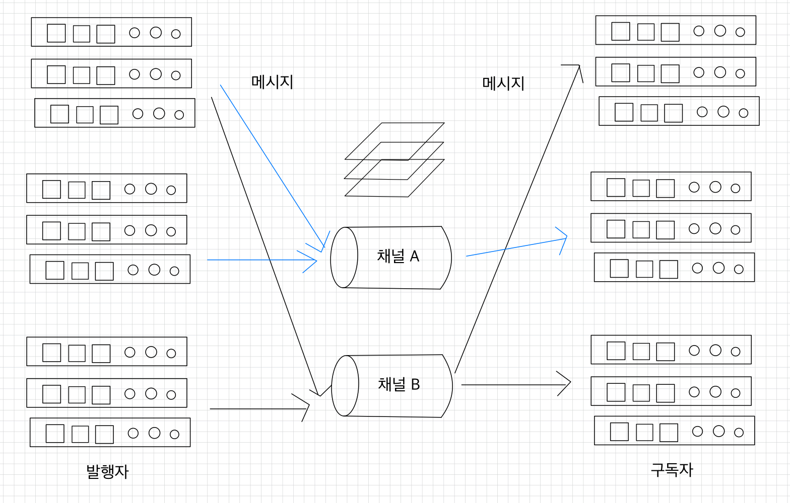

# 💻 레디스를 메시지 브로커로
**✍🏻 메시지 브로커**  
최근의 서비스 아키텍처는 여러 모듈이 서로 느슨하고 적절하게 연결시킨 구조를 선호하고 있다.  
모듈 간 서로 탄탄한 상호 작용이 필요하기 때문에 효율적인 메시징 솔루션, 즉 메시지 브로커를 필요로 한다.  

서비스 간 커넥션이 실패하는 상황은 언제나 발생할 수 있다.   
➡ 모듈 간의 통신에서는 되도록 비동기(async) 통신을 사용하거나, 동기(sync) 통신의 횟수를 최대한 줄이는 것이 바람직하다.  
당장 메시지를 처리하지 못하더라도 보낸 메시지를 어딘가에 쌓아둔 뒤 나중에 처리할 수 있는 채널을 만들어주는 것이 바로 **메시지 브로커의 핵심 역할**이다.

<br>

## 💡메시징 큐와 이벤트 스트림 
|               기준                | 메시징 큐                                                    | 이벤트 스트림                                                       |
|:-------------------------------:|----------------------------------------------------------|---------------------------------------------------------------|
|               용어                | 생산자(producer): 데이터를 생성하는 쪽 <br> 소비자(consumer): 데이터를 수신하는 쪽 | 발행자(publisher): 데이터를 생성하는 쪽 <br> 구독자(subscriber): 데이터를 수신하는 쪽 |
|               방향성               |생산자는 소비자의 큐로 데이터를 직접 푸시한다. <br> 2개의 서비스에 같은 메시지를 보내야 할 때 생산자는 2개의 각각 다른 메시징 큐에 각각 데이터를 푸시해야 한다.|발행자는 스트림의 특정 저장소에 하나의 메시지를 보낼 수 있고, 구독자들은 스트림에서 같은 메시지를 pull해갈 수 있기 때문에 메시지를 복제해서 저장하지 않아도 된다.|
|            데이터의 영속성             |소비자가 데이터를 읽어갈 때 큐에서 데이터를 삭제한다.|구독자가 읽어간 데이터는 바로 삭제되지 않고, 저장소의 설정에 따라 특정 기간 동안 저장될 수 있다.|
| 히스토리(메시지를 보내는 도중 새로운 소비자가 추가되면) |소비자는 새롭게 추가된 이후의 이벤트만 확인할 수 있다.|스트림에 쌓인 데이터는 일정기간 지워지지 않기 때문에 새로 추가된 서비스도 이전 데이터의 히스토리를 볼 수 있다.| 
|적합성|일대일 상황에서 유리하다.|다대다 상황에서 유리하다.|

<br>

### ✅ 레디스를 메시지 브로커로 사용하기
**`pub/sub`**  
레디스에서 제공하는 `pub/sub`를 사용하면 빠르고 간단한 방식으로 메시지를 전달할 수 있다.
레디스의 `pub/sub`에서 모든 데이터는 한 번 채널 전체에 전파된 뒤 삭제되는 일회성의 특징을 가지며, 메시지가 잘 전달됐는지 등의 정보는 보장하지 않는다.  
➡ `fire-and-forget` 패턴이 필요한 간단한 알림 서비스에서는 유용하게 사용될 수 있다.  

> `fire-and-forget`  
> 비동기 프로그래밍에서 사용되는 디자인 패턴으로, 어떤 작업을 수행하고 그 결과에 대한 응답을 기다리지 않고 바로 다음 코들르 실행하는 것을 말한다.  
> 로깅, 이벤트 발행, 통계 데이터 수집과 같이 작업의 성공 또는 실패에 대한 관심이 없는 경우에 활용될 수 있다.  
> 신뢰성이 필요한 경우에는 사용하지 않아야 한다.

<br>

**`list` 자료 구조**  
레디스의 `list` 자료 구조는 메시징 큐로 사용하기에 알맞다.  
push와 pop이 가능하며, 대기하다가 `list`에 새로운 데이터가 들어오면 읽어갈 수 있는 블로킹 기능을 사용할 수도 있다.  

<br>

**`stream` 자료 구조**  
레디스를 완벽한 스트림 플랫폼으로 사용할 수 있다.  
레디스 `stream`은 아파치 [`kafka` 시스템](https://github.com/kyeoungchan/note/tree/main/kafka)에서 영감을 받아 만들어진 자료 구조로, 데이터는 계속해서 추가되는 방식으로 저장된다(append-only).  
소비자와 소비자 그룹이라는 개념을 이용하면 카프카에서와 비슷하게 데이터의 분산 처리를 구현할 수 있다.  
`stream`에 저장되는 메시지를 실시간으로 리스닝하면서 소비할 수 있고, 저장돼있는 데이터를 시간대별로 검색하는 것도 가능하다.  

<br>

## 💡 레디스의 `pub/sub`
  
레디스 노드에 접근할 수 있는 모든 클라이언트는 발행자와 구독자가 될 수 있다.  
발행자는 특정 채널에 메시지를 보낼 수 있으며, 구독자는 특정 채널을 리스닝하다가 메시지를 읽어갈 수 있다.  

위에서 말했다시피, 매우 가볍기 때문에 최소한의 메시지 전달 기능만 제공한다.
- 발행자는 어떤 구독자가 메시지를 읽어가는지, 정상적으로 모든 구독자에게 메시지가 전달됐는지 확인 할 수 없다.
- 구독자 또한 해당 메시지가 언제 어떤 발행자에 의해 생성됐는지 등의 메타데이터는 알 수 없다.

정합성이 중요한 데이터를 전달하기에는 적합하지 않으며, 애플리케이션 레벨에서 메시지의 송수신과 관련한 로직을 추가해야할 수 있다.

### ✅ 메시지 publish하기
```shell
127.0.0.1:6379> PUBLISH hello world
0
```
위의 커맨드를 수행하면 `hello`라는 채널을 수신하고 있는 모든 서버들에 `world`라는 메시지가 전파된다.  
메시지가 전파된 후에는 메시지를 수신한 구독자의 수가 반환된다.  

<br>

### ✅ 메시지 subscribe하기
```shell
127.0.0.1:6379> SUBSCRIBE event1 event2
subscribe
event1
1
subscribe
event2
2
```
클라이언트가 위의 커맨드를 수행하면 event1과 event2 채널을 동시에 구독하기 시작한다.  
클라이언트가 구독자로 동작할 때에는 새로운 채널을 구독할 수 있지만 `pub/sub`과 관련되지 않은 다른 커맨드는 수행할 수 없다.  

<br>

ssh 창을 2개를 띄워서, 하나는 발행, 하나는 구독해보자.  
같은 redis 파일을 2번 실행시키면 된다.
```shell
# 발행자 클라이언트
127.0.0.1:6379> PUBLISH event1 hello
1
127.0.0.1:6379> PUBLISH event1 hello2
1
127.0.0.1:6379> PUBLISH event2 hello3
1
```
```shell
# 구독자 클라이언트
127.0.0.1:6379> SUBSCRIBE event1 event2
subscribe
event1
1
subscribe
event2
2

# hello 메시지 수신
message
event1
hello

# hello2 메시지 수신 
message
event1
hello2

# hello3 메시지 수신
message
event2
hello3
```

<br>

`PSUBSCRIBE` 커맨드를 사용하면 일치하는 패턴에 해당하는 채널을 한 번에 구독할 수 있다.  
이때 레디스는 glob-style 패턴을 지원한다.  
이때 메시지는 `message`가 아닌 `pmessage` 타입으로 전달된다.  
```shell
# 발행자 클라이언트
127.0.0.1:6379> PUBLISH mail-1 hello~!
1
```
```shell
# 구독자 클라이언트
127.0.0.1:6379> PSUBSCRIBE mail-*
psubscribe
mail-*
1
pmessage
mail-*
mail-1
hello~!
```
만약 구독자가 `SUBSCRIBE mail-1`과 `PSUBSCRIBE mail-*`을 동시에 구독하고 있을 때 `mail-1` 채널에 메시지가 발행되면 구독자는 2개의 메시지를 받게 된다.  

<br>

### ✅ 클러스터 구조에서의 pub/sub
레디스 클러스터 구조에서도 `pub/sub`을 사용할 수 있다.  
클러스터는 레디스가 자체적으로 제공하는 데이터 분산 형태의 구조다.  
레디스 클러스터에서 `pub/sub`을 사용할 때, 메시지를 발행하면 해당 메시지는 클러스터에 속한 모든 노드에 자동으로 전달된다.  
따라서 레디스 클러스터의 아무 노드에 연결해 `SUBSCRIBE` 커맨드를 사용하면 데이터를 수신할 수 있다.

<br>

**클러스터의 목적에는 부합하지 않는 방식**  
클러스터는 주로 대규모 서비스에서 데이터를 분산해서 저장하고 처리하기 위해 도입됐다.  
➡ 레디스 클러스터 내에서 `pub/sub`을 사용할 때 메시지가 모든 레디스 노드에 복제되는 방식은 클러스터 환경의 핵심 목표와는 부합하지 않으며, 이로 인해 불필요한 리소스 사용과 네트워크 부하가 발생할 수 있다.

<br>


<br>

**참고 자료**  
[개발자를 위한 레디스](https://product.kyobobook.co.kr/detail/S000210785682)