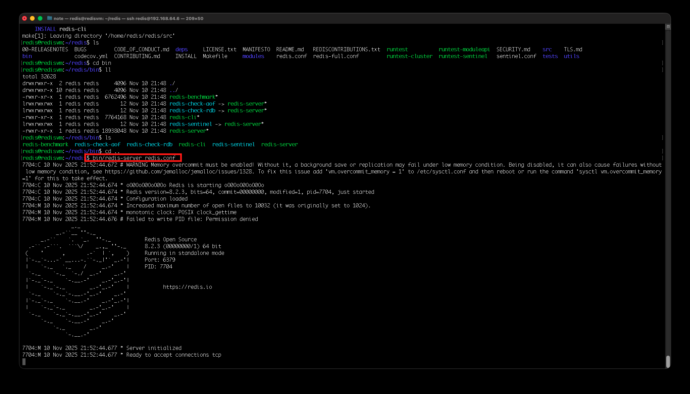

# 💻 레디스 시작하기
> linux 환경에서 진행하였습니다. 

## ✅ 레디스 설치하기

```shell
-- 최신 버전 다운로드
wget https://download.redis.io/redis-stable.tar.gz
```
레디스를 빌드하기 위해서는 gcc 버전 4.6 이상이 필요하므로 gcc를 미리 설치하는 것이 좋다.
-  **GNU Compiler Collection**의 약자로, GNU 프로젝트의 일환으로 개발된 무료 오픈 소스 컴파일러 모음이다.

```shell
-- gcc 설치
yum install -y gcc

-- 압축 파일 해제 후 빌드
tar -xzvf redis-stable.tar.gz
mv redis-stable redis
cd redis
make
```

> `cc: not found` 에러가 발생하는 경우가 있다.
> 이럴 때는 C 컴파일러가 설치되어있지 않아 발생한 것이므로, 하기와 같이 패키지를 설치한다.
> ```shell
> $ sudo apt update
> $ sudo apt install build-essential pkg-config
> ```

<br>

기본 디렉터리 내의 bin 디렉터리에 실행 파일을 복사하기 위해 `make install` 커맨드를 프리픽스 지정화와 함께 수행하였다.
```shell
# 프리픽스 경로: /home/{계정 username}/redis
$ make PREFIX=/home/redis/redis install
```

<br>

레디스 포르가운드(foreground) 모드(사용자가 현재 기기 화면에서 직접 보고 상호작용하는 상태)로 실행하기
```shell
$ bin/redis-server redis.conf
```



<br>

## ✅ 레디스 환경 구성
### 💡 Open files 확인
> 레디스의 기본 maxclients 설정 값은 10,000이다.  
이는 레디스 프로세스에서 받아들일 수 있는 최대 클라이언트의 개수를 의미한다.  
하지만 이 값은 레디스를 실행하는 서버의 파일 디스크립터 수에 영향을 받는다.  
레디스 프로세스 내부적으로 사용하기 위해 예약한 파일 디스크립터 수는 32개로, maxclients 값에 32를 더한 값보다 서버의 최대 파일 디스크립터 수가 작으면 레디스는 실행될 때 자동으로 그 수에 맞게 조정된다. 

> 🤔 파일 디스크립터란?  
> 리눅스 혹은 유닉스 계열의 시스템에서 프로세스(process)가 파일(file)을 다룰 때 사용하는 개념으로, 프로세스에서 특정 파일에 접근할 때 사용하는 추상적인 값이다.  
> 파일 디스크럽터는 일반적으로 0이 아닌 정수값을 갖는다.  
> 흔히 유닉스 시스템에서 모든 것을 파일이라고 한다.  
> 일반적인 정규파일부터 디렉토리, 소켓, 파이프, 블록 디바이스, 케릭터 디바이스 등 모든 객체들을 파일로 관리한다.    
> 프로세스가 실행 중에 파일을 Open하면 커널은 해당 프로세스의 파일 디스크립터 숫자 중 사용하지 않는 가장 작은 값을 할당해준다.  
> 그 다음 프로세스가 열려있는 파일에 시스템 콜을 이용해서 접근할 때, 파일 디스크립터(FD)값을 이용해서 파일을 지칭할 수 있다.  
> 
> 출처: [파일 디스크립터(File Descriptor) 란 무엇인가?](https://twofootdog.tistory.com/51)

<br>

```shell
# 현재 서버의 파일 디스크립터 수 확인
$ ulimit -a | grep open
```

open files의 값이 10,032보다 작다면 `/etc/security/limits.conf` 파일에 다음과 같은 구문을 추가한다.
```text
*               hard    nofile          100000
*               soft    nofile          100000
```

서버 재접속 후 다시 파일 디스크립터 수 확인해보면 설정한 값이 반영돼있는 것을 확인할 수 있다.
```shell
$ ulimit -a | grep open
open files                          (-n) 100000
```

<br>

### 💡 THP 비활성화
리눅스는 메모리를 페이지 단위로 관리하며, 기본 페이지는 4096바이트(4KB)로 고정돼있다.  
메모리 크기가 커질수록 페이지를 관리하는 테이블인 TLB의 크기도 커져, 메모리를 사용할 때 오버헤드가 발생하는 이슈가 생긴다.
➡ 페이지를 크게 만든 뒤 자동으로 관리하는 THP(Transparent Huge Page) 기능이 도입됐다.  
하지만 **레디스와 같은 데이터베이스 애플리케이션에서는 오히려 이 기능을 사용할 때 퍼포먼스가 떨어지고 레이턴시가 올라가는 현상이 발생하기 때문에 레디스를 사용할 땐 이 기능을 사용하지 않는 것을 추천한다.**

<br>

```shell
# 일시적으로 THP 비활성화
$ echo never > /sys/kernel/mm/transparent_hugepage/enabled
```

영구적으로 이 기능을 비활성화하고 싶다면 `/etc/rc.local` 파일에 다음 구문을 추가한다.
```shell
sudo nano /etc/rc.local
```
```text
if test -f /sys/kernel/mm/transparent_hugepage/enabled; then
  echo never > /sys/kernel/mm/transparent_hugepage/enabled
fi
```
다음 커맨드를 수행하면 부팅 중 rc.local 파일이 자동으로 실행되도록 설정할 수 있다.
```shell
sudo chmod +x /etc/rc.local
```

<br>

### 💡 vm.overcommit_memory=1로 변경
레디스는 디스크에 파일을 저장할 때 `fork()`를 이용해 백그라운드 프로세스를 만드는데, 이때 COW(Copy On Write) 메커니즘이 동작한다.  
이 메커니즘에서는 부모 프로세스와 자식 프로세스가 동일한 메모리 페이지를 공유하다가 레디스의 데이터가 변경될 때마다 메모리 페이지를 복사하기 때문에 데이터 변경이 많이 발생하면 메모리 사용량이 빠르게 증가할 수 있다.  
따라서 레디스 프로세스가 실행되는 도중 메모리르 순간적으로 초과해 할당해야하는 상황이 발생할 수 있다.  
이를 위해 `vm.overcommit_memory`를 1로 설정하는 것이 좋다.

<br>

`/etc/sysctl.conf` 파일에 `vm.overcommit_memory=1` 구문을 추가하면 영구적으로 해당 설정을 적용할 수 있다.  
```shell
#  재부팅 없이 바로 설정을 적용하려면
sysctl vm.overcommit_memory=1
```

<br>

### 💡 somaxconn과 syn_backlog 설정 변경
`tcp-backlog` 파라미터
- 레디스 인스턴스가 클라이언트와 통신할 때 사용하는 `tcp backlog` 큐의 크기를 지정한다.
- `redis.conf`에서 지정한 `tcp-backlog` 값은 서버의 `somaxconn(socket max connection)`과 `syn_backlog` 값보다 클 수 없다.
- 기본적으로 `tcp-backlog` 값은 511이므로, 서버 설정이 최소 511보다 크도록 설정해야 한다.

```shell
# 현재 서버 설정값 확인
$ sysctl -a | grep syn_backlog
# 결과: sysctl: net.ipv4.tcp_max_syn_backlog = 128

$ sysctl -a | grep somaxconn
# 결과: net.core.somaxconn = 4096
```

> 참고로, 나는 somaxconn 값은 이미 511보다 커서 syn_backlog만 크기를 늘렸다.

`/etc/sysctl.conf` 파일에 다음 구문을 추가하면 영구적으로 해당 설정을 적용할 수 있다.
```text
net.ipv4.tcp_max_syn_backlog = 1024
net.core.somaxconn = 1024
```

혹은 재부팅 없이 바로 설정하려면 다음 커맨드를 사용한다.
```shell
$ sudo sysctl net.ipv4.tcp_max_syn_backlog=1024
$ sudo sysctl net.core.somaxconn=1024
```

<br>

### 💡 레디스 설정 파일 변경
레디스를 실행할 때에는 `redis.conf`라는 이름의 설정 파일을 이용한다.
- port
  - 기본값: 6379
  - 커넥션이 지정된 포트로 레디스 서버에 접속할 수 있도록 허용한다.
- bind
  - 기본값: 127.0.0.1 -::1
  - 레디스가 설치된 서버 외부에서 레디스 인스턴스로 바로 접근하는 것을 허용하기 위해서는 해당 설정값을 변경해야 한다.
  - 예: `bind 192.168.1.100 127.0.0.1`
    - `192.168.1.100`과 `127.0.0.1` ip 주소로 들어오는 연결을 허용함을 의미한다.
  - 해당 값을 `0.0.0.0`으로 설정하면 레디스는 모든 ip로 들어오는 연결을 허용함을 뜻하며, 보안상 위험할 수 있다.
- protected-mode
  - 기본값: yes
  - 이 설정이 yes인 경우 패스워드를 설정해야만 레디스에 접근할 수 있다.
- requirepass / masterauth
  - 기본값: 없음
  - requirepass: 서버에 접속하기 위한 패스워드 값
  - masterauth: 파라미터 복제 구조를 사용할 때 필요한데, 연결된 마스터의 패스워드 값을 의미한다.
  - 만약 복제 연결을 사용할 예정이라면 이 두 값은 같은 값으로 설정하는 것이 좋다.
- daemonize
  - 기본값: no
  - 레디스 프로세스를 데몬으로 실행시키려면 yes로 변경해야한다.
  - 레디스를 데몬으로 실행하면 프로세스가 백그라운드에서 실행되고, pid 파일이 생성된다.
  - pid 파일은 pidfile이라는 파라미터로 제어되며, 기본값은 `/var/run/redis_6379.pid`이다.
- dir
  - 기본값: ./
  - 레디스의 워킹 디렉터리를 의미한다.
  - 로그 파일이나 백업 파일 등 인스턴스를 실행하면서 만들어지는 파일은 기본적으로 해당 디렉터리에 저장된다.


<br>

## ✅ 레디스 실행하기
`daemonize`를 `yes`로 설정한 경우 다음과 같은 커맨드로 레디스를 실행시킬 수 있다.
```shell
redis@redisvm:~/redis$ bin/redis-server redis.conf
```

<br>

레디스 프로세스를 종료하려면 다음 커맨드를 사용하면 된다.
```shell
redis@redisvm:~/redis$ bin/redis-cli shutdown
```

## ✅ 레디스 접속하기
레디스를 설치하면 함께 설치되는 cli(command line interface)를 이용해 레디스에 접속할 수 있다.  
`redis-cli`는 bin 디렉터리 내에 존재해 `bin/redis-cli`와 같이 실행시켜야하지만, 다음과 같이 `PATH`를 추가해주면 어느 위치에서든지 `redis-cli`에 바로 접근할 수 있다.  

```shell
$ export PATH=$PATH:/home/redis/redis/bin
```

```shell
# 레디스 서버에 접근하기 위한 커맨드 구조
redis-cli -h <ip주소> -p <port> -a <패스워드>
```
- ip 주소 디폴트: 127.0.0.1
- port 디폴트: 6379
- 패스워드: `requirepass`에 패스워드를 설정해준 경우 함께 입력한다.

```shell
# 사전에 레디스를 당연히 실행시킨 상태여야 한다.
$ bin/redis-server redis.conf

# 레디스 접속
$ redis-cli
127.0.0.1:6379>
```

```shell
127.0.0.1:6379> PING
PONG
```

레디스 접속에서 나오고 싶다면
```shell
127.0.0.1:6379> exit
```

<br>

레디스 서버에 특정 커맨드를 수행시킨 뒤 종료하고 싶다면 레디스를 커맨드라인 모드로 사용할 수 있다.  
즉, 응답 받고 redis-cli는 종료된다.
```shell
redis@redisvm:~/redis$ redis-cli PING
PONG
```

<br>

## ✅ 데이터 저장과 조회
`redis-cli`를 통해 데이터를 간단히 저장하고 삭제하는 작업이다.
```shell
redis@redisvm:~/redis$ redis-cli
127.0.0.1:6379> SET hello world
OK
127.0.0.1:6379> GET hello
"world"
```


<br>

**참고 자료**  
[개발자를 위한 레디스](https://product.kyobobook.co.kr/detail/S000210785682)