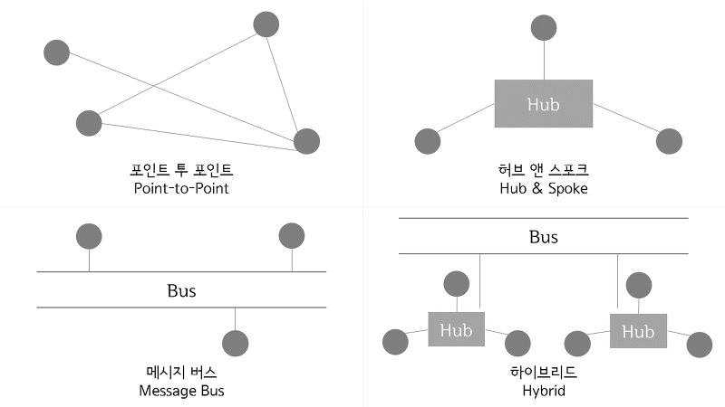

# EAI(Enterprise Application Integration)
## EAI란
- 미들웨어를 이용해 비즈니스 로직을 중심으로 기업(Enterprise) 내 애플리케이션(Application)을 통합(Integration)하는 비즈니스 통합 솔루션이다.
- 기업에서 운영되는 서로 다른 플랫폼(OS, DBMS 등) 및 애플리케이션(ERP, MES, e-Biz, DW, CRM, Legacy 등)들 간의 정보에 대한 전달, 연계, 통합(Interface & Integration)을 가능하게 한다.

## EAI 구축 유형

- Point-to-Point
  - 가장 기초적인 애플리케이션 통합방법으로 1:1 단순 통합방법
  - 장점
    - 미들웨어 불 필요
    - 빠른 적용 가능
    - 비용이 상대적으로 저렴
  - 단점
    - 재사용 불가
    - 시스템 증가 시 유지보수 비용 증가
- Hub & Spoke
  - 단일한 접점의 허브 시스템을 통하여 데이터를 전송하는 중앙 집중식 방법
  - 장점
    - 신규 애플리케이션 도입 시 확장 편리
    - 유지보수 및 확장 용이
  - 단점
    - 허브 장애 시 전체 장애 발생
- Message Bus
  - 애플리케이션 사이 미들웨어(버스)를 두어 연계하는 미들웨어 통합 방식
  - 장점
    - 뛰어난 확장성
    - 대용량 데이터 처리 가능
  - 단점
    - 초기 구축비용이 높음
- Hybrid
  - 그룹 내부는 허브 앤 스포크 방식을 사용하고, 그룹 간에는 메시지 버스 방식을 사용하는 통합 방식
  - 장점
    - 환경에 맞는 유연한 통합 작업 가능
  - 단점
    - 초기구축비용 및 관리비용이 높음

출처  
[EAI(Enterprise Application Integration) 정리](https://velog.io/@do_ng_iill/EAIEnterprise-Application-Integration-%EC%A0%95%EB%A6%AC)