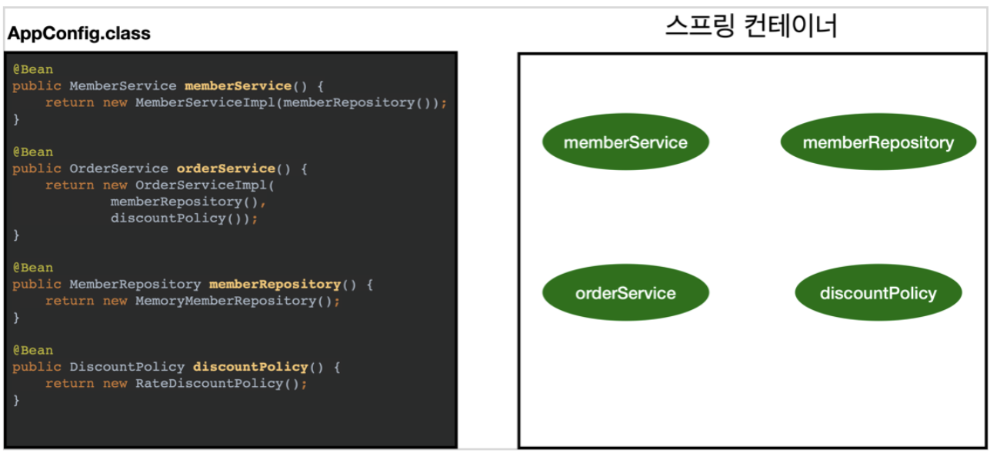

# 🫙 ApplicationContext
ApplicationContext는 일종의 DI 컨테이너, 스프링 컨테이너다.  
➡️ 빈들의 생성 및 의존성 주입 역할

### 스프링 컨테이너 생성 과정
1. 스프링 컨테이너 생성

   - 구성정보를 지정하여(즉, AppConfig.class 파일을 통해)
     - 스프링 컨테이너가 생성이 된다.
     - 스프링 빈 저장소도 같이 만들어진다.
2. 스프링 빈 등록

   - 스프링 컨테이너는 파라미터로 넘어온 설정 클래스 정보(위에 있는 AppConfig.class)를 사용하여 스프링 빈을 등록한다.
     - `@Bean`이 붙은 것들을 전부 호출한다.
   - 빈 이름
     - 빈 이름은 메서드 이름을 사용한다.
     - 직접 부여하는 방법도 있다.
       - `@Bean(name="memberService2")`
    > 참고로 `@Component`는 객체 위에서 스프링 빈으로 지정하고, `@Bean`은 메서드 위에서 메서드의 반환 객체를 스프링 빈으로 등록한다.
3. 스프링 빈 의존관계 설정 - 준비

    > 참고로 의존관계 주입 방식이 필드방식이면 의존관계 설정 준비 단계와 완료 단계가 동시에 이루어진다.
4. 스프링 빈 의존관계 설정 - 완료

## BeanFactory와 ApplicationContext

> **BeanFactory**
> - 스프링 컨테이너의 **최상위 인터페이스**다.
> - 스프링 빈을 관리하고 조회하는 역할을 담당한다.
> - IoC(Inversion of Control) 컨테이너
> - 서비스에서 요구하는 다양한 기능들을 수용하기에 다소 무리가 있음
> - **getBean()** 을 제공한다.

### ApplicationContext
- BeanFactory 기능을 모두 상속받아서 제공한다.
- 따라서 애플리케이션을 개발할 때는 빈을 관리하고 조회하는 기능을 마찬가지로 제공한다.

- **메시지소스를 활용한 국제화 기능**
    - 다국어 처리를 한다.
- **환경변수**
    - 로컬, 개발, 운영등을 구분해서 처리
    - 개발할 때 사용하는 3가지 환경
        - 로컬 PC 개발환경
        - Test Server 개발환경
        - 운영환경
            - 실제 Production이 나감
    - 각 환경별로 `@Profile`을 설정하여 어느 데이터베이스에 연결해야할지 환경변수 관련된 정보를 처리해준다.
- **애플리케이션 이벤트**
    - 이벤트를 발행하고 구동하는 모델을 편리하게 지원
- **편리한 리소스 조회**
    - 파일, 클래스패스, 외부 등에서 리소스를 편리하게 조회

출처  
[ApplicationContext](https://github.com/devSquad-study/2023-CS-Study/blob/main/Spring/spring_ApplicationContext.md)  
[스프링 핵심 원리 - 기본편](https://www.inflearn.com/course/%EC%8A%A4%ED%94%84%EB%A7%81-%ED%95%B5%EC%8B%AC-%EC%9B%90%EB%A6%AC-%EA%B8%B0%EB%B3%B8%ED%8E%B8)