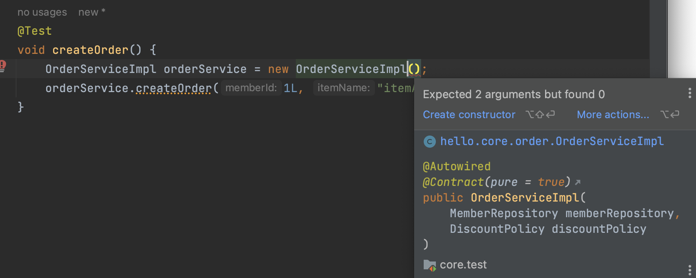

# ❗️ `@Autowired`

## 🤔 `@Autowired`란?
- `@Autowired`란 스프링 프레임워크에서 제공하는 의존성 주입(DI, Dependency Injection) 기능 중 하나이다.
- `@Autowired` 애너테이션은 스프링 컨텍스트에 등록된 빈(Bean) 객체들 사이에서 의존성을 자동으로 주입하기 위해 사용된다.
- 즉, 스프링은 `@Autowired`를 사용하여 의존성을 갖는 객체를 찾아서 해당 객체를 자동으로 생성하고 주입해준다.

### ✅ `@Autowired`를 사용한 예
```java
public class UserService {
    @Autowired
    private UserRepository userRepository;

    public void saveUser(User user) {
        userRepository.save(user);
    }
}
```
- `@Autowired` 애너테이션을 사용하여 `UserRepository`에 대한 의존성 주입을 수행하고 있다.
- 스프링 프레임워크는 `UserRepository`의 인스턴스를 자동으로 생성하고 `UserService`에 주입해준다.
- 즉, `UserService`는 `UserRepository`에 대한 의존성을 명시하지 않고도 사용 가능하고, `UserRepository`의 구현체를 변경하더라도 `UserService`의 코드를 수정할 필요가 없다.

<br>

**SOLID 원칙 준수**  
[SOLID 원칙이란 무엇인지 다시 복습하고 가자.](https://github.com/kyeoungchan/note/tree/main/software_engineering/object-oriented-programming)
1. 단일 책임 원칙(SRP)
    - `UserService`는 사용자(User)를 저장하는 책임을 가지고 있다.
    - `UserRepository`는 데이터베이스에 사용자를 저장하는 책임을 가지고 있다.
    - 각 클래스는 한 가지 책임만을 가지고 있으므로 단일 책임 원칙을 준수한다.
2. 개방-폐쇄 원칙(OCP)
    - `UserService` 클래스는 `UserRepository`에 의존하지만, 구체적인 `UserRepository`의 구현체에는 의존하지 않는다.
    - 따라서 `UserRepository`의 구현체를 변경하더라도 `UserService` 클래스는 수정할 필요가 없다.
    - 새로운 `UserRepository` 구현체를 추가하거나 기존 구현체를 변경할 때에도 `UserService` 코드에는 영향을 주지 않으므로 개방-폐쇄 원칙을 준수한다.
3. 리스코프 치환 원칙(LSP)
    - `UserService` 클래스는 `UserRepository` 인터페이스에 의존한다.
    - 상위 타입의 객체(인터페이스)는 하위 타입의 객체로 대체 가능해야한다.
    - `UserService` 클ㄹ래스는 `UserRepository` 구현체가 어떤 것이든 메서드를 동일하게 사용할 수 있으므로 리스코프 치환 원칙을 준수한다.
4. 인터페이스 분리 원칙(ISP)
    - `UserService`는 자신이 사용하지 않는 메서드에 의존하지 않으므로 ISP를 준수한다.
    - `UserRepository` 인터페이스는 사용자 저장에 필요한 메서드만 포함하고, 다른 기능은 다른 인터페이스에 분리할 수 있다.
5. 의존성 역전 원칙(DIP)
    - `UserService` 클래스는 `UserRepository`에 의존하지만, 의존성 주입을 통해 추상화된 인터페이스에 의존하도록 설계되어 있다.
    - 의존성 주입을 통해 고수준 모듈(`UserService`)는 저수준 모듈(`UserRepository`)에 의존하지 않고, 양쪽 모두 추상화된 인터페이스에 의존한다.


## 💡 `@Autowired`의 주입 방법
### 생성자 주입(Constructor Injection)
```java
public class UserService {
    private final UserRepository userRepository;

    @Autowired // 생성자가 하나면 생략가능
    public UserService(UserRepository userRepository) {
        this.userRepository = userRepository;
    }
    
    // ...
}
```
- 특징
    - 클래스를 인스턴스화할 때 모든 필수적인 의존성을 주입받아야 한다.
    - 생성자 호출 시점에 딱 1번만 호출된다는 것이 보장된다.
    - 생성자가 딱 1개만 있으면 `@Autowired` 생략이 가능하다.
    - 불변성(`final`)을 강조하여 객체를 불변 상태로 유지할 수 있다.
- 장점
    - 코드의 가독성이 높아진다.
        - 의존성 주입을 생성자를 통해 명시적으로 표현하기 때문에 의존성이 명확하게 드러난다.
    - 테스트 용이성이 높아진다.
        - Mock 객체 등을 주입하여 테스트하기 쉽다.
    - 필수적인 의존성을 강제로 주입받기에 객체의 일관성을 보장할 수 있다.
    - 의존성 변경에 유연하게 대처할 수 있다.
- 단점
    - 의존성이 많은 경우 생성자의 파라미터 개수가 늘어날 수 있다.
    - 객체 생성 시 매번 모든 의존성을 주입해야하기 때문에 코드의 중복이 발생할 수 있다.
        - `@RequiredArgsConstructor`로 해결 가능

### 수정자 주입(Setter Injection)
```java
public class UserService {
    // 여기에서는 final 사용 불가
    private UserRepository userRepository;

    @Autowired // 생성자가 하나면 생략가능
    public void setUserService(UserRepository userRepository) {
        this.userRepository = userRepository;
    }
    
    // ...
}
```
- 특징
    - 스프링 컨테이너가 Setter 메서드를 호출하여 의존성을 주입한다.
        - 즉, `@Autowired`가 있다면 굳이 setter를 호출하지 않더라도 스프링이 알아서 해당 메서드를 호출해준다.
    - 생성자 주입과 같이 있으면 생성자 주입 다음으로 이루어진다.
        - 스프링 컨테이너 생명주기에서 스프링 빈 의존관계 설정 준비 단계와 의존관계 설정 완료 단계로 나뉘는 이유가 여기에 있다.
- 장점
    - 선택적인 의존성이 있는 경우에 유용하다.
- 단점
    - Setter 메서드가 노출되어 객체의 일관성을 해치는 가능성이 있다.
    - 코드의 가독성이 생성자 주입에 비해 낮아진다.

### 필드 주입(Field Injection)
```java
public class UserService {
    @Autowired
    private final UserRepository userRepository;

    // ...
}
```
- 특징
    - 스프링 컨테이너가 필드에 직접 접근하여 주입한다.
- 장점
    - 코드가 간결하고 읽기 쉽다.
- 단점
    - 필드에 직접 접근하므로 외부에서 의존성을 변경하기 어렵다.
    - 의존성을 명시적으로 표현하지 않기 때문에 코드의 의존성 관계를 파악하기 어려울 수 있다.

### ❗️ 결론
생성자 주입을 사용하라!
1. 불변
    - 대부분의 의존관계 주입은 한번 일어나면 애플리케이션 종료시점까지 의존관계를 변경할 일이 없다.
    - 오히려 대부분의 의존관계는 **애플리케이션 종료 전까지 변하면 안된다.(불변해야 한다.)**
    - 수정자 주입을 사용하면, setXxx 메서드를 **public**으로 열어두어야 한다.
        - 누군가 실수로 변경할 수 도 있고, 변경하면 안되는 메서드를 열어두는 것은 좋은 설계 방법이 아니다.
    - 생성자 주입은 객체를 생성할 때 딱 1번만 호출되므로 이후에 호출되는 일이 없다.
        - 따라서 불변하게 설계할 수 있다.
2. 누락
- 프레임워크 없이 순수한 자바 코드를 단위 테스트 하는 경우에 누락을 알아차릴 수 있다.
    - 예를 들어 `OrderServiceImpl` 로직만 Test 해보고 `MemberRepository`나 `DiscountPolicy`는 가짜 객체를 만들어서 Test를 해보는 것이다.
```java
public class OrderServiceImpl implements OrderService {

    private MemberRepository memberRepository;
    private DiscountPolicy discountPolicy;

    @Autowired
    public void setMemberRepository(MemberRepository memberRepository) {
        this.memberRepository = memberRepository;
    }
    @Autowired
    public void setDiscountPolicy(DiscountPolicy discountPolicy) {
        this.discountPolicy = discountPolicy;
    }
		//...
}
```
```java
// test 폴더
// OrderServiceImplTest.java 생성 후 작성

@Test
void createOrder() {
    OrderServiceImpl orderService = new OrderServiceImpl();
    orderService.createOrder(1L, "itemA", 10000);
}
```
- 그런데 막상 실행 결과는 NPE(Null Point Exception)이 발생하는데, memberRepository, discountPolicy 모두 의존관계 주입이 누락되었기 때문이다.
- 실행시켜야 오류를 발견할 수 있다.

  
반면에 생성자 주입 방식을 하면 위와 같이 컴파일 에러가 누락 여부를 알려준다.
3. final 키워드
    - 생성자 주입을 사용하면 필드에 `final` 키워드를 사용할 수 있다.
    - 그래서 생성자에서 혹시라도 값이 설정되지 않는 오류를 컴파일 시점에 막아준다.


출처  
[spring_@Autowired](https://github.com/devSquad-study/2023-CS-Study/blob/main/Spring/spring_%40Autowired.md)