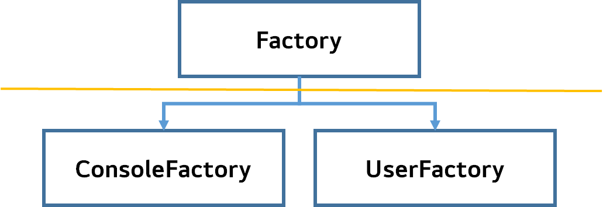

# ❗️ DI(Dependency Injection)
- DI란, 객체지향 프로그래밍에서 강한 결합도를 가진 객체들 사이의 의존성을 약한 결합도로 만들어주는 설계 기법이다.
- 스프링 관점에서는 ***클래스 간 의존관계를 스프링 컨테이너가 자동으로 연결해주는 것***을 말한다.
  - 즉, 객체는 의존성에 대한 관리를 신경쓰지 않고 독립적으로 동작 가능하다.

### 🤔 객체간 결합도를 낮춰야하는 이유
```text
코드의 재사용성, 유지보수성, 테스트 용이성 등이 향상되기 때문이다.
```
1. 재사용성(Reusability)
   - 의존성을 외부에서 주입받는 경우, 객체는 독립적으로 동작 가능하기 때문에 객체를 다른 컨텍스트에서 재사용하기 쉬워진다.
   - 예를 들어, 데이터베이스 연결을 관리하는 객체를 DI로 주입받는 경우, 동일 객체를 다른 데이터베이스에 연결하여 재사용 가능하다.
2. 유지보수성(Maintainability)
   - 결합도가 낮으면 변경 사항에 대한 영향 범위가 제한되므로 코드 수정이 간편해진다.
   - 예를 들어, `DataSource`를 변경할 때, 의존성 주입을 통해 `DataSource`를 제공하는 객체만 수정하면 된다.
3. 테스트 용이성(Testability)
   - 의존성을 외부에서 주입받기 때문에, 테스트 환경에서 모의 객체(Mocking)를 주입하여 테스트를 수행할 수 있다.
   - 즉, 의존 객체의 동작을 모의화하여 특정 시나리오를 테스트하는 데 도움을 준다.
   - `@SpringBootTest`를 사용하면 해당 환경에서는 `@Service`, `@Repository`를 활용할 수 있음을 기억하자.
4. 확장성(Scalability)
   - 새로운 기능을 추가하거나 변경할 때, 객체들 간 결합도가 낮으면 전체 시스템을 다시 구성할 필요 없이 해당 객체만 수정하면 된다.
   - 예를 들어, 새로운 알림 방법을 추가하려면, 알림을 제공하는 객체만 수정하면 된다.
5. 관리 용이성(Manageability)
   - 의존성 주입 컨테이너를 사용하면 의존성을 중앙 관리가 가능해지며, 객체 생성과 의존성 설정에 대한 로직을 분리하여 코드의 가독성을 향상시킨다.
```text
위의 장점들은 객체지향 프로그래밍의 핵심 원칙인 SOLID 원칙을 따르고, 유연하고 테스트 가능한 코드를 작성하기 위해 중요하다.
```

### ✅ DI(Dependency Injection) 예시

- SW를 사용하는 클라이언트는 `Factory` 클래스만을 호출해야하며, 구현체인 `ConsoleFactory`, `UserFactory`의 사용을 몰라야 한다.
- 클라이언트마다 전용 `Factory` 객체를 생성할 경우, 생산성이 떨어지고, 코드가 노출되기 때문이다.
  - `new` 연산을 많이 사용하면 생산성이 떨어진다.
  - `new Factory()`에 파라미터를 전달해야 구현체가 선택이 된다.
- 이를 위해, 스프링은 객체 간 의존성을 주입함으로써, 클라이언트가 사용하는 `Factory`가 `ConsoleFactory`인지, `UserFactory`인지를 감춘다.

출처  
[spring_@Autowired](https://github.com/devSquad-study/2023-CS-Study/blob/main/Spring/spring_%40Autowired.md)