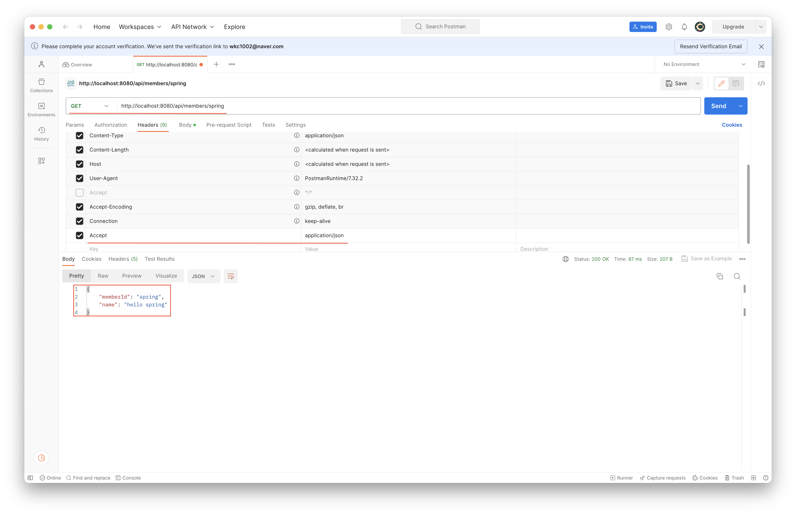
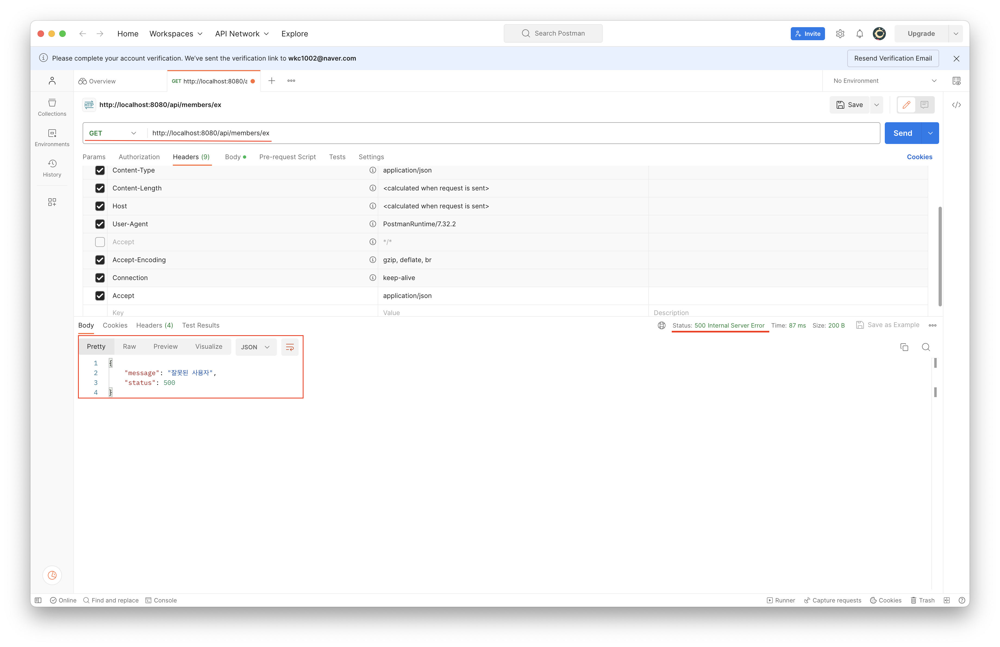
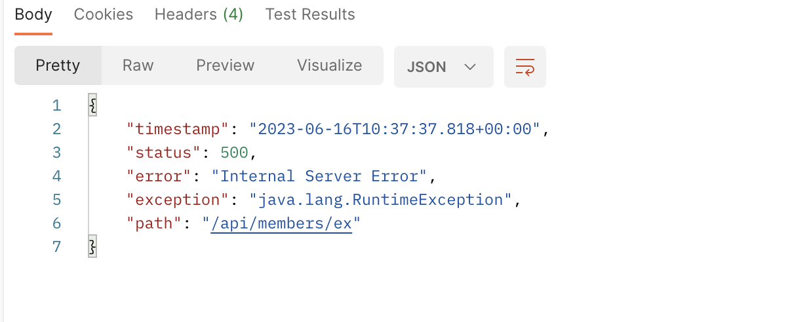
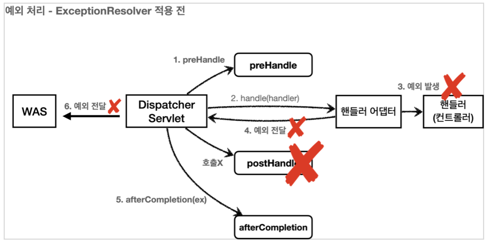
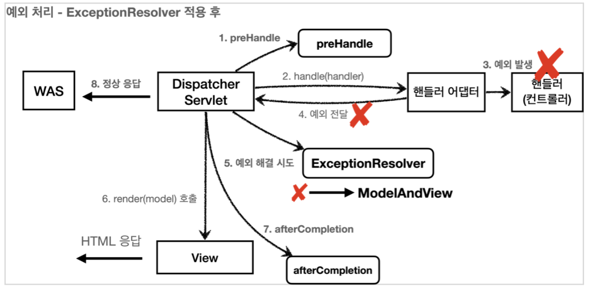
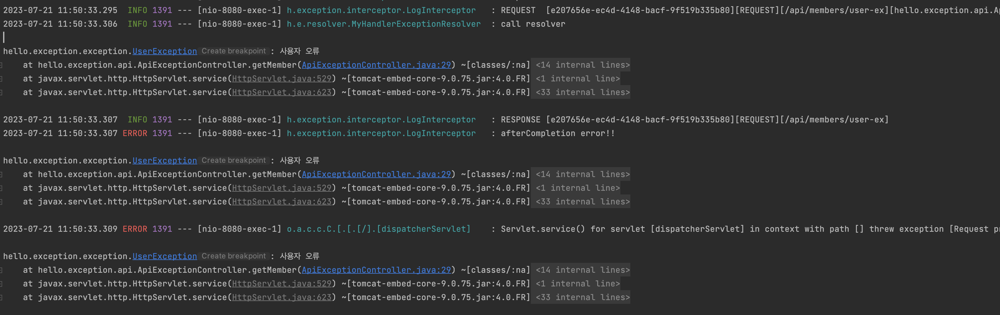

# 💻 API 예외 처리
> API의 경우 각 오류 상황에 맞는 오류 응답 스펙을 정하고, API를 호출하는 곳과 서버가 서로 약속을 해야한다.  
> 그리고 JSON으로 데이터를 내려주어야 한다.

```java
package hello.exception;

import org.springframework.boot.web.server.ConfigurableWebServerFactory;
import org.springframework.boot.web.server.ErrorPage;
import org.springframework.boot.web.server.WebServerFactoryCustomizer;
import org.springframework.http.HttpStatus;
import org.springframework.stereotype.Component;

@Component
public class WebServerCustomizer implements WebServerFactoryCustomizer<ConfigurableWebServerFactory> {
    @Override
    public void customize(ConfigurableWebServerFactory factory) {

        ErrorPage errorPage404 = new ErrorPage(HttpStatus.NOT_FOUND, "/error-page/404");
        ErrorPage errorPage500 = new ErrorPage(HttpStatus.INTERNAL_SERVER_ERROR, "/error-page/500");
        ErrorPage errorPageEx = new ErrorPage(RuntimeException.class, "/error-page/500");

        factory.addErrorPages(errorPage404, errorPage500, errorPageEx);
    }
}
```
이제 WAS에 예외가 전달되거나, `response.sendError()`가 호출되면 위에 등록한 예외 페이지 경로가 호출된다.

```java
package hello.exception.api;

import lombok.AllArgsConstructor;
import lombok.Data;
import lombok.extern.slf4j.Slf4j;
import org.springframework.web.bind.annotation.GetMapping;
import org.springframework.web.bind.annotation.PathVariable;
import org.springframework.web.bind.annotation.RestController;

@Slf4j
@RestController
public class ApiExceptionController {

    @GetMapping("/api/members/{id}")
    public MemberDto getMember(@PathVariable("id") String id) {

        if (id.equals("ex")) {
            throw new RuntimeException("잘못된 사용자");
        }

        return new MemberDto(id, "hello " + id);
    }

    @Data
    @AllArgsConstructor
    static class MemberDto {
        private String memberId;
        private String name;
    }

}
```
- 단순히 회원을 조회한느 기능을 하나 만들었다.
- 예외 테스트를 위해 URL에 전달된 id의 값이 ex면 예외가 발생하도록 코드를 심어두었다.

### ErrorPageController - API 응답 추가
```java
/**
 * @return json 형식이다.
 */
@RequestMapping(value = "/error-page/500", produces = MediaType.APPLICATION_JSON_VALUE)
public ResponseEntity<Map<String, Object>> errorPage500Api(
        HttpServletRequest request, HttpServletResponse response) {

    log.info("API errorPage 500");

    HashMap<String, Object> result = new HashMap<>(); // Json 형식으로  변환시키기 위한 HashMap이다.
    Exception ex = (Exception) request.getAttribute(ERROR_EXCEPTION);
    result.put("status", request.getAttribute(ERROR_STATUS_CODE));
    result.put("message", ex.getMessage());

    Integer statusCode = (Integer) request.getAttribute(RequestDispatcher.ERROR_STATUS_CODE); // 이거는 숫자로 꺼낼 수 있다.

    return new ResponseEntity<>(result, HttpStatus.valueOf(statusCode));
}
```
- `produces = MediaType.APPLICATION_JSON_VALUE`
  - 클라이언트가 요청하는 HTTP Header의 `ACCEPT` 값이 `application/json`일 때 해당 메서드가 호출된다는 뜻이다.
- 응답 데이터를 위해서 `Map`을 만들고 `status`, `message` 키에 값을 할당했다.
- Jackson 라이브러리는 `Map`을 JSON 구조로 변환할 수 있다.
- `ResponseEntity`를 사용해서 응답하기 때문에 메시지 컨버터가 동작하면서 클라이언트에 JSON이 반환된다.

### Postman으로 테스트
정상 호출: `http://localhost:8080/api/members/spring`  

```json
{
    "memberId": "spring",
    "name": "hello spring"
}
```

<br>

예외 발생 호출: `http://localhost:8080/api/members/ex`

```json
{
    "message": "잘못된 사용자",
    "status": 500
}
```

## ✅ 스프링 부트 기본 오류 처리
스프링 부트가 제공하는 `BasicErrorController` 코드를 보자.
```java
@RequestMapping(
    produces = {"text/html"}
)
public ModelAndView errorHtml(HttpServletRequest request, HttpServletResponse response) {
    HttpStatus status = this.getStatus(request);
    Map<String, Object> model = Collections.unmodifiableMap(this.getErrorAttributes(request, this.getErrorAttributeOptions(request, MediaType.TEXT_HTML)));
    response.setStatus(status.value());
    ModelAndView modelAndView = this.resolveErrorView(request, response, status, model);
    return modelAndView != null ? modelAndView : new ModelAndView("error", model);
}

@RequestMapping
public ResponseEntity<Map<String, Object>> error(HttpServletRequest request) {
    HttpStatus status = this.getStatus(request);
    if (status == HttpStatus.NO_CONTENT) {
        return new ResponseEntity(status);
    } else {
        Map<String, Object> body = this.getErrorAttributes(request, this.getErrorAttributeOptions(request, MediaType.ALL));
        return new ResponseEntity(body, status);
    }
}
```
- 다 해석하려고 하지는 말고 몇 가지만 보자.
- `/error` 동일한 경로를 처리하는 `errorHtml()`, `error()` 두 메서드를 확인할 수 있다.
- `errorHtml()`
  - `produces = {"text/html"}`
  - 클라이언트 요청의 Accept 헤더 값이 `text/html`인 경우에는 `errorHtml()`을 호출해서 view를 제공한다.
  - `ModelAndView`를 제공한다.
- `error()`
  - 그 외의 경우에는 호출되고 `ResponseEntity`로 HTTP Body에 JSON 데이터를 반환한다.

### 💡 스프링 부트의 예외 처리
- 스프링 부트의 기본 설정은 오류 발생 시 `/error`를 오류 페이지로 요청한다.
- `BasicController`는 이 경로를 기본으로 받는다.
  - `server.error.path`로 수정 가능하다. 기본 경로가 `/error`다.

**Postman으로 실행**  
> `BasicErrorController`를 사용하기 위해서는 `WebServerCustomizer`의 `@Component`를 주석처리해야한다.


```json
{
    "timestamp": "2023-06-16T10:37:37.818+00:00",
    "status": 500,
    "error": "Internal Server Error",
    "exception": "java.lang.RuntimeException",
    "path": "/api/members/ex"
}
```
> 만약 `Accept`를 `text/html`로 GetMapping을 요청한다면 스프링 부트가 자동 호출해주는 경로에 있는 오류 페이지가 뜬다.
> 

- 스프링 부트는 `BasicController`가 제공하는 기본 정보들을 활용해서 오류 API를 생성해준다.
- 다음 옵션들을 설정하면 더 자세한 오류 정보를 추가할 수 있다.
  - `server.error.include-binding-errors=always`
  - `server.error.include-exception=true`
  - `server.error.include-message=always`
  - `server.error.include-stacktrace=always`
  - 물론 오류 메시지는 너무 많이 추가하면 보안상 위험할 수 있기 때문에 간결하게 메시지만 노출하고, 로그를 통해서 확인하는 것이 좋다.

### 💡 Html 페이지 vs API 오류
- `BasicController`를 확장하면 JSON 메시지도 변경할 수 있다.
  - `proected Map<String, Object> getErrorAttributes(HttpServletRequest request, ErrorAttributeOptions options)`를 오버라이드 하는 식으로 확장할 수 있다.

- 스프링 부트가 제공하는 `BasicErrorController`는 HTML 페이지를 제공하는 경우에는 매우 편리하다.
- 그러나 API 오류 처리는 각각의 컨트롤러나 예외마다 서로 다른 응답 결과를 출력해야할 수도 있기 때문에 사용하는 것이 맞지 않다.
  - 클라이언트 서버가 서로 스펙을 정하기 나름이다.
- 따라서 이 방법은 HTML 화면을 처리할 때 사용하고, API 오류 처리는 아래에서 설명할 `@ExceptionHandler`를 사용하자.

<br>

## ✅ HandlerExceptionResolver
**상태코드 변환**  
- 예를 들어서 `IllegalArgumentException`을 처리못해서 컨트롤러 밖으로 넘어가는 일이 발생하면 HTTP 상태코드를 400으로 처리하고 싶다.
- 사용자가 Argument를 잘못 보낸 상황이다.

**ApiExceptionController 수정**
```java
@GetMapping("/api/members/{id}")
public MemberDto getMember(@PathVariable("id") String id) {

    if (id.equals("ex")) {
        throw new RuntimeException("잘못된 사용자");
    }

    if (id.equals("bad")) {
        throw new IllegalArgumentException("잘못된 입력 값");
    }

    return new MemberDto(id, "hello " + id);
}
```
`http://localhost:8080/api/members/bad` 호출 결과
```json
{
    "timestamp": "2023-06-16T11:48:37.731+00:00",
    "status": 500,
    "error": "Internal Server Error",
    "exception": "java.lang.IllegalArgumentException",
    "path": "/api/members/bad"
}
```

### 💡 HandlerExceptionResolver란
- 스프링 MVC는 컨트롤러(핸들러) 밖으로 예외가 던져진 경우 예외를 해결하고, 동작을 새로 정의할 수 있는 방법을 제공한다.
- 컨트롤러 밖으로 던져진 에외를 해결하고, 동작 방식을 변경하고 싶으면 `HandlerExceptionResolver`를 사용하면 된다.
- 줄여서 `ExceptionResolver`라고도 한다.

**ExceptionResolver 적용 전**  
 
WAS에 예외 전달이 되고, 500 에러를 띄우고 끝난다.

<br>

**ExceptionResolver 적용 후**

- `DispatcherServlet`이 `ExceptionResolver`에게 해당 `Exception`을 해결할 수 있는지 물어본다.
- `postHandler`는 호출 안 되지만, `ExceptionResolver`가 있으면 그것을 호출한다.
- 예외를 해결하도록 시도한다.
- 해결되면 `ModelAndView`를 반환 -> `render()` 호출 -> `afterCompletion()` 호출 -> 정상 응답으로 갈 수 있다.
  - 그러나 뷰 렌더링은 하지 않는다.
  - WAS는 `sendError()` 호출을 확인하고 오류 페이지를 뒤져본다.

**HandlerExceptionResolver - 인터페이스**
```java
public interface HandlerExceptionResolver {
	ModelAndView resolveException(HttpServletRequest request, HttpServletResponse response, Object handler, Exception ex);
}
```
- `handler`: 핸들러(컨트롤러) 정보
- `Exception ex`: 핸들러(컨트롤러)에서 발생한 예외

**MyHandlerExceptionResolver**
```java
package hello.exception.resolver;

import lombok.extern.slf4j.Slf4j;
import org.springframework.web.servlet.HandlerExceptionResolver;
import org.springframework.web.servlet.ModelAndView;

import javax.servlet.http.HttpServletRequest;
import javax.servlet.http.HttpServletResponse;
import java.io.IOException;

@Slf4j
public class MyHandlerExceptionResolver implements HandlerExceptionResolver {
  @Override
  public ModelAndView resolveException(HttpServletRequest request, HttpServletResponse response, Object handler, Exception ex) {

    try {
      if (ex instanceof IllegalArgumentException) {
        log.info("IllegalArgumentException resolver to 400");
        response.sendError(HttpServletResponse.SC_BAD_REQUEST, ex.getMessage());
        return new ModelAndView(); // 새로운 인스턴스를 빈 값으로 넘기면 계속 정상적으로 리턴되면서 WAS까지 return되고, 예외는 삼켜져버린다.
        // 그리고 정상 리턴 후 서블릿 컨테이너(WAS)에서 400으로 온 것을 확인한다.
      }
    } catch (IOException e) {
      log.error("resolver ex", e);
    }
    return null;
  }
}
```
- `ExceptionResolver`가 `ModelAndView`를 반환하는 이유는 마치 try, catch를 하듯이, `Exception`을 처리해서 정상 흐름처럼 변경하는 것이 목적이다.
  - 이름 그대로 `Exception`을 해결하는 것이 목적이다.
- 여기서는 `IllegalArgumentException`이 발생하면 `response.sendError(400)`을 호출해서 HTTP 상태코드를 400으로 지정하고, 빈 `ModelAndView`를 반환한다.

### 💡 반환 값에 따른 동작 방식
`HandlerExceptionResolver`의 반환 값에 따른 `DispatcherServlet`의 동작 방식은 다음과 같다.
1. 빈 ModelAndView
   - `new ModelAndView()`처럼 빈 `ModelAndView`를 반환하면 뷰를 렌더링하지 않고, 정상 흐름으로 서블릿이 리턴된다.
2. ModelAndView 지정
   - `ModelAndView`에 `View`, `Model` 등의 정보를 지정해서 반환하면 뷰를 렌더링한다.
   - 오류 페이지를 렌더링할 수 있다.
3. null
   - `null`을 반환하면 다음 `ExceptionResolver`를 찾아서 실행한다. 
   - 만약 처리할 수 있는 `ExceptionResolver`가 없으면 예외 처리가 안 되고, 기존에 발생한 예외를 서블릿 밖으로 던진다. -> WAS는 이 경우에 500으로 처리해버린다.

### 💡 ExceptionResolver 활용
1. 예외 상태 코드 변환
   - 예외를 `response.sendError(xxx)` 호출로 변경해서 상태 코드에 따른 오류를 처리하도록 위임
   - 서블릿 컨테이너에 `Exception`을 던지는 게 아니라 `sendError()`로 오류 코드를 던진다.
   - 이후 WAS는 서블릿 오류 페이지를 찾아서 내부 호출, 예를 들어서 스프링 부트가 기본으로 설정한 `/error`가 호출됨
2. 뷰 템플릿 처리
   - `ModelAndView`에 값을 채워서 예외에 따른 새로운 오류 화면 뷰 렌더링해서 고객에게 제공
3. API 응답 처리
   - `response.getWriter().println("hello");`처럼 HTTP 응답 바디에 직접 데이터를 넣어주는 것도 가능하다.
   - 여기에서 JSON으로 응답하면 API 응답 처리를 할 수 있다.
    ```java
    public class MyHandlerExceptionResolver implements HandlerExceptionResolver {
            @Override
        public ModelAndView resolveException(HttpServletRequest request, HttpServletResponse response, Object handler, Exception ex) {
    
                    //...
                    try {
    
                            if (ex ...) {
                        response.getWriter().println("{\"df\":\"df\"}");
                                    // {"df":"df"}
                        }
                    //...
            }
    }
    ```

### 💡 WebConfig - 수정
`WebMvcConfigurer`를 통해 등록
```java
/**
 * 기본 설정을 유지하면서 추가
 */
@Override
public void extendHandlerExceptionResolvers(List<HandlerExceptionResolver> resolvers) {
    resolvers.add(new MyHandlerExceptionResolver());
}
```
> `configureHandlerExceptionResolvers(..)`를 사용하면 스프링이 기본으로 등록하는 `ExceptionResolver`가 제거되므로 주의, `extendHandlerExceptionResolvers`를 사용하자.

Postman으로 테스트
- http://localhost:8080/api/members/ex ⇒ HTTP 상태 코드 500
- http://localhost:8080/api/members/bad ⇒ HTTP 상태 코드 400

<br>

## ✅ HandlerExceptionResolver 활용
**UserException**
```java
package hello.exception.exception;

public class UserException extends RuntimeException {

    public UserException() {
        super();
    }

    public UserException(String message) {
        super(message);
    }

    public UserException(String message, Throwable cause) {
        super(message, cause);
    }

    public UserException(Throwable cause) {
        super(cause);
    }

    protected UserException(String message, Throwable cause, boolean enableSuppression, boolean writableStackTrace) {
        super(message, cause, enableSuppression, writableStackTrace);
    }
}
```

**ApiExceptionController - 예외 추가**
```java
package hello.exception.api;

import hello.exception.exception.UserException;
import lombok.AllArgsConstructor;
import lombok.Data;
import lombok.extern.slf4j.Slf4j;
import org.springframework.web.bind.annotation.GetMapping;
import org.springframework.web.bind.annotation.PathVariable;
import org.springframework.web.bind.annotation.RestController;

@Slf4j
@RestController
public class ApiExceptionController {

    @GetMapping("/api/members/{id}")
    public MemberDto getMember(@PathVariable("id") String id) {

        if (id.equals("ex")) {
            throw new RuntimeException("잘못된 사용자");
        }
        if (id.equals("bad")) {
            throw new IllegalArgumentException("잘못된 입력 값");
        }
        if (id.equals("user-ex")) {
            throw new UserException("사용자 오류");
        }

        return new MemberDto(id, "hello " + id);
    }

    @Data
    @AllArgsConstructor
    static class MemberDto {
        private String memberId;
        private String name;
    }

}
```
http://localhost:8080/api/members/user-ex

- 호출시 `UserException`이 발생하도록 해두었다.
  
  - 오류가 여러 개 뜬다.
    1. `MyHandlerExceptionResolver`에서 뿌려졌고
    2. `afterCompletion()`에서 뿌려졌고
    3. 서블릿 컨테이너에서 출력
- 이제 이 예외를 처리하는 `UserHandlerExceptionResolver`를 만들어보자.
  - 서블릿 컨테이너까지 user-ex 날랐다가 -> 서블릿 컨테이너에서 exception 터졌네하고 -> /error 내려오고 -> BasicErrorController 호출 -> BasicErrorController에서 500 에러 결과를 내준다.
  ```json
  {
    "timestamp": "2023-06-17T05:42:15.520+00:00",
    "status": 500,
    "error": "Internal Server Error",
    "exception": "hello.exception.exception.UserException",
    "path": "/api/members/user-ex"
  }
  ```

**UserHandlerExceptionResolver**
```java
package hello.exception.resolver;

import com.fasterxml.jackson.databind.ObjectMapper;
import hello.exception.exception.UserException;
import lombok.extern.slf4j.Slf4j;
import org.springframework.web.servlet.HandlerExceptionResolver;
import org.springframework.web.servlet.ModelAndView;

import javax.servlet.http.HttpServletRequest;
import javax.servlet.http.HttpServletResponse;
import java.io.IOException;
import java.util.HashMap;
import java.util.Map;

@Slf4j
public class UserHandlerExceptionResolver implements HandlerExceptionResolver {

    private final ObjectMapper objectMapper = new ObjectMapper();

    @Override
    public ModelAndView resolveException(HttpServletRequest request, HttpServletResponse response, Object handler, Exception ex) {
        try {

            if (ex instanceof UserException) {
                log.info("UserException resolver to 400");
                String acceptHeader = request.getHeader("accept");
                response.setStatus(HttpServletResponse.SC_BAD_REQUEST);

                if ("application/json".equals(acceptHeader)) {
                    Map<String, Object> errorResult = new HashMap<>();
                    errorResult.put("ex", ex.getClass()); // exception 종류 넣어주기
                    errorResult.put("message", ex.getMessage());

                    String result = objectMapper.writeValueAsString(errorResult); // json을 문자로 바꿔주고 결과를 반환하기 위함

                    response.setContentType("application/json");
                    response.setCharacterEncoding("utf-8");
                    response.getWriter().write(result);

                    return new ModelAndView(); // 예외는 먹어버리지만 정상적으로 return이 된다.
                } else {
                    // TEXT/HTML
                    return new ModelAndView("error/500"); // templates/error/500이 호출된다.
                } 
            }

        } catch (IOException e) {
            log.error("resolver ex", e);      
        }

        return null;
    }
}
```
- HTTP 요청 해더의 `ACCEPT` 값이 `application/json`이면 JSON으로 오류를 내려주고,
- 그 외 경우에는 `error/500`에 있는 HTML 오류 페이지를 보여준다.

**WebConfig에 UserHandlerExceptionResolver 추가**
```java
@Override
public void extendHandlerExceptionResolvers(List<HandlerExceptionResolver> resolvers) {
    resolvers.add(new MyHandlerExceptionResolver());
    resolvers.add(new UserHandlerExceptionResolver());
}
```
