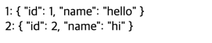

# Template Syntax
DOM을 기본 구성 요소 인스턴스의 데이터에 선언적으로 바인딩할 수 있는 HTML 기반 템플릿 구문을 사용하는 방법
종류
1. Text Interpolation
2. Raw HTML
3. Attribute Bindings
4. JavaScript Expressions

## Text Interpolation
`<p> Message: {{ msg }}</p>`
- 데이터 바인딩의 가장 기본적인 형태
- 이중 중갈호 구문(콧수염 구문)을 사용
- 콧수염 구문은 해당 구성 요소 인스턴스의 msg 속성 값으로 대체
- msg 속성이 변경될 때마다 업데이트된다.

## Raw HTML
```vue
<div v-html="rawHtml"></div>
const rawHtml = ref('<span style="color:red">This should be red.</span>')
```
- 콧수염 구문은 데이터를 일반 텍스트로 해석하기 때문에 실제 HTML을 출력하려면 v-html을 사용해야 한다.

## Attribute Bindings
```vue
<div v-bind:id="dynamicId"></div>
const dynamicId = ref('my-id')
```
- 콧수염 구문은 HTML 속성 내에서 사용할 수 없기 때문에 v-bind를 사용한다.
- 바인딩 값이 null이거나 undefined인 경우 렌더링 요소에서 제거된다.

## JavaScript Expressions
```vue
{{ number + 1 }}
{{ ok ? 'YES' : 'NO' }}
{{ message.split('').reverse().join('') }}
<div :id="`list-${id}`"></div>
```
- Vue는 모든 데이터 바인딩 내에서 JavaScript 표현식의 모든 기능을 지원한다.
- Vue 템플릿에서 JavaScript Expression을 사용할 수 있는 위치는 다음과 같이 2가지다.
    1. `{{}}` 구문
    2. 모든 directive의 속성 값. 즉, `v-`로 시작하는 특수 속성
        - 단, 하나의 단일 표현식만 포함될 수 있다.
        - if문이나 반복문을 사용할 수 없고, if문 대신 삼항 연산자는 사용 가능하다.

## Directive 구문
구조가 4가지로 나뉜다.
`v-on:submit.prevent="onSubmit"`
1. Name: `v-on`
2. Argument: `submit`
3. Modifiers: `prevent`
4. Value: `onSubmit`

### Arguments
- `v-bind`나 `v-on` 뒤에는 콜론(:)으로 인자를 데이터 바인딩할 수 있다.
- 아래의 예시를 참고하자.
```vue
<a v-bind:href="helloUrl">Hello Link</a>
<button v-on:click="callHelloFunc">Hello Button</button>
```

### Modifiers
- `.(dot)`으로 directive가 특별한 방식으로 바인딩되어야함을 나타낸다.
- 가장 많이 사용하는 modifiers는 `.prevent`가 있다.
  `<form @submit.prevent="onSubmit">...</form>`

### Built-in Directives
1. v-html
2. v-show
3. v-if
4. v-else
```vue
<div v-if="Math.random() > 0.5">
    Now you see me
</div>
<div v-else>
    Now you don't
</div>
```
5. v-else-if
```vue
<div v-if="type === 'A'">
    A
</div>
<div v-else-if="type === 'B'">
    B
</div>
<div v-else>
    Not A/B/C
</div>
```
```vue
const canView = ref(true)

<p v-if="canView">Hello!</p>
<p v-else>i'll be invisible when "canView"</p>
<button @click="canView = !canView">상태 변경</button>
```
6. v-for
```vue
<div v-for="item in items">
    {{ item.text }}
</div>

<div v-for="(item, index) in items"></div>
<div v-for="(value, key) in object"></div>
<div v-for="(value, name, index) in object"></div>
```
```vue
<div v-for="item in myArr" :key="item.id">
    <!-- {{ key }}: {{ item }} -->
    <!-- {{item.key}}: {{item}} -->
    <!-- key에는 접근이 안 된다. -->
    {{item.id }}: {{item}}
</div>

const myArr = ref([{
    id: 1,
    name: "hello"
}, {
    id: 2,
    name: "hi"
}])
```
실행 결과  


### v-for와 v-if는 같이 사용하면 안 된다.
다음과 같은 방식으로 선택적으로 반복문을 활용할 수 있다.
1. computed 활용
```vue
let id = 0

const myArr = ref ([
    { id: id++, name: 'hello', willFilter: true},
    { id: id++, name: 'hi', willFilter: false},
    { id: id++, name: '안녕하세요', willFilter: true},
    { id: id++, name: '안녕', willFilter: true},
    { id: id++, name: '안뇽', willFilter: false},
])

const filteredElements = computed(() => myArr.value.filter((elem) => elem.willFilter))

<ul>
    <li v-for="elem in filteredElements" :key="elem.id">
        {{ elem.name }}
    </li>
</ul>
```
실행결과  


2. `<template>` 사용
```vue
let id = 0

const myArr = ref ([
    { id: id++, name: 'hello', willFilter: true},
    { id: id++, name: 'hi', willFilter: false},
    { id: id++, name: '안녕하세요', willFilter: true},
    { id: id++, name: '안녕', willFilter: true},
    { id: id++, name: '안뇽', willFilter: false},
])

<ul>
    <template v-for="elem in myArr" :key="elem.id">
        <li v-if="elem.willFilter">
            {{ elem.name }}
        </li>
    </template>
</ul>
```
실행결과  

<br>  
<br>  

7. v-on
```vue
<button v-on:click="doThis"></button>
<button v-on:[event]="doThis"></button>
<button v-on:click="doThat('hello', $event)"></button>
<button @click="doThis"></button>
```
8. v-bind
```vue

<button v-bind:[key]="value"></button>

```
9. v-model