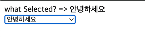

# v-model
- form 태그를 사용할 때 입력 값과 js 상태를 동기화할 때 사용한다.
- 참고로 `v-bind`와 `v-on`을 같이 사용해서도 동기화가 가능하다.
    ```vue
    const inputSomething = ref('')
    const whenInput = (event) => inputSomething.value = event.currentTarget.value

    <p>{{ inputSomething }}</p>
    <input :value="inputSomething" @input="whenInput">
    ```
- `v-model`을 사용하면 다음과 같다.
    ```vue
    const inputSomething = ref('')
    
    <p>{{ inputSomething }}</p>
    <input v-model="inputSomething">
    ```
## CheckBox와 v-model
```vue
const isChecked = ref(false)

<input type="checkbox" id="chkbx" v-model="isChecked">
<label for="chkbx">{{ isChecked }}</label>
```
배열을 활용해서 여러 체크박스들을 다룰 수 있다.
```vue
const checkedArr = ref([])

<div>checkedArr = {{ checkedArr }}</div>

<input type="checkbox" id="chkbx1" value="hello1" v-model="checkedArr">
<label for="chkbx1">hello1</label>
<input type="checkbox" id="chkbx2" value="hello2" v-model="checkedArr">
<label for="chkbx2">hello2</label>
```
실행 결과  


## Select와 v-model
```vue
const selectedThing = ref('')

<div>what Selected? => {{ selectedThing }}</div>

<select v-model="selectedThing">
    <option disabled value="">Thing을 선택해주세요</option>
    <option>Hello</option>
    <option>Hi</option>
    <option>안녕하세요</option>
    <option>안녕!</option>
</select>
```

실행결과  

