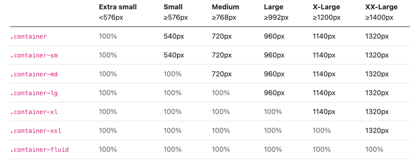
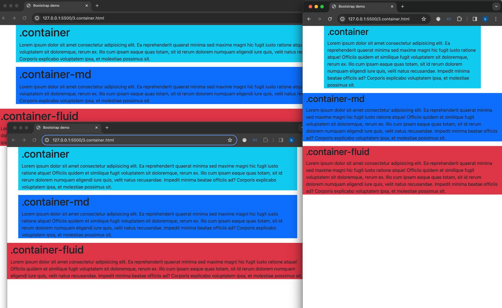
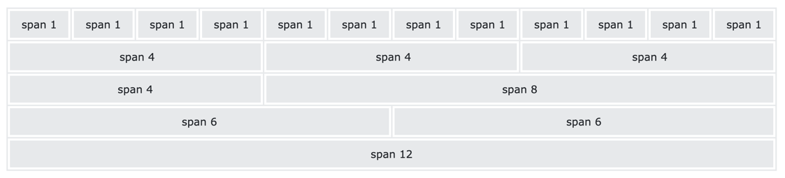
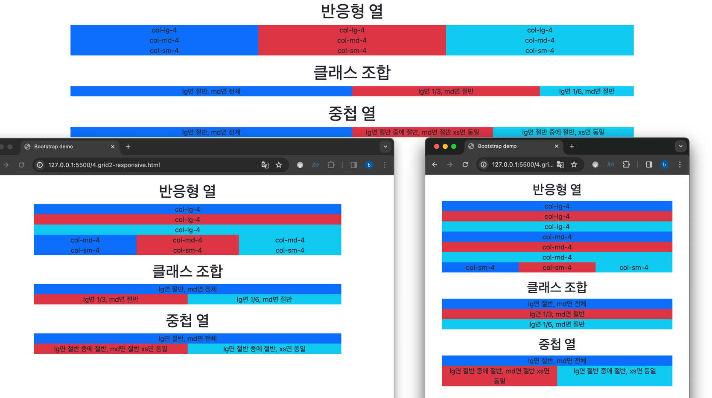
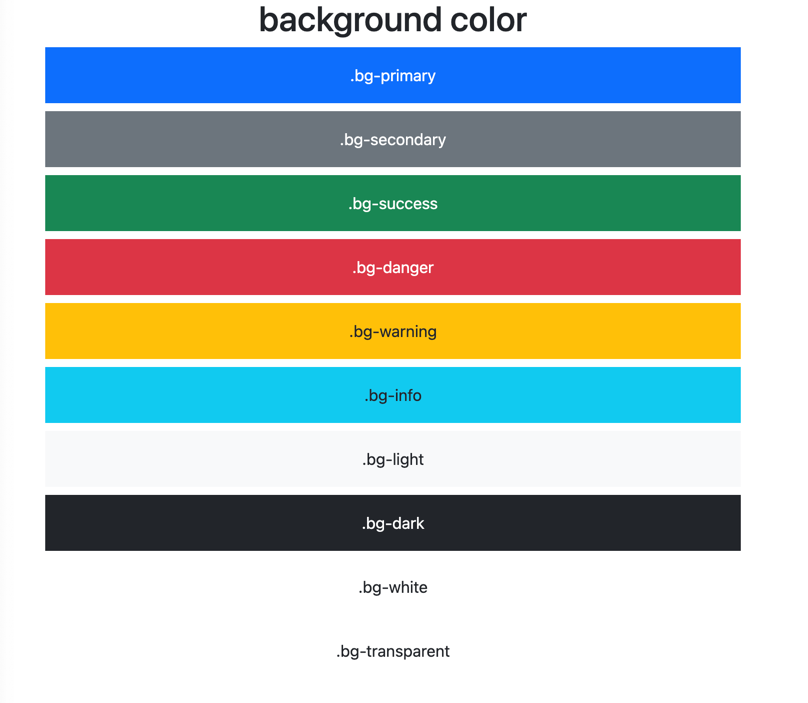
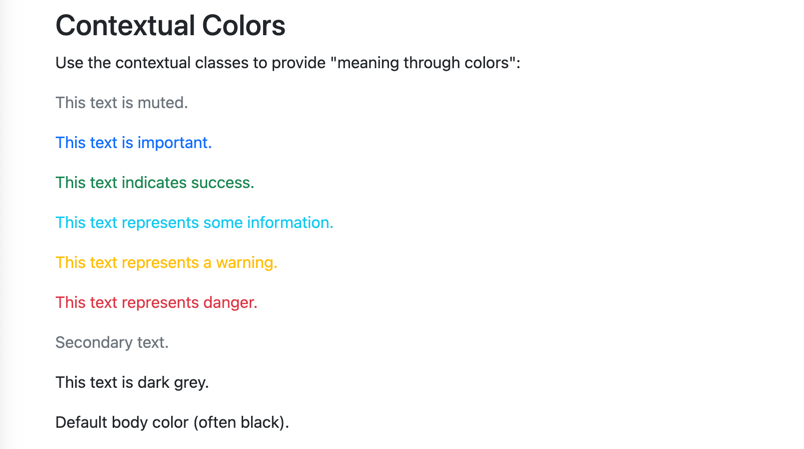
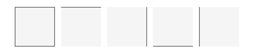
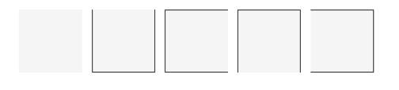
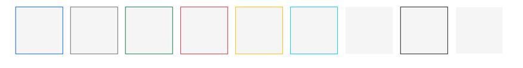
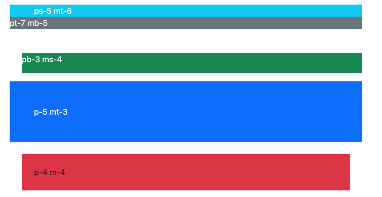

# Bootstrap
## 설정
아래의 코드를 넣어주기만 하면 bootstrap의 컴파일된 CSS와 js의 캐시 버전을 프로젝트에 전달할 수 있다.
```html
<link
    href="https://cdn.jsdelivr.net/npm/bootstrap@5.3.3/dist/css/bootstrap.min.css"
    rel="stylesheet"
    integrity="sha384-QWTKZyjpPEjISv5WaRU9OFeRpok6YctnYmDr5pNlyT2bRjXh0JMhjY6hW+ALEwIH"
    crossorigin="anonymous">

<script
    src="https://cdn.jsdelivr.net/npm/bootstrap@5.3.3/dist/js/bootstrap.bundle.min.js"
    integrity="sha384-YvpcrYf0tY3lHB60NNkmXc5s9fDVZLESaAA55NDzOxhy9GkcIdslK1eN7N6jIeHz"
    crossorigin="anonymous"></script>
```
npm을 통해 설치하는 방법도 있다.  
`npm install bootstrap@5.3.3`

버전마다 바뀌므로 아래의 링크를 확인하자.  
https://getbootstrap.com/docs/5.3/getting-started/download/

## Container
- container 클래스는 다음과 같이 Breakpoint(sm, md, lg, xl, xxl)에 따라서 width가 조정된다.
- `.container-fluid`는 항상 100%인 것도 기억해두면 좋다.

출처: https://getbootstrap.com/docs/5.0/layout/containers/  

### 예시 코드
```html
<div class="container bg-info">
  <h1>.container</h1>
  <p>
    Lorem ipsum dolor sit amet consectetur adipisicing elit. Ea reprehenderit quaerat minima sed
    maxime magni hic fugit iusto ratione atque! Officiis quidem et similique fugit voluptatem
    sit doloremque, rerum ex. Illo cum ipsam eaque quas totam, sit id rerum dolorem numquam
    eligendi iure quis, velit natus recusandae. Impedit minima beatae officiis ad? Corporis
    explicabo voluptatem ipsa, et molestiae possimus sit.
  </p>
</div>
<div class="container-md bg-primary">
  <h1>.container-md</h1>
  <p>
    Lorem ipsum dolor sit amet consectetur adipisicing elit. Ea reprehenderit quaerat minima sed
    maxime magni hic fugit iusto ratione atque! Officiis quidem et similique fugit voluptatem
    sit doloremque, rerum ex. Illo cum ipsam eaque quas totam, sit id rerum dolorem numquam
    eligendi iure quis, velit natus recusandae. Impedit minima beatae officiis ad? Corporis
    explicabo voluptatem ipsa, et molestiae possimus sit.
  </p>
</div>
<div class="container-fluid bg-danger">
  <h1>.container-fluid</h1>
  <p>
    Lorem ipsum dolor sit amet consectetur adipisicing elit. Ea reprehenderit quaerat minima sed
    maxime magni hic fugit iusto ratione atque! Officiis quidem et similique fugit voluptatem
    sit doloremque, rerum ex. Illo cum ipsam eaque quas totam, sit id rerum dolorem numquam
    eligendi iure quis, velit natus recusandae. Impedit minima beatae officiis ad? Corporis
    explicabo voluptatem ipsa, et molestiae possimus sit.
  </p>
</div>
```
결과


## Grid System
bootstrap의 grid system은 flexbox로 구출되어 페이지에 최대 12개의 열을 허용한다.

출처: https://www.w3schools.com/bootstrap5/bootstrap_grid_basic.php

### 예시코드
```html
<div class="container text-center">
  <h1 class="mt-3">반응형 열</h1>
  <div class="row">
    <div class="col-lg-4 bg-primary">col-lg-4</div>
    <div class="col-lg-4 bg-danger">col-lg-4</div>
    <div class="col-lg-4 bg-info">col-lg-4</div>
  </div>
  <div class="row">
    <div class="col-md-4 bg-primary">col-md-4</div>
    <div class="col-md-4 bg-danger">col-md-4</div>
    <div class="col-md-4 bg-info">col-md-4</div>
  </div>
  <div class="row">
    <div class="col-sm-4 bg-primary">col-sm-4</div>
    <div class="col-sm-4 bg-danger">col-sm-4</div>
    <div class="col-sm-4 bg-info">col-sm-4</div>
  </div>
  <h1 class="mt-3">클래스 조합</h1>
  <div class="row">
    <div class="col-lg-6 col-md-12 bg-primary">lg면 절반, md면 전체</div>
    <div class="col-lg-4 col-md-6 bg-danger">lg면 1/3, md면 절반</div>
    <div class="col-lg-2 col-md-6 bg-info">lg면 1/6, md면 절반</div>
  </div>
  <h1 class="mt-3">중첩 열</h1>
  <div class="row">
    <div class="col-lg-6 col-md-12 bg-primary">lg면 절반, md면 전체</div>
    <div class="col-lg-6">
      <div class="row">
        <div class="col-lg-6 col col-md-6 bg-danger">lg면 절반 중에 절반, md면 절반 xs면 동일</div>
        <div class="col-lg-6 col bg-info">lg면 절반 중에 절반, xs면 동일</div>
      </div>
    </div>
  </div>
</div>
```
실행 결과
- 위: lg가 적용됐을 때, 즉 992px보다 크거나 같을 때
- 왼쪽: md가 적용됐을 때, 즉 720px보다 크거나 같을 때
- 오른쪽: none일 때, 즉 xs가 적용됐을 때로 576px보다 크거나 같을 때


## Background Color
```html
<div class="container text-center">
  <h1>background color</h1>
  <div class="p-3 mb-2 bg-primary text-white">.bg-primary</div>
  <div class="p-3 mb-2 bg-secondary text-white">.bg-secondary</div>
  <div class="p-3 mb-2 bg-success text-white">.bg-success</div>
  <div class="p-3 mb-2 bg-danger text-white">.bg-danger</div>
  <div class="p-3 mb-2 bg-warning text-dark">.bg-warning</div>
  <div class="p-3 mb-2 bg-info text-dark">.bg-info</div>
  <div class="p-3 mb-2 bg-light text-dark">.bg-light</div>
  <div class="p-3 mb-2 bg-dark text-white">.bg-dark</div>
  <div class="p-3 mb-2 bg-white text-dark">.bg-white</div>
  <div class="p-3 mb-2 bg-transparent text-dark">.bg-transparent</div>
</div>
```


## Text Color
```html
<div class="container mt-3">
    <h2>Contextual Colors</h2>
    <p>Use the contextual classes to provide "meaning through colors":</p>
    <p class="text-muted">This text is muted.</p>
    <p class="text-primary">This text is important.</p>
    <p class="text-success">This text indicates success.</p>
    <p class="text-info">This text represents some information.</p>
    <p class="text-warning">This text represents a warning.</p>
    <p class="text-danger">This text represents danger.</p>
    <p class="text-secondary">Secondary text.</p>
    <p class="text-dark">This text is dark grey.</p>
    <p class="text-body">Default body color (often black).</p>
    <p class="text-light">This text is light grey (on white background).</p>
    <p class="text-white">This text is white (on white background).</p>
</div>
```

> body color는 기본 값으로 black이다.

## Link Color
```html
<div class="container text-center">
  <h1>link color</h1>
  <a href="#" class="link-primary">Primary link</a>
  <a href="#" class="link-secondary">Secondary link</a>
  <a href="#" class="link-success">Success link</a>
  <a href="#" class="link-danger">Danger link</a>
  <a href="#" class="link-warning">Warning link</a>
  <a href="#" class="link-info">Info link</a>
  <a href="#" class="link-light">Light link</a>
  <a href="#" class="link-dark">Dark link</a>
</div>
```


## Border
```html
<span class="border border-dark"></span>
<span class="border-top border-dark"></span>
<span class="border-end border-dark"></span>
<span class="border-bottom border-dark"></span>
<span class="border-start border-dark"></span>
```
  
border를 지우고 싶다면 0를 덧붙이면 된다.
```html
<span class="border border-0 border-dark"></span>
<span class="border border-top-0 border-dark"></span>
<span class="border border-end-0 border-dark"></span>
<span class="border border-bottom-0 border-dark"></
```
  
border에 색상도 적용할 수 있다.
```html
<span class="border border-primary"></span>
<span class="border border-secondary"></span>
<span class="border border-success"></span>
<span class="border border-danger"></span>
<span class="border border-warning"></span>
<span class="border border-info"></span>
<span class="border border-light"></span>
<span class="border border-dark"></span>
<span class="border border-white"></span>
```

## Spacing
개인적으로 가장 많이 혼란스럽게 했던 부분인데 이제 완벽 이해해보자.
> `mt-3`, `ps-4` 이런식으로 많이도 ~~괴롭힘당했다.~~  

크게 3가지로 구조가 나뉜다.
- property
  - m: margin(마진)
  - p: padding(패딩)
- sides
  - t: top(위에)
  - b: bottom(아래)
  - s: start(왼쪽)
  - e: end(오른쪽)
  - x: 좌우
  - y: 상하
  - bland: 4방향
- sizes
  - 0~5
  - auto
```html
<div class="ps-5 mt-6 bg-info text-white">ps-5 mt-6</div>
  <div class="pt-7 mb-5 bg-secondary text-white">pt-7 mb-5</div>
  <div class="pb-3 ms-4 bg-success text-white">pb-3 ms-4</div>
  <div class="p-5 mt-3 bg-primary text-white">p-5 mt-3</div>
  <div class="p-4 m-4 bg-danger text-dark">p-4 m-4</div>
</div>
```
