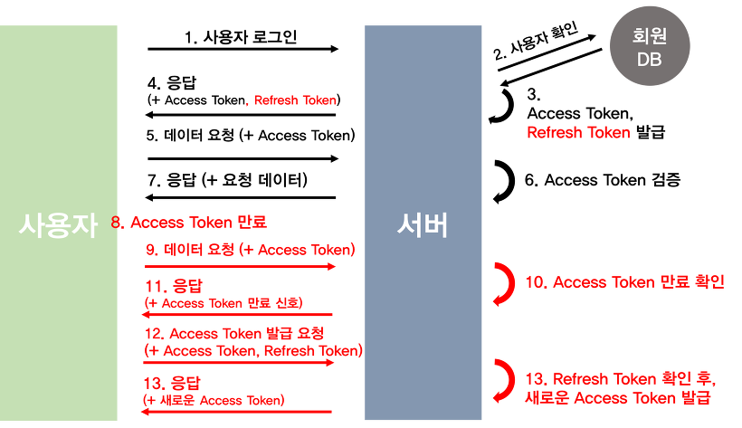

# 💻 JWT(Json Web Tokens)
## ✅ 세션의 장단점
### 💡 장점
JSESSIONID는 유의미한 값이 아니라 서버에서 세션(사용자) 정보를 찾는 key로만 활용된다.
- 따라서 탈취되었다고 개인정보가 탈취된 것은 아니다.
- 세션하이제킹 공격을 당할 수 있기 때문에 그렇다고 절대적으로 안전한 것은 아니다.
    > **세션하이제킹이란**  
  공격자가 두 컴퓨터 간의 유효한 세션을 장악할 때 발생한다.  
  데이터를 스누핑하기 위해 유효한 세션 ID를 훔친다.  
  TCP 3-way-handshaking 시에 잘못된 시퀀스 넘버를 위조해서 연결된 세션에 잠시 혼란을 준 뒤 자신이 끼어드는 형식이다.
### 💡 단점
- 서버에 세션 정보를 서버 메모리에 저장하기 때문에 부담이 많이 든다.
- Scale out/up이 요구되기 때문에 로드 밸런싱 등 신경써야할 부분이 많아진다.
    > Scale out: 서버를 여러 대 추가하여 시스템을 확장하는 것  
    Scale up: 기존 서버의 사양을 업그레이드하여 시스템을 확장하는 것
- Session ID를 전달하는 Cookie를 사용하여 클라이언트인 척 할 수 있는 보안의 약점이 존재한다.
- 매번 요청 시 세션 저장소를 조회해야 한다.

## ✅ Token이란
- 클라이언트가 서버에 접속하여 사용자 인증을 성공 -> 서버에서 토큰을 생성하여 (저장하지 않고) 클라이언트에게 발급해준다.
- 클라이언트는 요청의 헤더에 토큰을 넣어서 서버에 보낸다.
- 클라이언트는 이 토큰으로 서버1이든 서버2든 요청을 하면 그 토큰을 기반으로 사용자 인증이 가능해진다.
- key로만 사용되고 그 외에는 의미가 없는 JSESSIONID와 달리 토큰은 데이터를 포함한다.

### 💡 장점
- 세션 관리를 할 필요가 없어 별도의 저장소를 필요로 하지 않는다.
- 서버 분산 & 클러스터 환경과 같은 확장성에 좋다.

### 💡 단점
- 한 번 제공된 토큰은 회수가 어렵다.
  - 세션의 경우, 서버에서 세션을 삭제해버리면 클라이언트가 갖고 있는 JSESSIONID는 무효화 된다.
  - 그러나 토큰은 stateless하기 때문에 한 번 제공된 토큰을 서버에서는 무효화시킬 방법이 없다.
  - => 따라서 토큰의 유효기간을 짧게 한다.
- 토큰에는 사용자 관련 데이터가 있기 때문에 상대적으로 안정성이 우려된다.
  - 따라서 민감정보를 토큰에 포함시키면 안 된다.(예를 들어, 비밀번호나 개인정보)

## ✅ JWT, Json Web Token
- 인증에 필요한 정보를 암호화 시킨 JSON 토큰을 말한다.
- JSON 데이터를 Base64 URL-safe-Encode를 통해 인코딩하여 직렬화한다.
  - 물론 인코딩한다고 암호화된 것은 아니다. 난해한 문자열일 뿐이다.
- 토큰 내부에 위/변조를 방지를 위한 개인키를 통한 전자서명을 포함한다.
- JWT의 구조
  - Header
  - Payload
  - Signature

### 💡 Header
- JWT를 검증하는 데 필요한 정보를 가진 객체
- Signature에 사용한 암호화 알고리즘이 무엇인지 정보를 담고 있다.(key: "alg")
- Key의 ID가 무엇인지 정보를 담고 있다.(key: "kid")
- Key ID 대신 사용할 토큰의 타입을 담는 경우도 있다.(key: "typ")

### 💡 Payload
- 서버로 보낼 실질적으로 인증에 필요한 사용자 권한 정보와 데이터로 구성된다.(key-value 형태)
- Claim
  - 데이터의 각각 필드들
  - key - value 형식으로 이루어진 한 쌍의 데이터
  - 토큰에는 여러 개의 claim을 넣을 수 있다.
- Payload 역시 Json으로 바꾼 뒤 UTF-8로 인코딩하고 Base64로 변경한 데이터일 뿐이다.
  - 암호화 X

### 💡 Signature
- 앞의 Header와 Payload는 암호화되지 않았고, json -> utf-8 -> Base64로 변환한 데이터일 뿐이다.
  - 따라서 직접 조작해서 충분히 만들 수 있다.
- 토큰 자체의 진위여부를 판단하는 역할을 담당하는 것이 Signature다.
- Header와 Payload를 합친 뒤 비밀키로 Hash를 생성하여 암호화한다.
  - SecreKey로 Hashing한 후 Base64로 변경한다.

### 💡 Key Rolling
- JWT의 토큰 생성 메커니즘을 보다보면 알다시피 Secret Key가 노출되면 사실상 모든 데이터가 유출될 수 있다.
  - 이런 문제를 방지하기 위해 Secret Key를 여러 개 두어 노출에 대비한다.
  - 여러개를 사용하면서 수시로 추가하고 삭제하고 변경하면 1개가 노출되어도 나머지 Secret Key와 데이터는 안전한 상태가 된다.
  - => 이것이 Key Rolling이다.
- Secret Key 1개에 Unique한 ID(kid 혹은 key id)를 연결시켜준다.
  - JWT 토큰을 만들 때 헤더에 kid를 포함하여 제공한다.
  - 서버에서 토큰을 해석할 때 kid로 Secret Key를 찾아서 Signature를 검증한다.

## ✅ Access Token과 Refresh Token
### 💡 Refresh Token이 필요한 이유
- Access Token만을 통한 인증 방식의 문제는 탈취당할 경우 보안에 취약하다는 점이다.
  - Access Token은 발급된 이후, 서버에 저장되지 않고 토큰 자체로 검증을 하여 사용자 권한을 인증한다.
  - 따라서 Access Token이 만료되기 전까지는, 토큰을 획득한 사람이면 누구나 권한 접근이 가능해진다.
  - JWT는 발급한 후 삭제가 불가능하기 때문에, 접근에 관여하는 토큰에 유효기간을 부여하는 식으로 탈취 문제에 대응한다.
- 유효기간의 딜레마
  - 유효기간을 짧게 하면, 보안 취약 문제를 개선할 수 있지만, 그만큼 사용자가 로그인을 자주 해서 새롭게 Token을 발급받아야 하기 때문에 불편하다.
  - 유효기간을 길게 하면, 토큰을 탈취 당했을 때, 보안에 취약해진다.
- 용어 비교
  - Access Token
    - 접근에 관여하는 Token.
    - JWT 그 자체
  - Refresh Token
    - 재발급에 관여하는 Token.
    - 마찬가지로 JWT 그 자체.

### 💡 Refresh Token
- AccessToken을 탈취했을 경우에 대한 최소한의 대비(완벽한 해결책은 아니다.)
- AccessToken의 유효기간을 짧게 설정하여 탈취되어도 사용기간을 줄이는 효과가 있다.
- RefreshToken을 통해 다시 AccessToken을 발급받아 사용한다.
- RefreshToken은 인증 정보를 담고 있지 않고 오로지 AccessToken 재발급 용도로만 사용한다.

### 💡 AcessToken과 RefreshToken을 사용한 Logic Process
**Access Token과 Refresh Token을 따로 보내는 로직**  
1. 클라이언트가 ID, PW로 서버에게 인증을 요청하고 서버는 이를 확인하여 Acess Token과 Refresh Token을 발급받는다.
2. 클라이언트는 이를 받아 Refresh Token을 저장하고 Access Token을 가지고 서버에 자유롭게 요청한다.
3. 요청을 하던 도중 Access Token이 만료된다면 서버로부터 오류를 전달받는다.
4. 클라이언트는 본인이 사용한 Access Token이 만료되었다는 사실을 인지하고 본인이 가지고 있던 Refresh Token을 서버로 전달하여 새로운 Access Token의 발급을 요청한다.
5. 서버는 Refresh Token을 받아 서버의 Refresh Token Storage에 해당 토큰이 있는지 확인하고, 있다면 Acess Token을 생성하여 전달한다.
6. 이후 2번으로 돌아가서 동일한 작업을 진행한다.

 

**Access Token과 Refresh Token을 따로 보내는 로직**  
1. 클라이언트가 ID, PW로 서버에게 인증을 요청하고 서버는 이를 확인하여 Acess Token과 Refresh Token을 발급받는다.
2. 서버는 Refresh Token을 데이터베이스에 저장한다.
3. 클라이언트는 이를 받아 Access Token과 Refresh Token을 쿠키, 세션 혹은 웹스토리지에 저장한다.
4. 요청이 있을 때마다 클라이언트는 Access Token과 Refresh Token 둘을 헤더에 담아 서버에 자유롭게 요청한다.
5. 요청을 하던 도중 Access Token이 만료된다면, 서버는 같이 보내진 Refresh Token을 DB의 것과 비교해서 일치하면 다시 Access Token을 발급해준다.
6. 사용자가 로그아웃을 하면 저장소에서 Refresh Token을 삭제하여 사용이 불가능하도록 하고, 새로 로그인하면 서버에서 다시 재발급하여 DB에 저장한다.

### 💡 Access Token & Refresh Token 재발급 원리
1. 기본적으로 로그인 같은 과정을 하면 Access Token과 Refresh Token을 모두 발급한다.  
이때, Refresh Token만 서버측의 DB에 저장하며, Refresh Token과 Access Token을 쿠키 혹은 웹스토리지에 저장한다.
2. 사용자가 인증이 필요한 API에 접근하고자 하면, 가장 먼저 토큰을 검사한다.  
이때, 토큰을 검사함과 동시에 각 경우에 대해서 토큰의 유효기간을 확인하여 재발급 여부를 결정한다.
   1. Access Token과 Refresh Token 모두가 만료된 경우: 에러 발생 (재 로그인하여 둘다 새로 발급)
   2. Access Token은 만료됐지만, Refresh Token은 유효한 경우: Refresh Token을 검증하여 Access Token 재발급  
     → 클라이언트(쿠키, 웹스토리지)에 저장되어있는 Refresh Token과 서버 DB에 저장되어있는 Refresh Token 일치성을 확인한 뒤 Access Token을 재발급한다.
   3. Access Token은 유효하지만, Refresh Token은 만료된 경우: Access Token을 검증하여 Refresh Token 재발급  
     → Access Token이 유효하다라는 것은 이미 인증된 것과 마찬가지니 바로 Refresh Token을 재발급한다. 
   4. Access Token과 Refresh Token 모두가 유효한 경우: 정상 처리
3. 로그아웃을 하면 Access Token과 Refresh Token을 모두 만료시킨다.

### 💡 Refresh Token 인증 과정

1. 사용자가 ID, PW를 통해 로그인
2. 서버에서는 회원 DB에서 값을 비교  
3. 로그인이 완료되면 Access Token, Refresh Token을 발급한다. 이때 회원 DB에도 Refresh Token을 저장해둔다.
4. 클라이언트 측에 응답으로 Access Token과 Refresh Token을 보낸다.
5. 사용자는 Refresh Token은 안전한 장소에 저장 후, Access Token을 헤더에 실어 요청을 보낸다.
6. Access Token을 검증한다.
7. 클라이언트가 요청한 데이터를 보낸다.
8. 시간이 지나 Access Token이 만료됐다.
9. 사용자는 이전과 동일하게 Access Token을 헤더에 실어 요청을 보낸다.
10. 서버는 Access Token이 만료됨을 확인한다.
11. 권한없음을 신호로 보낸다.
> 참고로 Access Token이 만료될 때마다 9~11번 과정을 거칠 필요는 없다.  
> 사용자(프론트엔드)에서 Access Token의 Playload를 통해 유효기간을 알 수 있다.  
> 따라서 프론트엔드 단에서 API 요청 전에 토큰이 만료됐다면 곧바고 재발급 요청을 할 수도 있다.
12. 사용자는 Refresh Token과 Access Token을 함께 서버로 보낸다.
13. 서버는 받은 Access Token이 조작되지 않았는지 확인한 후, Refresh Token과 사용자의 DB에 저장되어 있던 Refresh Token을 비교한다.
14. 서버는 새로운 Access Token을 헤더에 실어 다시 API 요청 응답을 진행한다.

참고  
[Access Token & Refresh Token](https://inpa.tistory.com/entry/WEB-%F0%9F%93%9A-Access-Token-Refresh-Token-%EC%9B%90%EB%A6%AC-feat-JWT)